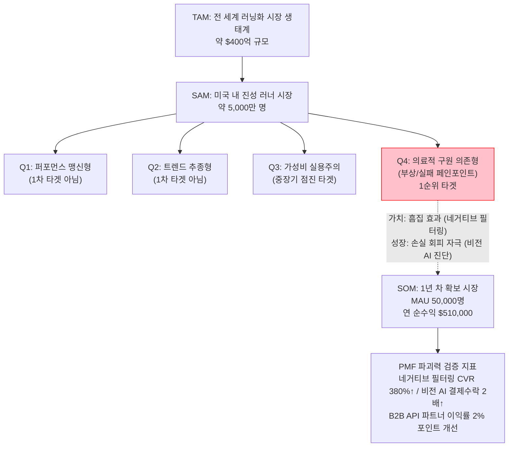

# **WOMBET2: TAM-SAM-SOM 종합 시장 전략 시각화 리포트**

본 리포트는 1단계(시장 탐색)부터 7단계(솔루션 및 SOM 정의)까지 도출된 WOMBET2의 시장성 검증 결과를 한눈에 파악할 수 있도록 통합한 최종 시각화 대시보드입니다. 투자자 피칭(IR) 및 초기 기획 검증의 척도로 활용됩니다.

---

## 1. TAM–SAM–SOM 시장 산출표 및 흐름도

| 구분 | 시장 크기 / 목표 | 근거 요약 |
| --- | --- | --- |
| **TAM** (전체 대상 시장) | **$400억 (약 55조 원)** | 글로벌 러닝화 및 스포츠 이커머스 트래픽 생태계 전체 배후 시장 |
| **SAM** (유효 서비스 시장) | **약 5,000만 명** | 미국 내 주 2회 이상 트래킹, 장비에 과금하는 진성 러너 규모 |
| **SOM** (1년 차 획득 시장) | **MAU 50,000명 / $51만 수익** | Q4(의료적 구원 의존형) 내 실제 획득 비율 적용, 객단가 $150 B2C/B2B 모델 결합 |

---

## 2. 분석 체계 전체 논리 구조 (1단계~7단계)

| 단계 | 분석 모듈 | 핵심 도출 내용 |
| --- | --- | --- |
| ① | TAM (거시 탐색) | **문제의식:** 러닝화 시장은 크지만, 리뷰 불신과 '신발 무덤(실패 비용)' 구조가 팽배 |
| ② | SAM (범위 축소) | **범위:** 미국 내 "진성 러너" 생태계 파편화 문제로 한정 |
| ③ | Causal (원인 분석) | **원인:** 인플루언서 호평의 이면(협찬) + 소비자의 모호한 착화감 인지 한계 |
| ④ | 가설 수립 | **가치/락인/수익 3대가설:** 단점 노출, 시각 AI 진단, B2B 반품 억제 플러그인 |
| ⑤ | 마켓 세그먼트 (2x2) | **타겟:** 브랜드보단 수치(데이터)를 중시하며, 부상 경험이 있는 **'Q4 세그먼트'** 확정 |
| ⑥ | 타겟 정제 및 심층분석 | **차별화 로직:** Q4에게 네거티브 리뷰는 진실성을, 붉은색 진단 오버레이는 공포(손실회피)를 줌 |
| ⑦ | SOM 산출 및 실행 | **명세서:** 1년 내 MAU 5만 명 확보. B2C 수수료($21만)+B2B($30만) 달성을 위한 PoC 설계 |

---

## 3. 타겟 소비자 행동 기반 핵심 지표 대시보드

| 지표명 (행동/재무) | 수치 | 출처 및 벤치마크 기반 | 검증 수준 |
| --- | --- | --- | --- |
| "흠집 효과"의 CVR 임팩트 | **최대 380% 폭발** | Spiegel Research (완벽한 평점 vs 4.2~4.7 평점 비교 결과) | ✅ 공개 논문 |
| 단점 노출 시 체류 시간 변화 | **4배 증가** | Spiegel Research (부정적 리뷰 탐색 시 신뢰도 및 시간 상승) | ✅ 공개 논문 |
| 비전 시각화 시 전환 수용률 | **34% ➔ 72%** | Overjet (치과 AI 진단 오버레이 경험 도입 전후 비교) | ✅ 타산업 실증 |
| 커머스 핏/사이즈 반품률 방어 | **최대 60% 축소** | True Fit / ASICS (개인화 스캐닝 도입 후 브래케팅 감소치) | ✅ 비즈니스 성과 |
| 건당 반품/환불 처리 매몰 비용 | **$30 ~ $45** | NRF (National Retail Federation) 조사 통계 | ✅ 공개 리포트 |

---

## 4. 데이터 출처 신뢰도 분류 (3 Tier)

WOMBET2 논리의 타당성을 평가하기 위해 적용된 데이터 출처의 신뢰성을 구분합니다.

### 🟢 Tier 1: 공개 연구 조사 단위 (강력한 설득 논거)
*   **스피겔 리서치 센터 (Spiegel Research):** 흠집 효과와 CVR 3.8배 상승 관계 증명
*   **NRF 보고서:** 이커머스 반품 역물류 비용의 평균 처리 단가 명시
*   **의료업계 지표 (Overjet Case):** 손실회피가 인간의 심리에 미치는 지표 (동의율 2.1배 상승)

### 🟡 Tier 2: 인접 산업 기반 유추치 (일부 변수 존재)
*   **핏테크 B2B 가치 (True Fit):** 신발 산업 반품 축소 비율이 러닝화라는 강도 높은 관여도 시장에서도 일치할 것인지에 대한 유추 적용.
*   **Q4 타겟의 행동 비율 전환율:** 모든 부상 러너가 비전 AI 진단과 추천에 결제를 즉시 연동할 것이라는 가설. (테스트 필요)

### 🔴 Tier 3: AI 기반 초기 추정치 (반드시 제품으로 실측 필요)
*   **SOM 트래픽 달성률:** 1년 내 50,000 MAU 확보 비용 (초기 마케팅 CAC 미정)
*   **B2B 영업 성공률:** 정식 API 런칭 전, 유통 매장 10곳에서 월 $2,500 단가의 라이선스를 승인할 지불의사(Willingness To Pay) 검증 필요.

---

## 5. 비즈니스 리스크 및 가설 매핑 대시보드 (검증 맵)

우리가 세운 비즈니스의 각 요소가 얼마만큼 데이터를 통해 뒷받침되고 있는지 직관화한 대시보드입니다. (🟢 검증됨 / 🟡 부분 지지 / 🔴 미검증)

| 사업 영역 | 핵심 문제 및 가설 | 🟢 | 🟡 | 🔴 | 전체 검증 강도 |
| --- | --- | --- | --- | --- | --- |
| **P1. 문제의 크기** | 기존 리뷰는 모호하며 실패비용, 반품 비용이 천문학적으로 발생함. | O | | | ██████████ **매우 강함** |
| **P2. 가치 제안 (UX)** | 네거티브 필터링이 오히려 유저의 신뢰와 CVR을 폭증시킬 것이다. | O | | | ██████████ **매우 강함** |
| **P3. 성장/행동 전환** | 무릎/발바닥 진단 붉은색 오버레이가 유저의 지갑을 열게 할 것이다. | | O | | ██████░░░░ **중간 (타산업 유추)** |
| **P4. 타겟 도달** | SNS 등으로 페인포인트를 자극했을 때 CPA 2달러 이하로 모객된다. | | | O | ██░░░░░░░░ **약함 (테스트 필요)** |
| **P5. B2B 수익화** | 타겟 판매점들이 반품 방어를 위해 월 $2,500 지출 의사가 있다. | | | O | ██░░░░░░░░ **약함 (세일즈 시급)** |

> **💡 전략적 함의 (Strategic Insight)**
> *"왜 사람들이 이 서비스를 열광적으로 쓸 수밖에 없는가(Pain & Value)"에 대한 논리는 **스피겔 연구소의 심리학적 실증자료**와 **현행 반품 비용 데이터**로 완벽하게 방어되었습니다.* 
> *하지만 "WOMBET2 팀이 얼마나 저렴하게 타겟을 모아올 것인가(CAC)"와 "1년 안에 B2B 계약을 어떻게 따낼 것인가(Sales)"는 아직 공란입니다. 따라서 MVP인 **'가짜 문(Fake Door) 랜딩페이지 실험'**과 **'수동 리포트 기반의 B2B 영업'**을 최우선으로 착수해야 합니다.*

---

## 6. 결론: 다음 주부터 실행해야 할 최우선 Action Items

데이터 리서치 체계가 종료됨에 따라, 가장 위험(🔴 미검증)한 영역을 즉각 해소하기 위해 아래 검증 레이스로 돌입해야 합니다.

1.  **[즉각 실행] 타겟 유입 테스트 (2주일)**
    *   Carrd나 Webflow로 "당신을 부상 입히는 신발 TOP3 확인하기" 랜딩 페이지 제작
    *   Meta 광고에 $50를 집행하여 실제 Q4 세그먼트의 이메일 가입 전환율(CPA) 실측.
2.  **[즉각 실행] B2B 컨시어지 콜드메일 전송 (1주일)**
    *   북미 로컬 러닝샵 20개를 선정.
    *   "반품률을 절반으로 낮춰줄 수동 고객 데이터 가이드 분석을 1달간 무료로 해주겠다" 제안 및 미팅 어레인지 시도.
3.  **[단기 기획] 오즈의 마법사 진단 (1개월)**
    *   비전 AI 머신러닝 구축 홀딩. 카카오톡/디스코드 봇을 활용하여 사용자가 사진을 올리면 2시간 내 직접 붉은색 마킹을 칠한 PDF를 전송하는 PoC 착수.
