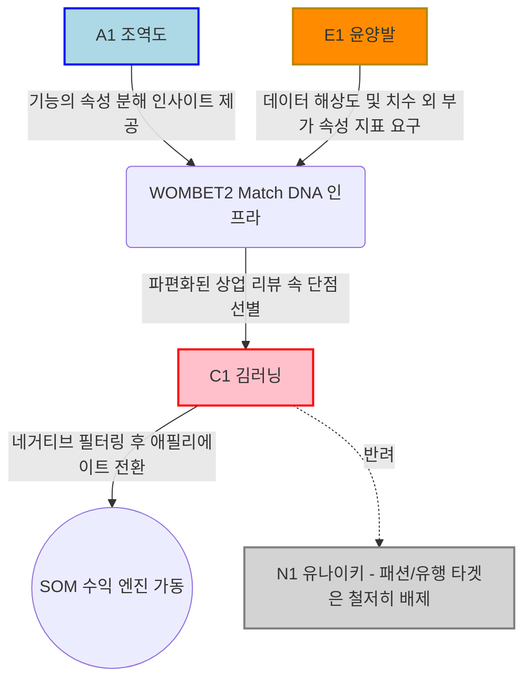
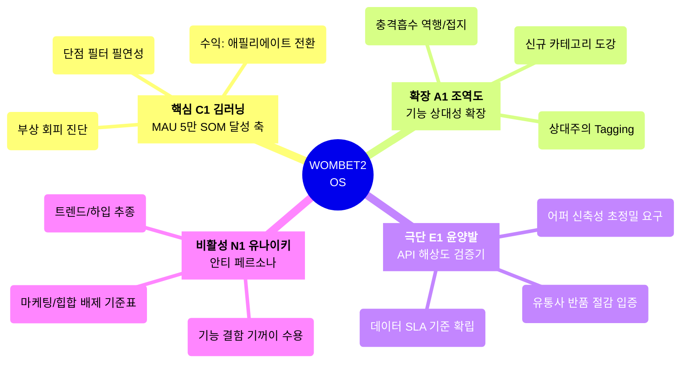
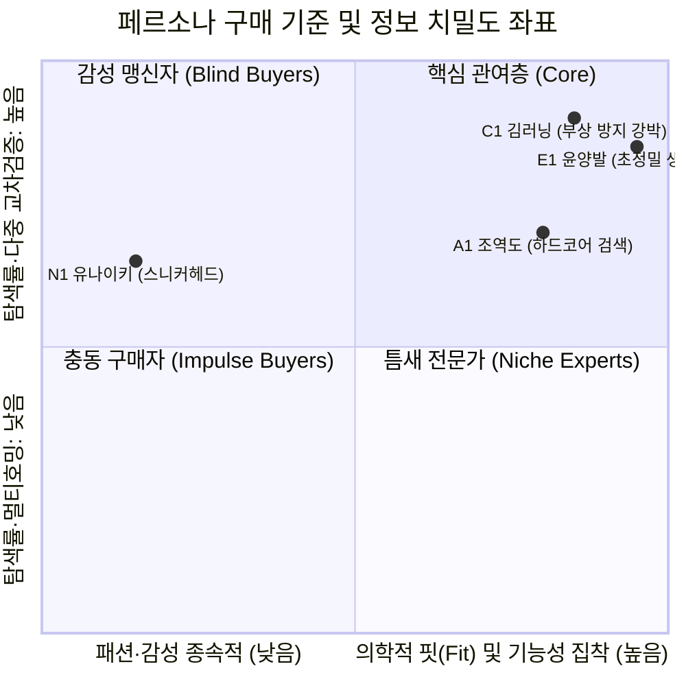
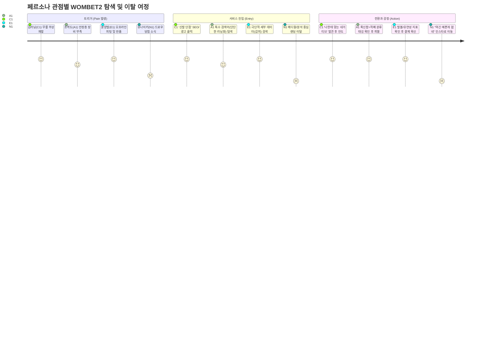

# **WOMBET2 스포츠 기어 매칭/탐색 플랫폼 — 고객 페르소나 스펙트럼 (최종)**

## **스펙트럼 구조 요약**

| 유형 | 인원 | 목적 | 채택 페르소나 | 평가 점수 |
| --- | --- | --- | --- | --- |
| **핵심(Core)** | 1명 | 주력 타겟 — MVP 기능 설계 및 1년 차 SOM 생존 모델 타겟 | C1 김러닝 | 15/15 |
| **확장(Adjacent)** | 1명 | 인접 영역 — 검색 아키텍처 유연성 설계 및 필터 카테고리 확장 | A1 조역도 | 14/15 |
| **극단(Extreme)** | 1명 | 포용적 설계 — B2B 데이터(Match DNA) 해상도 및 극한의 필터링 한계 기준 | E1 윤양발 | 15/15 |
| **비활성(Non-user)** | 1명 | 진입 장벽 — 마케팅 타겟 배제 기준 및 핵심 가치 분별 | N1 유나이키 | 15/15 |

---

## **1. 핵심 사용자 (Core) — 1명**

### **C1. 김러닝 (34) — "과내전으로 유튜브 리뷰에 배신당한 마스터즈 러너"**

**세그먼트:** Q4 의료적 구원 의존형 | **역할:** 1년 차 SOM(5만 MAU) 수익 핵심 엔진 | **평가:** 문제 ★★★★★ / 행동 ★★★★★ / 맥락 ★★★★★

| 항목 | 내용 |
| --- | --- |
| **유형명** | 부상 회피형 리뷰 다중 탐색자 |
| **직무** | IT기업 기획자 |
| **주요 문제** | 과거 족저근막염으로 6개월간 러닝을 쉬었다. 최근 유튜브에서 '가장 완벽한 쿠션'이라고 극찬한 카본 러닝화를 샀으나, 자신의 '과내전(Overpronation)' 성향과 충돌해 통증이 재발했다. 칭찬 일색인 커머스 리뷰 속에서 자신의 역학적 약점과 충돌하는 **'치명적 단점'만을 골라내지 못해** 탐색 피로도에 짓눌려 있다. |
| **목표** | "수많은 장점은 필요 없다. 내 생체 약점과 충돌하는 페널티 요소를 단번에 걸러내서 부상 없이 훈련할 신발을 5분 안에 찾고 싶다." |
| **사용 맥락** | 새로 출시된 러닝화 리뷰 영상을 2~3개 시청한 직후, 실제 그 신발이 내 발 특성에 맞을지 팩트체크하고 싶을 때 즉시 플랫폼에 유입된다. 부상 징후가 느껴질 때 강하게 활성화된다. |
| **감정** | 광고성 인플루언서 리뷰에 대한 **뿌리 깊은 불신과 분노**, 잘못 샀다가 다시 다칠 수 있다는 강박적인 **치명적 불안감**, 여러 탭을 띄워놓고 비교해야 하는 **멀티호밍의 피곤함**. |
| **대체 솔루션** | 해외의 RunRepeat 사이트 단점 항목 번역, 러닝 커뮤니티(갤러리) 질문 탐색, 유튜브 영상 여러 개 교차 시청 |
| **핵심 니즈 기능** | '단점(Cons)' 위주의 네거티브 필터링 / 사용자 신체 특성에 따른 '비추천(Not Ideal For)' 마킹 / 시각적 핏 진단(비전 AI 오버레이 가이드) |

> 💡 **MVP 설계 체크:** "C1이 제품을 검색했을 때, 극찬 리뷰보다 '당신의 과내전에는 맞지 않는다'는 단점 데이터가 가장 먼저 시야에 들어오는가?"

---

## **2. 확장 사용자 (Adjacent) — 1명**

### **A1. 조역도 (27) — "가벼운 쿠셔닝이 오히려 재앙인 크로스핏 애호가"**

**세그먼트:** 인접 스포츠 극관여층 | **역할:** 검색 아키텍처(Tagging) 유연성 고도화 | **평가:** 문제 ★★★★★ / 행동 ★★★★★ / 맥락 ★★★★

| 항목 | 내용 |
| --- | --- |
| **유형명** | 메인스트림 역행형 핏 탐색자 |
| **직무** | 대학원생 / 크로스핏 및 역도 애호가 |
| **주요 문제** | 바벨의 막대한 하중을 온전히 지탱하려면 극도로 단단하고 평평한 접지력이 필요하다. 하지만 주류 신발 시장의 알고리즘과 리뷰어들의 기준은 '가벼움'과 '푹신한 쿠셔닝'에 맞춰져 있어, 일반인들이 찬양하는 신발을 신으면 발목이 꺾여 심각한 부상(염좌) 위기에 놓인다. |
| **목표** | "남들이 단점이라고 욕하는 '무겁고 단단한 돌덩이 같은 착화감'을 가진 제품만 따로 모아서 필터링하고 싶다." |
| **사용 맥락** | 크로스핏이나 역도화 구매 주기가 도래했을 때, 일반 스포츠 이커머스에서 원하는 신발을 도저히 찾을 수 없어 틈새 리뷰 사이트를 뒤질 때. |
| **감정** | 대중적인 '쿠셔닝'만 찬양하는 리뷰 생태계 시스템 자체에 대한 **이질감과 답답함**. 정밀한 하중 지지 성능을 알리지 않는 마케팅에 대한 **분노**. |
| **대체 솔루션** | 해외 역도 전문 유튜버 영상 자동번역 정독, 레딧(Reddit) 하이엔드 피트니스 장비 스레드 검색 |
| **핵심 니즈 기능** | 장단점의 '상대성 판단' 필터 (특정 목적에 따른 '장/단점 치환 시스템') / 스포츠 목적별 지면 접지력 수치화(Scale) |

> 💡 **검색 논리 체크:** "WOMBET2의 DB 아키텍처는 절대적 '별점'을 넘어서, 똑같은 기능이라도 누구에게는 장점, 어떤 종목엔 단점이 되는 것을 태깅(Tagging)하고 있는가?"

---

## **3. 극단 사용자 (Extreme) — 1명**

### **E1. 윤양발 (31) — "기성품 생태계에서 추방된 아픈 자"**

**세그먼트:** Q4-A 극단 핏 불일치(결함 보유) | **역할:** B2B API 정밀도(Match DNA) 해상도 기준 | **평가:** 문제 ★★★★★ / 행동 ★★★★★ / 맥락 ★★★★★

| 항목 | 내용 |
| --- | --- |
| **유형명** | 극단적 체형 소외형 |
| **직무** | 게임회사 개발자 |
| **주요 문제** | 좌우 발 길이가 15mm 이상 다르고 양쪽에 심한 무지외반증 뼈 돌출이 있다. 기성 러닝화 99%가 착화 자체를 거부할 만큼 고통을 느끼며, 단순히 발 볼이 '넓다'는 정보만으로는 실패 비용(반품, 발 피로)을 막을 수 없다. 가장 중요한 건 돌출 부위를 압박하지 않는 '특수 부위 갑피(Upper)의 신축성과 재질'이다. |
| **목표** | "이 신발 어퍼 특정 부위가 돌출된 뼈를 편안하게 감싸줄 만큼 재질이 유연한지 수치화된 데이터로 팩트체크하고 싶다." |
| **사용 맥락** | 모든 오프라인 매장에서 피팅 후 발의 고통을 겪고 집에 돌아왔을 때, 마지막 희망을 품고 초정밀 치수 데이터(갑피 물성 포함)를 검색할 때. 반품률이 100%에 달하는 인물. |
| **감정** | 기성 신발 브랜드들에게 철저히 소비자로 인정받지 못한다는 **소외감과 체념**. 매번 두 사이즈를 따로 사서 하나를 버리거나 반품비용을 내야하는 **억울함**. |
| **대체 솔루션** | 커스텀 수제화 제작, 벨크로 샌들 위주 착용, 두 개의 사이즈 구매 후 한쪽씩 조합 착화 |
| **핵심 니즈 기능** | 신발 각 부위별 형태(DNA) 세부 분류 / 길이 외에 '재질 유연성/토박스 압박률' 등 다차원 스펙 게이지 바 기재 |

> 💡 **데이터 해상도 체크:** "우리가 구축할 Match DNA API(B2B 판매 모델)는 단순히 길이/너비를 넘어 E1이 확인하고자 하는 갑피 유연성(Upper Elasticity) 같은 극한의 변수도 잡아낼 수 있는가?"

---

## **4. 비활성 사용자 (Non-user) — 1명**

### **N1. 유나이키 (25) — "피가 안 통해도 한정판은 못 참지"**

**세그먼트:** Q2 트렌드 추종 하입비스트 | **역할:** 마케팅 배제 타겟·기능적 엣지 수호 | **평가:** 문제 ★★★★★ / 행동 ★★★★★ / 맥락 ★★★★★

| 항목 | 내용 |
| --- | --- |
| **유형명** | 브랜드 가치 맹신·하입 추종자 |
| **직무** | 휴학 중인 대학생 |
| **비활성 핵심 이유** | 중요한 건 발의 고통이나 기능적 구조가 아니라 오로지 새로 뽑아낸 '트렌드와 로고' 뿐이다. 신발이 너무 꽉 끼어 아킬레스건이 까져도, 발볼이 찢어져 물집이 생겨도 트렌디하다면 스스로 합리화하고 그 고통을 참아낸다. "네거티브 단점 검증" 자체에 메리트를 못 느낀다. |
| **목표** | "이 신발을 신고 인스타 스토리에 올렸을 때 몇 개의 하트를 받을 수 있는가?" (기능적 진보 목표 부재) |
| **사용 맥락** | 기능보다는 한정판 드로우 일정이나 리셀 가격 등락폭에만 이목이 집중된다. 이성적인 치수나 내구성 데이터에는 눈길을 주지 않는다. |
| **감정** | 특정 한정판 스니커를 가졌다는 집단 내 우월성. 누군가 '그 신발 무릎에 안 좋아'라고 말할 때 느끼는 **지루함과 무시**. 통증을 감내하는 패션 허세. |
| **대체 솔루션** | 크림(KREAM), 무신사 스니커즈 커뮤니티 트렌드, 나이키 SNKRS 당첨 앱. |
| **진입 배제 및 활용 전략** | ① 이들에게 기능적(메디컬) 경고 메시지를 노출시키는 마케팅은 전환율이 0%에 수렴한다. ② 플랫폼 내 UI/UX에 어정쩡하게 '트렌디한 아이템 추천' 기능을 도입하려는 내부의 유혹을 막기 위한 '배제 리트머스 테스트' 용도로 활용한다. |

> 💡 **포지셔닝 체크:** "우리의 페이크도어 도달 랜딩 페이지가 N1의 디자인 구미를 당길 만한 '패션 이미지'가 아닌, 오직 C1만을 노리는 극단적이고 치명적인 '부상 팩트'만 담고 있는가?"

---

## **페르소나 간 연결 구조 (지렛대 구조)**



*   **E1 윤양발 & A1 조역도** → 이들이 제기하는 **극한의 데이터 요구**가 WOMBET2 DB 아키텍처(Match DNA)의 정밀도 하한선을 높여주면, 이 정밀도가 결국 일반적인 부상을 겪는 코어인 C1의 문제를 훨씬 완벽하게 해결합니다. E1, A1은 플랫폼 데이터 고도화의 기준선입니다.
*   **C1 김러닝** → 1년 차에 도달할 집중 타겟이자, "반품 절감 비즈니스(API)"를 완성하기 위한 트래픽 코어.
*   **N1 유나이키** → WOMBET2가 크림(KREAM) 같은 리셀 플랫폼이나 무신사로 오염되지 않도록 '버려야 할 가치(패션/브랜드 맹신)'를 명확히 그어줍니다.

---

## **페르소나별 MVP 기능 우선순위 매핑**

| 기능 | C1 김러닝 | A1 조역도 | E1 윤양발 | N1 유나이키 |
| --- | --- | --- | --- | --- |
| **페이크도어 (네거티브 경각심 마케팅)** | ★★★★★ | ★★★ | ★★★ | — |
| **오즈의 마법사 (수동 육안 오버레이 진단)** | ★★★★★ | ★★ | ★★★★ | — |
| **극단적 단점/페널티 선별 리뷰 필터링** | ★★★★★ | ★★★★★ | ★★★ | ★ |
| **갑피/미드솔 세부 유연성 게이지 바** | ★★ | ★★★★ | ★★★★★ | — |
| **성분/기능별 상대성 구조화(누군가에겐 단점)**| ★★★ | ★★★★★ | ★★★★ | — |

**Phase 1 진입 시 핵심 개발 요건:**
1. 시중에 퍼진 호평 속에서 오직 '부상 페널티 및 치명적 단점'만 역추출한 50개 러닝화 인덱스 DB 필터.
2. C1 유입을 위한 "당신의 무릎을 박살내는 유행 러닝화" 형태의 페이크도어 진입 게이트.
3. 데이터의 속성을 절대가치(점수)가 아니라 상대가치(A에겐 장점, B에겐 타격)로 보여주는 아키텍처 확립.

---

## **스펙트럼별 전략적 활용 가이드**

| 스펙트럼 | 활용 시점 (WOMBET2 개발) | 핵심 검증 질문 |
| --- | --- | --- |
| **핵심 (C1 김러닝)** | MVP 런칭/페이크도어 집행, 사용자 1:1 심층 인터뷰 대상자 리크루팅 | "C1이 WOMBET2 화면을 보고 자신의 종아리 통증과 족저근막염 원인을 직관적으로 해소했는가?" |
| **확장 (A1 조역도)** | 검색 알고리즘 고도화, 스포츠 장르 확장(테니스, 피트니스) 시 카테고리 매핑 | "A1이 역도화를 검색했을 때, 쿠션감을 '장점'이 아닌 치명적 '피해야 할 단점 요소'로 세팅할 수 있는 필터 환경인가?" |
| **극단 (E1 윤양발)** | API 데이터 고도화(유통사 판매용 B2B 상품 구성 시 데이터 스펙 한계 결정) | "WOMBET2가 긁어온 핏 데이터가 E1에게 제품을 추천했을 때 반품 확률을 줄여줄 수 있는 세부 항목(어퍼 유연성 등)을 갖췄는가?" |
| **비활성 (N1 유나이키)** | 마케팅 카피라이팅 작성, UI/UX 디자이너 초기 톤앤매너 싱크업 | "광고 소재나 메인 화면에 N1이 좋아할 만한 '힙한 트렌드'나 쓸데없는 콜라보 요소가 섞여 있어 본질을 흐리지는 않는가?" |


# **WOMBET2 Persona Spectrum Map (통합 시각화 리포트)**

**작성 배경**: 
본 문서는 페르소나 스펙트럼 기법의 최종 5단계 산출물입니다. 초기 12명의 탐색 그룹에서 선별된 4종 페르소나, 그들의 상세 카드와 시장 검증 결과(1~4단계)를 기반으로 **WOMBET2 플랫폼의 '인물 간 관계망과 제품 설계 접점'을 5가지 다이어그램으로 시각화**했습니다.

---

## **Map 1. 스펙트럼 전체 구조 (System Architecture)**
> WOMBET2를 중심으로 각 페르소나가 어떤 속성으로 포진해 있고, 1년 차 비즈니스(SOM)에 어떤 기여를 하는지 직관적으로 보여줍니다.



---

## **Map 2. 시장 세그먼트 매트릭스 (Market Positioning)**
> 시장 내 잠재 고객들을 **결정 기준(X축)과 정보 치밀도(Y축)** 구획판 위에 올려, WOMBET2가 어떤 특성의 좌표를 공략하고 버려야 할지를 명확화합니다.


*   **분석 포인트**: WOMBET2 비즈니스는 명확히 1사분면의 우측 상단(**C1, E1**)에 집중해야 합니다. 상업 리뷰에 갇혀 탐색 피로도(y축)는 높은 반면, 기능 고관여(x축)를 충족 받지 못하는 계층이 바로 수익의 진원지입니다.

---

## **Map 3. 전환 / 데이터 플라이휠 흐름도 (Data Flywheel)**
> E1(극단)과 A1(확장)이 제기하는 까다로운 조건이 어떻게 메인 데이터베이스(DB)를 살찌우고, 궁극적으로 범용 타겟인 C1(핵심)을 무한 수익 창출로 안착시키는지 보여주는 동력 모델입니다.

```mermaid
graph LR
    subgraph 1. Data Input & SLA (인프라 고도화)
        E1[E1 윤양발<br/>: 극한의 재질/치수 한계 요구] -->|갑피/미드솔 연성 데이터 매핑| DB[(WOMBET2<br/>Match DNA 엔진)]
        A1[A1 조역도<br/>: 상대적 페널티 척도 요구] -->|기능의 장단점 상대 태깅화| DB
    end

    subgraph 2. Value Output (플랫폼 전환 모델)
        DB -->|정밀 네거티브 필터링 적용| C1[C1 김러닝<br/>: 리뷰 피로도 5분 컷 매칭]
        C1 -->|신뢰도 100% 매칭 구매| Rev([SOM 1차 수익: 제휴 커머스])
        Rev --> |데이터 정합성 영업| B2B([B2B 수익: 반품절감 API])
    end

    subgraph 3. Filtering Out (마케팅 방어벽)
        N1[N1 유나이키<br/>: 트렌드 합리화 충동] -. "의료적 정보 튕겨냄" .-> X[마케팅 리소스 절감]
        DB -. 배제 .-> N1
    end

    style DB fill:#FFE4E1,stroke:#FF0000,stroke-width:2px;
    style Rev fill:#90EE90,stroke:#006400,stroke-width:2px;
```

---

## **Map 4. 다중 페르소나 고객 여정 (User Journey Blueprint)**
> 각 페르소나가 우리 서비스와 만나는 계기(트리거)부터 진입, 행동 양식의 감정 변화를 매핑했습니다.



---

## **Map 5. 제품 개발 및 UI/UX 설계 우선순위**
> 도출된 페르소나 요구를 1년 차 마일스톤에 맞춘 기능 단위(Feature) 모듈로 분할하고 매핑했습니다. 

```mermaid
graph TD
    MVP[1년 차 개발 우선순위 <br/> '오즈의 마법사 & 단점 DB']
    
    MVP --> F1[1순위: 네거티브 필터 UI<br/>(장점이 아닌 '치명적 단점' 우선 노출)]
    MVP --> F2[1순위: 상대성 인덱스 태그<br/>(누구에겐 장점, 누구에겐 페널티인지 분기)]
    MVP --> F3[2순위: Match DNA 고도화<br/>(갑피 신축성, 토박스 압박 등 2차 지표)]
    MVP --> F4[3순위: AI 오버레이 핏 진단<br/>(기술 자동화 전 수작업 테스트 먼저)]
    
    style F1 fill:#FFC0CB,stroke:#FF0000,stroke-width:2px;
    style F2 fill:#ADD8E6,stroke:#0000FF,stroke-width:2px;
    style F3 fill:#E6E6FA,stroke:#800080,stroke-width:1px;
    
    F1 -. "C1 탐색 피로도 해소" .-> C1(C1 코어 매칭)
    F2 -. "A1 논리 파괴 보완" .-> A1(A1 확장 타겟 획득)
    F3 -. "E1 API 데이터 정밀도" .-> E1(E1 극단 타겟 반품 방지)
    F1 -. "N1 튕겨냄 (힙합 배제)" .-> N1(N1 안티 페르소나 차단)
```

**[최종 코멘트]**
본 5종의 스펙트럼 맵은 단순 기획 문서가 아니라, **경영진의 사업 전략 회의(투자 IR 등), 프론트엔드 개발자의 데이터 스키마 구축 방향성, 마케터의 SEO 최적화 및 랜딩 타겟팅을 통제하는 하나의 바이블**로 기능하도록 구성되었습니다.
