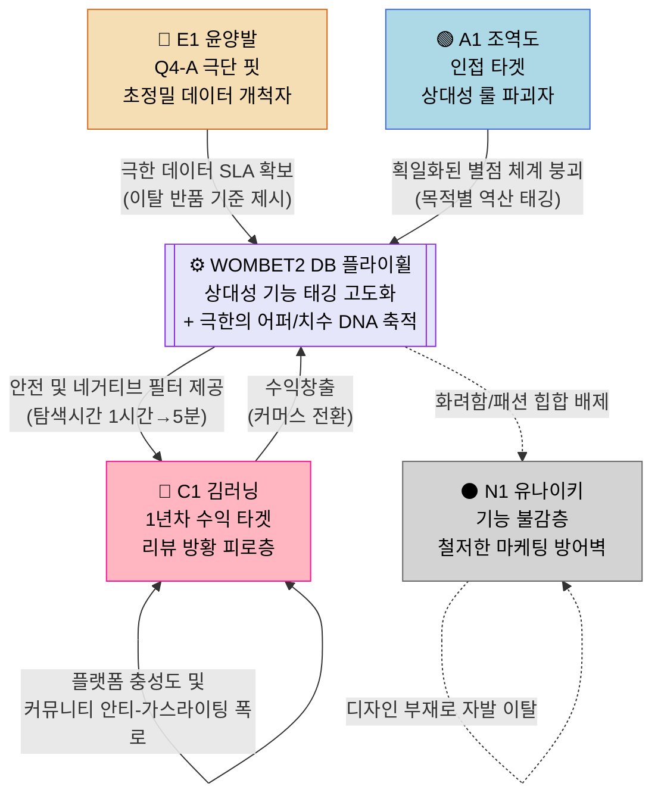

# **고객 여정지도 (CJM) — WOMBET2 스포츠 기어 매칭 및 단점 필터링 플랫폼**

---

## **CJM 01 · 핵심 사용자 (Core)**

### **C1 김러닝 (34) — Q4 의료적 구원 의존형 · 안티 가스라이팅 러너**

> **여정 특성:** 칭찬 일색의 인플루언서 리뷰에 배신당해 부상을 입은 경험이 있음. 철저한 예방을 위해 탭을 5개씩 띄우며 멀티호밍하는 유저. '극찬'은 무시하고 '치명적 단점' 정보에 즉각적인 신뢰를 보내며, 구매 성공 시 압도적 충성도를 보임.

| 단계 | 고객 행동 | 고객 생각 | 감정 | Pain Point | 개선 기회 |
| --- | --- | --- | --- | --- | --- |
| **인지** | 유튜브 리뷰에서 '최고의 쿠션'이라 극찬받은 신발을 의심함. 검색(SEO) 중 "당신의 러닝화가 연골을 망친다"는 페이크도어 마케팅을 보고 유입 | "진짜 부상 이슈 없는 거 맞아? 내 과내전 발목에도 안 다칠까?" | 불신 + 방어적 호기심 | **과도한 상업 리뷰로 인한 피로와 가스라이팅** — 리뷰어의 칭찬이 내 발성향에도 장점인지 파악할 기준이 전혀 없음 | 증상/디버프 기반 검색망. "과내전을 박살 내는 카본화 Top5" 같은 네거티브 마케팅 진입점 마련 |
| **고려** | 유튜브에서 극찬받았던 제품을 검색. 100점 만점 별점이 아니라, '과내전 비추천', '발목 외곽 지지력 붕괴' 등 **극단적인 단점 중심의 리뷰 메타데이터** 확인 | "맞아, 이 신발의 무른 쿠션이 내전 성향엔 독이 되지. 이 사이트는 광고는 안 하네." | 안도 + 강한 신뢰 | **다수 탭을 여는 교차검증(멀티호밍) 시간 낭비** — 단점을 찾기 위해 레딧이나 해외 사이트를 자동 번역하는 번거로움 | '제품별 치명적 페널티 3가지' 1초 요약 뷰. 유저 신체 스펙 기반 '비추천(Red Tag)' 명시 |
| **결정** | 내 생체역학 스펙에 맞는 쿠션화를 선별. 부상/안전 관련 오버레이 핏 진단 결과를 보고 최종 확신. 애필리에이트(제휴몰) 구매 링크 클릭 | "유튜브 극찬템 샀다가 병원비 30만원 깨졌는데, 이건 안전하겠네." | 안심 + 구매 확정 | **구매 전 신체 특성과의 최후의 불일치 여부 확인 불가** — "진짜 내 발에 통증이 없나?"라는 최후의 불안감 발생 | 인앱 진단 (오즈의 마법사식 핏 진단) 솔루션 연계. '이 신발은 당신의 아치를 보호합니다' 코멘트 제공 |
| **온보딩** | 자신의 통증 이력(족저근막염), 발(아치) 사진 등록, 마일리지(러닝 횟수) 등록. 교체 주기 알림 설정 | "내 부상 데이터 넣어두면 다음 신발 추천 때 알아서 안전한 것만 골라주겠지." | 루틴 정착 + 체계성 | **수기로 부상일지/마일리지를 기록해야 하는 번거로움** — 부상 예방이라는 핵심 목표를 위한 데이터 관리 기능 부재 시 일회성 유입에 그침 | 온보딩 시 '부상 이력/아치 형태' 원스텝 선택 가이드. 마일리지 한계점 연동 (쿠션 꺼짐 교체 알림) |
| **충성도** | 소속된 런클럽 단톡방이나 런갤 커뮤니티에 "칭찬 알바에 속지 말고 여기서 단점 검색해라"며 자발적 공유 (안티 리뷰 바이럴의 선봉장) | "다들 협찬 영상 보고 발 망가지지 말고 이 앱으로 단점이나 체크해라." | 전도사 + 자기 확신 | **신규 브랜드나 마이너 카테고리에 단점 DB가 비어있을 때 이탈** — 모든 신발의 단점 DB를 실시간 업데이트하지 않으면 신뢰 역풍 | 유저 자발적 '함정/부상 리뷰' 제보 기능(보상 연계). DB 확장 시각화 오픈 |

**감정 곡선:** 불신·방어 → 안도·신뢰 → 안심·구매 확정 → 루틴 정착 → **전도사** 
**플랫폼 핵심 가치:** "칭찬에 속아 버린 병원비 30만 원, 5초 단점 필터링으로 차단"

---

## **CJM 02 · 확장 사용자 (Adjacent)**

### **A1 조역도 (27) — 인접 스포츠 극관여층 · 틈새 필터 탐색자**

> **여정 특성:** 기존 리뷰/커머스 시장의 '가볍고 푹신한 것이 최고다'라는 획일적 우상향 기준을 정면 반박하는 사용자. 자신의 목적(역도, 크로스핏)에 맞는 '무거운 돌덩이' 모델을 찾고자 상대적 가치 태깅에 반응함. 

| 단계 | 고객 행동 | 고객 생각 | 감정 | Pain Point | 개선 기회 |
| --- | --- | --- | --- | --- | --- |
| **인지** | 크로스핏 고중량 와드(WOD) 중 발목 흔들림을 느끼고, 헬스 갤러리 장비 스레드를 뒤지다가 발목 지지력이 높은 신발 링크를 통해 자연 유입 | "리뷰 많고 평점 높은 거 샀다가 역도 할 때 무릎 갈릴 뻔 헸네. 접지력 좋은 거 어딨나?" | 이질감 + 짜증 | **포털 이커머스의 획일적인 평점 알고리즘 오류** — 목적을 배제한 채 '무조건 푹신하고 가벼운' 것을 5점 주는 환경적 한계 | "바벨러를 위해 오히려 쿠션 없는 신발" SEO 점유. 목적별 카테고리 진입 분리 |
| **고려** | [역도/짐] 카테고리로 필터링. **'쿠셔닝' 항목이 장점이 아닌 '단점/위험 요소'로 세팅**되어 있고, 접지력 하중 지지 데이터가 표시되는 것을 발견 | "이 플랫폼은 미친 푹신함이 여기선 치명적 단점이라고 태그해 놨네. 말이 통하는구만." | 카타르시스 + 흥미 | **기능 스펙의 상대적 매핑 부재** — 기존 사이트들은 쿠션이 없으면 무조건 '별점 하락'의 패널티로 치부해 좋은 역도화를 걸러내지 못함 | **상대성 필터(Relativity Tagging)** 적용. '러닝엔 단점, 역도엔 1순위 장점'이라는 목적별 치환 표시 |
| **결정** | 발목 뒤틀림 방지(Heel Counter) 강성 및 평평한 오프셋(Drop) 수치 등 하드 스펙 확인 후 커머스 링크 통해 결제 | "해외 유튜버 영상 자동번역 안 돌리고 여기서 바로 스펙 수치 비교가 되니 편하다." | 탐색 성공 + 안도 | **해외 딥서치를 통하지 않고선 강성/오프셋 구조 파악 불가** — 깊은 니즈를 충족시키는 데이터가 없으면 결국 레딧으로 다시 떠남 | 접지 강도(Scale), Drop 힐투토 오프셋 상세 스펙 다차원 그래프 UI 표시 |
| **온보딩** | 나만의 WOD용 장비 즐겨찾기 설정 및 장비별 적합 훈련 시나리오 메모. | "가벼운 날은 이거 신고, 스내치 치는 날은 이거 신자." | 탐구욕 충족 | **종목이 러닝/역도 외에 테니스/등산 등으로 섞일 때 탐색 UX 혼재** — 본인만의 운동 장르 설정이 구체적이지 않으면 정보 오염 발생 | 프로필에 '메인 운동 종목' 선택 기능 배치 시 기본 필터링 룰을 역변환(Reverse) 시켜 적용 |
| **충성도** | 체육관 고인물들이나 오픈챗방에 WOMBET2의 특정 필터 결과표 스크린샷 캡쳐 후 "여기가 장비 스펙 분석의 끝판왕"이라며 공유 | "운동의 본질을 아는 플랫폼이야. 이 데이터가 팩트다." | 지식 과시 + 강력한 지지 | **한 번 데이터 오류가 발생하면 헬스 커뮤니티 특성상 즉시 나락(불신)으로 추락** — 특정 목적 커뮤니티의 검열 심리 강함 | 사용자 DB 교정 건의 기능. "오류 지적자 마일리지 보상" 같은 참여형(Wiki) 데이터 팩트체크 시스템 |

**감정 곡선:** 이질감·짜증 → 카타르시스 → 탐색 성공 → 탐구욕 충족 → **지식 과시·브랜드 지지** 
**플랫폼 핵심 가치:** "어떤 종목에선 장점이, 다른 종목에선 페널티. 거짓말 없는 핏 치환 모델"

---

## **CJM 03 · 극단 사용자 (Extreme)**

### **E1 윤양발 (31) — Q4-A 극단적 핏 이상자 · 철저한 생존 지향형**

> **여정 특성:** 뼈 돌출과 비대칭으로 인해 이커머스에서 가장 극심한 '반품 실패'를 겪어, 길이 중심의 스펙에 환멸을 느낌. 어퍼(Upper) 재질의 유연성 등 매우 정밀한 생체 역학 데이터베이스를 요구하는 플랫폼 한계 검증 인물.

| 단계 | 고객 행동 | 고객 생각 | 감정 | Pain Point | 개선 기회 |
| --- | --- | --- | --- | --- | --- |
| **인지** | 오프라인 매장에 가서 5켤레 피팅 후 발등 고통을 느껴 결국 빈손으로 귀가. "발볼 넓은 런닝화" 검색 중 극초정밀 데이터 명시가 된 WOMBET2 발견 | "또 브랜드 놈들 뻔한 '와이드 치수' 뻥튀기면 바로 욕하고 나갈 거다." | 깊은 체념 + 회의적 시도 | **길이, 단순 발볼(2E, 4E) 외의 치수 부재가 심각한 고통 유발** — 무지외반 부위를 압박하는 신발 '갑피(Upper)' 데이터 등을 제공하는 곳이 아예 없음 | 검색창에 "무지외반 추천" 같은 형태적 증상 검색 허용. 'Match DNA' 기반 극한의 해상도 데이터 예고 |
| **고려** | 특정 제품 상세페이지 진입. 길이를 넘어서 '조직의 연성(늘어남), 토박스 상단 압박 강도, 재봉선 위치에 따른 돌출부 간섭' 등의 데이터 게이지 바를 확인 | "이 사이트 미쳤다. 어퍼가 얼마나 잘 늘어나는지까지 점수로 수치화했네." | 경이로움 + 구출(생존) 감정 | **피팅 전까진 특정 신체 결함부와 신발 설계(이음새 등)의 충돌 여부 은폐** — 구매 후 착화해야만 고통을 알게 되고, 반품비용과 환멸로 이어짐 | '어퍼 신축성 등급표' 명시. 부위별 핏 압박 위험도(Heatmap) 시각화 이미지 제공 |
| **결정** | 짝짝이 발을 커버할 만큼 갑피 유연성이 90% 이상인 제품으로 결정. "이거면 고통 없이 신을 수 있다"고 확신 후 제휴몰 단번에 결제 | "제발 이번엔 맞을 거다. 최소한 아프진 않겠지." | 절박함이 동반된 안도 | **최종 구매 결정 시 과거 반복된 반품의 트라우마가 발목을 잡음** — "이 지표도 거짓말이면 어쩌지?" 하는 두려움 | 유통사(커머스) 시스템 B2B 연결을 통해, 치수 실패 시 무료 반품 지원 옵션 뱃지 실험적 연동 |
| **온보딩** | 자신의 비대칭 양발 치수(좌 265mm, 우 280mm) 및 뼈 돌출값을 디테일하게 입력(Match DNA 등록). | "이것만 입력하면 더 이상 오프라인 매장 돌면서 눈치 안 봐도 되겠네." | 해방감 | **플랫폼이 추천할 커버리지(선택지) 부족 시 상대적 박탈감 유발** — 특이체형 핏을 입력해도 플랫폼이 "맞는 신발이 0건"이라고 응답 시 분노 | 특이 스펙자에게는 맞지 않는 부분(페널티)을 정확히 고지하며 타협할 수 있는 차선책까지 큐레이션 제시 |
| **충성도** | 실제로 제품 도착 후 통증 없는 안착 성공. 족부질환 환우 카페 및 오픈 카톡방 등에 "기성품 난민 구원 플랫폼" 타이틀로 소문 확산 | "내 인생 신발을 20년 만에 여길 통해 편하게 찾았다." | 고신뢰 정착 + 충성 | **데이터 정합성이 떨어져 다시 부상을 입게 되면 가장 무섭게 브랜드를 공격** — 플랫폼의 데이터 정확도(SLA)가 신뢰의 생명선 | Match DNA B2B 사업 입증 논리로 사용(우리는 특이체형조차 반품률 0%로 만들 기술력을 가졌다) |

**감정 곡선:** 체념·회의적 → 경이로움 → 절박한 안도 → 해방감 → **환희·영구 고착**
**플랫폼 핵심 가치:** "발 길이와 폭의 폭력을 넘어, 어퍼 텐션까지 아우르는 핏 DNA"

---

## **CJM 04 · 비활성 사용자 (Non-user)**

### **N1 유나이키 (25) — Q2 트렌드 맹신자 · 객관화 불능 안티 페르소나**

> **여정 특성:** 핏의 불편함이나 발의 고통을 트렌디한 디자인(패션 스왝)으로 합리화함. 이들의 비합리성에 리소스 낭비를 차단하여 WOMBET2가 크림(KREAM)같은 패션앱으로 변질되는 것을 막는 방파제.

| 단계 | 고객 행동 | 고객 생각 | 감정 | Pain Point | 개선 기회 |
| --- | --- | --- | --- | --- | --- |
| **인지** | 커뮤니티나 인스타 탐색 중 WOMBET2 광고나 검색결과 노출. "유행하는 신발인데 단점투성이네?" 라며 스쳐지나감 | "이게 힙한 건데 기능이 왜 필요해? 안 예쁘고 이상한 것만 가득하네." | 지루함 + 무시 | **의학적/기능적 Pain을 통증으로 여기지 않음** — 발가락 양옆에 물집이 잡혀도 인스타 스토리 자랑 목적이 이를 상쇄해버림 | 전환 목표 제외 유저. 광고 집행 시 패션/리셀 키워드(드로우, 한정판) 등을 철저히 제외 타겟팅 |
| **고려** | 우연히 랜딩 페이지를 넘겨봐도, 화려한 컬래버레이션 정보 대신 무릎 각도, 연골, 중족골 압박 어쩌구 하는 수치들만 가득함 | "아, 여긴 찐 아재들, 러너증후군 환자들만 오는 병원 같은 덴가 보다." | 피로감 + 튕겨냄 | **디자인적 자극과 힙(Hip) 요소의 부재** — 트렌드 추종자들에게 WOMBET2 데이터는 교과서처럼 지루하고 매력 없음 | 오히려 앱의 톤앤매너를 더욱 임상적(Medical), 퍼포먼스(Data) 위주로 드라이하게 구성하는 리트머스 테스트로 삼음 |
| **결정** | (즉시 이탈) 한정판 러닝화 재판매가나 발매 일정 확인을 위해 KREAM, 무신사 앱으로 이동 후 구매 결제 | "난 역시 나이키가 짱이야." | 안도 (관찰자 복귀) | **이들이 혹시라도 전환될까 기웃거리는 기획적 타협을 내부에서 발생시키는 것 자체가 문제** | 이들이 우리 플랫폼에서 이탈하는 모습을 긍정적인 '타겟 선별 과정'으로 정의 |
| **온보딩** | 불가능 | - | - | 이들을 붙잡기 위한 그 어떤 알람이나 리인게이지먼트 마케팅도 시도하지 않음 | 리소스 절약 |
| **충성도** | 불가능 (오히려 패션 커뮤니티에 "저기선 예쁜 거 사면 바보 취급함" 이라 평할 수 있음. 이는 핵심유저에겐 훈장이 됨) | "기능충들의 아지트." | 외부 방관 | 반대의 구전활동이 오히려 Core 타겟(C1)에게는 "여기가 전문성 있는 리얼 팩트 플랫폼이구나"라는 신뢰 보상으로 전환됨 | N1의 비난은 오히려 타겟팅이 제대로 이뤄진 확고한 포지셔닝(Moat)의 승리 증거 |

**감정 곡선:** 지루함·무시 → 피로감(튕겨냄) → 즉시 이탈 → **외부 방관**
**플랫폼 핵심 퍼포먼스:** 이들에게 어필하려 하지 않음으로써 마케팅 비용 $0 확보 및 본질 수호.

---

## **페르소나 여정망 교차 인사이트**

### **1. 공통 Pain Point — WOMBET2가 박살 내야 할 MVP 1순위 (TOP 3)**

| 순위 | Pain Point | 해당 페르소나 | MVP 해결 기능 |
| --- | --- | --- | --- |
| **1** | 기만적 상업성 극찬 가스라이팅 트라우마: "장점이 아니라 단점 팩트체크가 필요하다" | C1, A1 | 치명적 맹점(Negative) 중심 선별 필터링 UI 반영 |
| **2** | 획일적 알고리즘 기준의 폭력성: "무조건 높은 별점 시스템은 틈새 수요를 죽인다" | A1, E1 | 장/단점의 상대성 태깅 (특정 종목에선 단점 부여) |
| **3** | 피상적 치수 가이드의 한계: "발 길이 말고 갑피/눌림 등 정밀 핏 데이터가 없다" | E1, C1 | Match DNA 및 부위별 압력/유연성 수치 그래프 |

### **2. 플랫폼 성장 여정망도 (Data & Flywheel Pipeline)**

### **3. 고객 여정 단계별 최우선 개선 마일스톤**

| CJM 단계 | 가장 큰 위험 및 Pain | 전략적 우선 해결책 (WOMBET2) | 영향 받는 페르소나 |
| --- | --- | --- | --- |
| **인지(Trigger)** | 상업적 찬양 인플루언서 리뷰에 갇혀, 자신에게 맞는 정보의 분법 불능 | "당신의 러닝화가 무릎을 박살 낸다" 페이크도어 도달 등 네거티브 팩트 전략 | C1, A1 |
| **고려(Search)** | 평점·별점 중심 이커머스에서 스펙이 '폭력적'으로 일원화 됨 | **상대성 태그** (폭신함=러닝엔 별, 역도엔 똥) 분배 및 '단점 1순위 노출' | A1, C1 |
| **결정(Decision)** | 피팅 전, 돌출 뼈 등 특이 체형과 제품 상성의 최후 불확실성 (반품 트라우마) | 길이만이 아닌 **'갑피 유연도/압박 스케일 바(Match DNA)'** 시각화 제공 | E1, C1 |
| **온보딩(Onboard)** | 정보 1회 체리피킹 후 이탈 | 부상 일지+발 데이터 입력 기반 '차기 신제품' 안전 경고 푸시 알림 | C1, E1 |
| **충성도(Loyalty)** | 신규 등록 장비 데이터 오류 발생 시 전문 커뮤니티의 맹렬한 역풍 | 유저 자발적 '단점 오류 제보(Wiki)' 참여형 시스템 구축 | C1, A1 |
