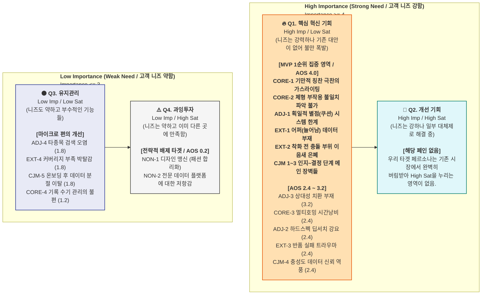
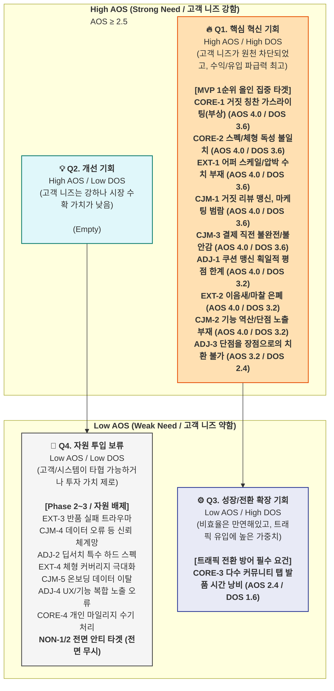

# **WOMBET2 페르소나 주요 Pain-Goal 종합 정리표**

---

## **1. 4명 페르소나 Pain / Goal 종합표**

| 유형 | 페르소나 | 세그먼트 | 핵심 Pain | 세부 Pain | Goal | 감정 키워드 |
| --- | --- | --- | --- | --- | --- | --- |
| 🔵 **핵심** | **C1 김러닝** (34) | Q4 의료적 구원 의존형 | **과도한 상업 리뷰로 인한 피로와 가스라이팅** | ① 칭찬 리뷰에 배신당해 부상 입은 경험<br>② 단점 교차검증을 위한 다수 탭(멀티호밍) 시간 낭비<br>③ 구매 전 내 체형 부작용 불일치 여부 확인 불가<br>④ 부상/마일리지 수기 기록의 번거로움 | **"칭찬에 속아 버린 병원비 30만 원, 5초 단점 필터링으로 차단"**<br>→ 기만적 찬양 배제 + 치명적 단점 5분 컷 필터링 | 불신·방어 → 안도·신뢰 → 전도사 |
| 🟢 **확장** | **A1 조역도** (27) | 인접 스포츠 극관여층 | **획일화된 알고리즘의 폭력성(평점 기준 오류)** | ① 목적 배제된 '쿠션=최고' 평점 시스템 한계<br>② 스펙의 상대적 매핑 부재 (쿠션이 단점임을 확인 불가)<br>③ 강성, 오프셋 등 하드 스펙 확인 위해 딥서치 강요<br>④ 목적 외 여러 종목 장비 혼재 시 탐색 오염 | **"어떤 운동엔 장점이, 다른 운동엔 페널티다. 목적에 맞는 신발만 보고 싶다"**<br>→ 상대성 태깅 필터 + 목적별 스펙 자동 치환 | 이질감·짜증 → 카타르시스 → 지지 |
| 🔴 **극단** | **E1 윤양발** (31) | Q4-A 극단적 핏 이상자 | **피상적 치수 가이드 한계 및 잦은 반품 실패** | ① 길이/발볼에 국한된 치수 부재가 심각한 고통 유발<br>② 피팅 전에 신발 설계와의 충돌(압박) 여부 은폐<br>③ 최종 결제 시 과거 반복된 반품 실패 트라우마<br>④ 특이 체형의 선택지(커버리지) 부족으로 박탈감 | **"단순 길이를 넘어, 어디가 늘어나고 압박되는지 초정밀 데이터로 반품을 없애 달라"**<br>→ 어퍼 연성/압박 스케일 바 시각화 + Match DNA 정합성 | 체념·회의 → 경이로움 → 환희·정착 |
| ⚫ **비활성** | **N1 유나이키** (25) | Q2 트렌드 맹신자 | **기능/의학적 Pain 자체를 인식 불가** | ① 발이 아파도 패션 힙합으로 합리화하여 무시<br>② 메디컬/분석 데이터 위주 UI에 극도의 피로감<br>③ 화려한 디자인 부재 시 즉시 이탈 (기능성 무가치) | **(목표 부재)** "힙하고 예쁜 나이키 한정판만 산다"<br>→ 기능충 아지트로 판단 후 자발적 이탈 (마케팅 방어벽 역할 충실) | 지루함·무시 → 즉시 이탈 → 방관 |

---

## **2. Pain / Goal 매트릭스 — 한눈에 비교**

| 비교 축 | C1 김러닝 | A1 조역도 | E1 윤양발 | N1 유나이키 |
| --- | --- | --- | --- | --- |
| **Pain 한 줄** | 상업 리뷰 피로 및 가스라이팅 | 획일적 평점 기준의 폭력성 | 피상적 치수 데이터로 인한 고통 | 기능/스펙적 Pain 미인식 |
| **Goal 한 줄** | 치명적 단점 5초 필터링 | 목적별 스펙 상대성 확인 | 초정밀 어퍼 핏 데이터 확인 | (목표 없음/트렌드 맹신) |
| **탐색 행태** | 다수 탭 교차검증 (멀티호밍) | 역도화 등 해외 딥서치 검색 | 오프라인 피팅 전전 및 잦은 반품 | 트렌드 정보 즉각 수용 |
| **관여 특징** | 안티 가스라이팅 | 상대적 룰 파괴자 | 극한의 SLA 데이터 검증자 | 디자인 및 브랜드 유행 맹신 |
| **전환/이탈** | 1년 차 사업 최우선 수익 타겟 | 틈새 인덱스 제공 시 즉각 획득 | 한계 핏 데이터 입증 시 영구 고착 | 방파제 안티 타겟 (철저히 배제) |

---

## **3. CJM 여정 단계별 공통 Pain — 플랫폼 우선 해결 과제**

| CJM 단계 | 가장 큰 공통 Pain | 해당 페르소나 | 전략적 우선 해결책 (WOMBET2) |
| --- | --- | --- | --- |
| **인지** | 상업적 찬양 인플루언서 리뷰에 갇혀, 자신에게 맞는 정보 식별 불가 | C1, A1 | "당신의 러닝화가 무릎을 박살 낸다" 페이크도어 등 **네거티브 팩트 전략** |
| **고려** | 획일화된 평점/별점 중심 이커머스에서 스펙이 폭력적으로 일원화 됨 | C1, A1 | **상대성 태그** (폭신함=러닝엔 별, 역도엔 독) 분배 및 '단점 최상단 노출' |
| **결정** | 피팅 전, 돌출 뼈 등 특이 체형과 제품 상성의 최후 불확실성 (반품 트라우마) | C1, E1 | 길이만이 아닌 **'갑피 유연도/압박 스케일 바(Match DNA)'** 시각화 제공 |
| **온보딩** | 정보 1회 체리피킹 후 이탈 및 부상 이력 연속성 부재 | C1, E1 | 부상 일지+발 데이터 입력 기반 '차기 신제품' 안전 경고 푸시 알림 |
| **충성도** | 신규 등록 장비 데이터 오류 발생 시 전문 커뮤니티의 맹렬한 역풍 | C1, A1, E1 | 유저 자발적 '단점/오류 제보(Wiki)' 참여형 데이터 팩트체크 시스템 |

---

## **4. 공통 Pain Top 3 — 페르소나 교차 빈도순**

| 순위 | 공통 Pain | 해당 페르소나 | 결합 해결 기능 |
| --- | --- | --- | --- |
| **1** | **기만적 상업성 극찬 가스라이팅 트라우마**<br>— "장점이 아니라 단점 팩트체크가 필요하다" | C1, A1 | 치명적 맹점(Negative) 중심 선별 필터링 UI 및 최상단 노출 반영 |
| **2** | **피상적 치수 가이드 시스템 한계**<br>— "발 길이 말고 갑피/눌림 등 정밀 핏 데이터가 필요하다" | C1, E1 | Match DNA 도입 및 부위별(토박스 등) 압력/유연성 수치 그래프 시각화 |
| **3** | **획일적 알고리즘 기준의 폭력성**<br>— "무조건 높은 별점 시스템은 틈새 수요를 죽인다" | A1, E1 | 운동 목적(용도) 기반 장/단점 상대성 변환 태깅 시스템 |

# **WOMBET2: Importance (중요도) 평가 보고서**

## **Importance 점수 기준**

| 점수 | 의미 | 판단 기준 |
| --- | --- | --- |
| **5** | 매우 중요 | 해결 안 되면 목표 자체가 불가능 (원천 차단) |
| **4** | 중요 | 해결 안 되면 큰 불편·비효율 발생 (우회 시 큰 손실) |
| **3** | 보통 | 약간의 불편을 감수하고 우회 경로로 목표 달성 가능 |
| **2** | 낮음 | 해결 없어도 대안을 통해 대부분 진행 가능 |
| **1** | 매우 낮음 | 고객이 문제로 인식하지 않거나, 해결 의지 0 |

---

## **A. 스펙트럼 4분류별 Pain Importance**

### **🔵 핵심 (Core) — C1 김러닝**

| # | Pain / Goal | Imp | 근거 |
| --- | --- | --- | --- |
| CORE-1 | **칭찬 리뷰 가스라이팅으로 인한 부상 경험 (안전 위협)** | **5** | C1의 절대적 최우선 목표인 '부상 방지'를 정면 위협. 안전에 대한 확신이 충족되지 않으면 구매 의사결정 자체가 일어날 수 없음. |
| CORE-2 | **구매 전 내 체형 부작용 불일치 여부 확인 불가** | **5** | 극찬 리뷰 상품이어도 과내전/아치에 독이 될 수 있다는 두려움. 결제 버튼 클릭 전 최후의 불확실성이며, 확실한 배제(필터링) 장치 없이는 구매 전환 불가. |
| CORE-3 | **단점 교차검증을 위한 다수 탭(멀티호밍) 시간 낭비** | **4** | 단점을 찾기 위해 레딧이나 타 커뮤니티를 전전하며 스스로 우회 해결 중이나, 탐색에 극심한 생력(시간/피로) 소모가 발생하는 대표 비효율 요소. |
| CORE-4 | **부상/마일리지 수기 기록의 번거로움** | **3** | 엑셀/메모장 등으로 대체 관리 가능. 당장의 탐색 행위 자체를 막진 않으나 플랫폼 온보딩 후 루틴(Lock-in) 정착을 결정하는 보조 기능임. |

---

### **🟢 확장 (Adjacent) — A1 조역도**

| # | Pain / Goal | Imp | 근거 |
| --- | --- | --- | --- |
| ADJ-1 | **목적 배제된 획일적 평점 시스템의 폭력성(쿠션=최고)** | **5** | 기존 이커머스의 알고리즘 하에서는 A1이 원하는 타겟 장비(단단함)가 하위권에 있어 정보 획득이 원천 차단됨. 목적 달성 불가. |
| ADJ-2 | **강성·오프셋 등 하드 스펙 확인을 위한 해외 딥서치 강요** | **4** | 국내 상용 플랫폼이 기능 스펙을 취급하지 않아 발생. 해외 채널로 우회해야만 정보를 겨우 조합할 수 있는 심각한 비효율 유발. |
| ADJ-3 | **스펙의 상대적 매핑 부재 (장단점 치환 불가)** | **4** | 타인에겐 단점(딱딱함)이 본인에겐 필수 장점임. 플랫폼 내에서 이 상대성을 역산하여 이해해야 하는 인지적 과부하 발생. |
| ADJ-4 | **목적 외 여러 종목 장비 혼재 시 탐색 UX 오염** | **3** | 필터링의 수고로움을 유발할 뿐, 치명적인 진입 장벽이나 정보 획득 실패로 직결되진 않음. 수동 분류 가능. |

---

### **🔴 극단 (Extreme) — E1 윤양발**

| # | Pain / Goal | Imp | 근거 |
| --- | --- | --- | --- |
| EXT-1 | **어퍼 텐션, 토박스 압박 데이터 부재 (육체적 고통 직결)** | **5** | 길이/발볼에만 국한된 기존 치수 스펙 하에서는 특이 체형 유저에게 "직접적이고 극심한 신체적 통증"이 반드시 동반됨. 해결 안 되면 생존 불가. |
| EXT-2 | **어퍼 이음새, 뼈 충돌 부위 은폐 (피팅/착화 전 확인 불가)** | **5** | 구매 전, 혹은 착화 전에는 알 수 없도록 정보가 은폐되어 있어 무조건 오프라인 피팅을 강요당하는 불가능 장벽 요소. |
| EXT-3 | **재발하는 반품 실패에 대한 심리적 트라우마** | **4** | 최종 구매 허들을 극도로 높임. B2B 제휴 등을 통한 '무료 반품 뱃지' 같은 우회 경로 제공 시 마찰을 낮출 수 있으나 미조치 시 중도 이탈률 팽창 가능성 큼. |
| EXT-4 | **특이 체형의 핏 커버리지(선택지) 부족 박탈감** | **3** | "맞는 신발이 단 0개입니다"라는 결과 통보가 유저 감정에 상처를 입히지만, 본인의 체형적 결함 탓을 하며 감수할 의지(우회)가 있음. |

---

### **⚫ 비활성 (Non-user) — N1 유나이키**

| # | Pain / Goal | Imp | 근거 |
| --- | --- | --- | --- |
| NON-1 | **기능/의학적 Pain 자체를 미인식 (패션 스왝 합리화)** | **1** | 물집 같은 고통도 트렌드 앞에서는 Pain으로 취급하지 않음. 고객 스스로 문제로 인식하지 않으므로 플랫폼 개입 의미가 100% 없음. |
| NON-2 | **메디컬·데이터 위주 UI에 극도의 튕겨냄 (거부감)** | **1** | 스펙트럼 설계 시 이들을 '일부러 튕겨내기 위한(마케팅 방어벽)' 전략의 산물. 해결해 줄 이유도, 노력할 가치도 전혀 없음. |

---

## **B. CJM 여정 단계별 공통 Pain — Importance**

| # | CJM 단계 | 공통 Pain | Imp | 영향 분류 |
| --- | --- | --- | --- | --- |
| CJM-1 | **인지** | 상업성 극찬 맹신 트라우마 (나에게 맞는 정보 식별 불가) | **5** | 핵심, 확장 |
| CJM-2 | **고려** | 획일화된 평점 알고리즘 한계 / 목적별 기능 상대성 배제 | **5** | 핵심, 확장 |
| CJM-3 | **결정** | 핏 상성의 최후 불확실성 (압박/부상 발생 및 반품 트라우마) | **5** | 핵심, 극단 |
| CJM-4 | **충성도** | 데이터 오류 발생 시 맹렬한 역풍 및 신뢰 완전 붕괴 | **4** | 핵심, 확장, 극단 |
| CJM-5 | **온보딩** | 정보 1회 발췌 후 이탈 (부상 이력 등 데이터 연속성 부재) | **3** | 핵심, 극단 |

---

## **C. Importance 종합 순위**

| 순위 | Pain ID | Pain 내용 | 분류 | Imp |
| --- | --- | --- | --- | --- |
| 1 | CORE-1 | 칭찬 리뷰 가스라이팅으로 인한 부상 경험 (안전 위협) | 🔵 핵심 | **5** |
| 1 | CORE-2 | 구매 전 내 체형 부작용 불일치 여부 확인 불가 | 🔵 핵심 | **5** |
| 1 | ADJ-1 | 목적 배제된 획일적 평점 시스템의 폭력성(쿠션=최고) | 🟢 확장 | **5** |
| 1 | EXT-1 | 어퍼 텐션, 토박스 압박 데이터 부재 (육체적 고통 직결) | 🔴 극단 | **5** |
| 1 | EXT-2 | 어퍼 이음새, 뼈 충돌 부위 은폐 (피팅/착화 전 확인 불가) | 🔴 극단 | **5** |
| 6 | CORE-3 | 단점 교차검증을 위한 다수 탭(멀티호밍) 시간 낭비 | 🔵 핵심 | **4** |
| 6 | ADJ-2 | 강성·오프셋 등 하드 스펙 확인을 위한 해외 딥서치 강요 | 🟢 확장 | **4** |
| 6 | ADJ-3 | 스펙의 상대적 매핑 부재 (장단점 치환 불가) | 🟢 확장 | **4** |
| 6 | EXT-3 | 재발하는 반품 실패에 대한 심리적 트라우마 | 🔴 극단 | **4** |
| 10 | CORE-4 | 부상/마일리지 수기 기록의 번거로움 | 🔵 핵심 | **3** |
| 10 | ADJ-4 | 목적 외 여러 종목 장비 혼재 시 탐색 UX 오염 | 🟢 확장 | **3** |
| 10 | EXT-4 | 특이 체형의 핏 커버리지(선택지) 부족 박탈감 | 🔴 극단 | **3** |
| 13 | NON-1 | 기능/의학적 Pain 자체를 미인식 (패션 스왝 합리화) | ⚫ 비활성 | **1** |
| 13 | NON-2 | 메디컬·데이터 위주 UI에 극도의 튕겨냄 (거부감) | ⚫ 비활성 | **1** |

---

## **D. 평가 분포 요약**

```
전체 14개 항목 Importance 분포
━━━━━━━━━━━━━━━━━━━━━━━━━━
  5점 (원천 차단): █████      5개 (36%)  ← 핵심(AOS 고득점 타겟) 문제 해결 최우선 영역
  4점 (우회 비효율): ████      4개 (29%)  ← 경험(UX/효율성) 차별화 영역
  3점 (감수 가능): ███       3개 (21%)  ← Lock-in/부가 가치 영역
  2점 (목표 대안):          0개 ( 0%)
  1점 (외부/안티): ██        2개 (14%)  ← 철저히 자원 투입 배제 영역 (N1)
━━━━━━━━━━━━━━━━━━━━━━━━━━
```

**핵심 인사이트:** 
WOMBET2의 핵심(C1)과 연계 타겟(A1, E1)의 주요 Pain들이 **5점(목표 원천 차단)**에 크게 몰려 있습니다. 이는 기존 커머스 생태계(리뷰, 획일화 평점, 단순 치수)가 타겟의 목표를 근본적으로 무력화하고 있음을 시사합니다. 따라서 다음 만족도(Satisfaction) 평가에서 낮게 나타날 확률이 높으며, 결국 AOS 측면에서 폭발적인 혁신 기회를 확보할 수 있는 시장 빈틈임을 입증합니다. N1 계층의 점수(1점)는 이들을 의도적으로 배제하는 플랫폼 전략이 유효함을 반증합니다.


# **WOMBET2: Satisfaction (현재 만족도) 평가 보고서**

## **Satisfaction 점수 기준**

| 점수 | 의미 | 판단 기준 |
| --- | --- | --- |
| **5** | 완전 충족 | 현재 솔루션이 이 Pain을 거의 완벽히 해결 |
| **4** | 대체로 충족 | 불편은 있으나 고객이 수용 가능한 수준 |
| **3** | 보통 | 작동은 하지만 효율·정확성에 뚜렷한 한계 |
| **2** | 미흡 | 해결은 시도하지만 고객 불만이 높음 (막대한 수고/비용 수반) |
| **1** | 거의 미충족 | 대체 솔루션이 사실상 존재하지 않거나 무방비 상태 |

---

## **분류별 현재 대체 솔루션 현황**

| 분류 | 현재 사용 중인 기성 대체 솔루션 |
| --- | --- |
| 🔵 **핵심** | 칭찬 일색 유튜브 인플루언서 리뷰, 블로그 체험단, 마이너 커뮤니티(런닝 갤러리/오카방) 질문, 해외 리뷰 사이트 딥서치 |
| 🟢 **확장** | 특정 종목(역도/크로스핏 등) 매니아 커뮤니티, 레딧(Reddit), 해외 유튜버 번역본 (국내 솔루션 전무) |
| 🔴 **극단** | 무한 오프라인 매장 피팅 발품, 소수 와이드핏 브랜드(뉴발란스 등) 제품 한정 구매, 지속적인 환불 배송비 감수 |
| ⚫ **비활성** | 무신사 랭킹 쇼핑, KREAM(크림) 등 트렌디한 한정판/래플(Draw) 플랫폼, 패션 인스타그래머 리뷰 팔로우 |

---

## **A. 스펙트럼 4분류별 Pain Satisfaction**

### **🔵 핵심 (Core) — C1 김러닝**

| # | Pain / Goal | Imp | Sat | 대체 솔루션 충족 현황 |
| --- | --- | --- | --- | --- |
| CORE-1 | **칭찬 리뷰 가스라이팅으로 인한 부상 경험 (위협)** | 5 | **1** | 현재 리뷰 시장은 협찬 위주로 가스라이팅(무조건적 찬양)이 만연해 '치명적 단점' 위주의 거름망 솔루션이 **사실상 전무**. |
| CORE-2 | **구매 전 내 체형 부작용 불일치 여부 확인 불가** | 5 | **1** | 추천 사이트는 있어도 '내 체형(건강 상태)과 제품의 독성 여부'를 분석해 주는 B2C 인체공학/예방 솔루션 없음. |
| CORE-3 | **단점 교차검증을 위한 다수 탭(멀티호밍) 시간 낭비** | 4 | **2** | 디시인사이드나 레딧 등 커뮤니티를 돌아다니며 집단지성으로 직접 파헤치지만, 파편화되어 있어 극심한 시간 소모와 피로 동반. |
| CORE-4 | **부상/마일리지 수기 기록의 번거로움** | 3 | **3** | 스트라바(Strava)나 NRC 등에 러닝 기록은 남기지만, "신발 자체의 수명과 예방 지표"를 1:1로 집중 관리해주지 못해 엑셀 수기 병행. |

---

### **🟢 확장 (Adjacent) — A1 조역도**

| # | Pain / Goal | Imp | Sat | 대체 솔루션 충족 현황 |
| --- | --- | --- | --- | --- |
| ADJ-1 | **목적 배제된 획일적 평점 시스템의 폭력성** | 5 | **1** | 국내외 범용 이커머스에서 스코어 필터는 '쿠션=높은 별점'으로 고정. 역도화/단단함을 긍정 요소로 검색하는 알고리즘 **전무**. |
| ADJ-2 | **강성·오프셋 하드 스펙을 위한 해외 딥서치 강요** | 4 | **2** | 국내 쇼핑몰 상세페이지는 제조사 홍보용에 그침. 스펙 시트를 구하기 위해 해외 리뷰 사이트의 번역기에 전적으로 통제불능 의존. |
| ADJ-3 | **스펙의 상대적 매핑 부재 (장단점 치환 불가)** | 4 | **1** | "남의 단점이 내 종목의 최고 장점"이라는 것을 시스템적으로 역산·태깅해주는 플랫폼이 업계에 **전혀 없음**. 수동 인지 과부하 발생. |
| ADJ-4 | **목적 외 여러 종목 장비 혼재 시 탐색 UX 오염** | 3 | **2** | 통합 피트니스 카테고리로 묶여 있어 원치 않는 종목(런닝화)이 섞임. 유저가 직접 수동 필터 키워드를 걸러내야 함. |

---

### **🔴 극단 (Extreme) — E1 윤양발**

| # | Pain / Goal | Imp | Sat | 대체 솔루션 충족 현황 |
| --- | --- | --- | --- | --- |
| EXT-1 | **어퍼 텐션, 토박스 압박 데이터 부재 (통증 유발)** | 5 | **1** | 브랜드 공식 규격은 길이와 폭(2E, 4E 등)에 국한. 재질의 유연성, 압박 부위 한계를 수치화·데이터화한 커머스는 **존재하지 않음**. |
| EXT-2 | **이음새/뼈 충돌 부위 은폐 (피팅 전 확인 불가)** | 5 | **1** | 실질적 신체 마찰 포인트를 시각화한(예: Heatmap) 서비스 **없음**. 유일한 대안은 무한 오프라인 발품(피팅 매장 순회)뿐. |
| EXT-3 | **재발하는 반품 실패 심리적 트라우마** | 4 | **2** | 커머스의 '무료 반품' 옵션을 보험 삼아 울며 겨자 먹기로 결제하지만, 잦은 환불 과정 자체에서 정신적/시간적 고통 크게 높음. |
| EXT-4 | **특이 체형의 핏 커버리지 부족 박탈감** | 3 | **2** | 소수 와이드핏 지원 브랜드(뉴발란스 아시안핏 등) 단일 제품군으로 선택권이 강제 귀속되어 플랫폼 대안 부족. |

---

### **⚫ 비활성 (Non-user) — N1 유나이키**

| # | Pain / Goal | Imp | Sat | 대체 솔루션 충족 현황 |
| --- | --- | --- | --- | --- |
| NON-1 | **의학적 Pain 미인식 (패션 스왝 합리화)** | 1 | **4** | 발이 아파도 인스타그램 자랑과 트렌드 추종으로 보상받음. 주관적으로 심리적 만족감이 매우 높음 (문제 인식 안 함). |
| NON-2 | **메디컬 UI/데이터에 극도의 튕겨냄** | 1 | **4** | 이탈 후 KREAM(크림)같은 유행/패션 중심 플랫폼으로 복귀. KREAM이 완벽하게 디자인적 소구와 리셀 니즈를 충족 중. |

---

## **B. CJM 여정 단계별 공통 Pain — Satisfaction**

| # | CJM 단계 | 공통 Pain | Imp | Sat | 충족 현황 |
| --- | --- | --- | --- | --- | --- |
| CJM-1 | **인지** | 상업성 리뷰 맹신 트라우마 (정보 식별 불가) | 5 | **1** | 독립 팩트 필터 없음. 리뷰 = 마케팅 자산화됨 |
| CJM-2 | **고려** | 획일화 평점 한계 및 기능 상대성 배제 | 5 | **1** | 목적 기반 역산 알고리즘/필터 지원 플랫폼 전무 |
| CJM-3 | **결정** | 핏 압박/상성 최후 불확실성 (반품 트라우마) | 5 | **1** | 결제 직전 체형 불일치 여부를 의학/데이터로 방어 못 함 |
| CJM-4 | **충성도** | 오류 시 역풍, 중앙화된 신뢰 커뮤니티 부재 | 4 | **2** | 분산된 디씨 갤러리 등에 의존. 신뢰 통제 메커니즘 미흡 |
| CJM-5 | **온보딩** | 정보 1회 발췌 후 이탈 (데이터 연속성 부재) | 3 | **2** | 기존 러닝앱과 장비 리뷰가 분리되어 교체 알림 등 미흡 |

---

## **C. Satisfaction 종합순위 (오름차순 - 미충족이 가장 심각한 순)**

| 순위 | Pain ID | Pain 내용 | 분류 | Imp | Sat |
| --- | --- | --- | --- | --- | --- |
| 1 | CORE-1 | 칭찬 리뷰 가스라이팅으로 인한 부상 경험 (안전 위협) | 🔵 핵심 | 5 | **1** |
| 1 | CORE-2 | 구매 전 내 체형 부작용 불일치 여부 확인 불가 | 🔵 핵심 | 5 | **1** |
| 1 | ADJ-1 | 목적 배제된 획일적 평점 시스템의 폭력성 | 🟢 확장 | 5 | **1** |
| 1 | EXT-1 | 어퍼 텐션, 토박스 압박 데이터 부재 (육체적 고통 직결) | 🔴 극단 | 5 | **1** |
| 1 | EXT-2 | 어퍼 이음새, 뼈 충돌 부위 은폐 (피팅 전 확인 불가) | 🔴 극단 | 5 | **1** |
| 1 | CJM-1 | [인지] 상업성 리뷰 맹신 트라우마 (정보 식별 불가) | CJM | 5 | **1** |
| 1 | CJM-2 | [고려] 획일화 평점 한계 및 기능 상대성 배제 | CJM | 5 | **1** |
| 1 | CJM-3 | [결정] 핏 압박/상성 최후 불확실성 (반품 트라우마) | CJM | 5 | **1** |
| 9 | ADJ-3 | 스펙의 상대적 매핑 부재 (장단점 치환 불가) | 🟢 확장 | 4 | **1** |
| 10 | CORE-3 | 단점 교차검증을 위한 다수 탭(멀티호밍) 시간 낭비 | 🔵 핵심 | 4 | **2** |
| 10 | ADJ-2 | 강성·오프셋 등 하드 스펙 다운을 위한 해외 딥서치 강요 | 🟢 확장 | 4 | **2** |
| 10 | EXT-3 | 재발하는 반품 실패에 대한 심리적 트라우마 | 🔴 극단 | 4 | **2** |
| 10 | CJM-4 | [충성도] 데이터 오류 시 신뢰 통제 메커니즘 미흡 | CJM | 4 | **2** |
| 14 | ADJ-4 | 목적 외 여러 종목 장비 혼재 시 탐색 UX 오염 | 🟢 확장 | 3 | **2** |
| 14 | EXT-4 | 특이 체형의 핏 커버리지(선택지) 부족 박탈감 | 🔴 극단 | 3 | **2** |
| 14 | CJM-5 | [온보딩] 정보 1회 발췌 후 데이터 연속성 부재 | CJM | 3 | **2** |
| 17 | CORE-4 | 부상/마일리지 수기 기록의 번거로움 | 🔵 핵심 | 3 | **3** |
| 18 | NON-1 | 의학적 Pain 미인식 (패션 스왝 합리화) | ⚫ 비활성 | 1 | **4** |
| 18 | NON-2 | 메디컬·데이터 기반 플랫폼에 극도의 피로감/튕겨냄 | ⚫ 비활성 | 1 | **4** |

---

## **D. 평가 분포 및 핵심 시사점**

```
전체 19개 항목 Satisfaction 분포
━━━━━━━━━━━━━━━━━━━━━━━━━━━━━━
  1점 (시장 공백): █████████ 9개 (47%)  ← 기존 시장 부재 (AOS 폭발적 기회)
  2점 (고객 불만): ███████   7개 (37%)  ← 비효율 감수 영역 (수동 발품)
  3점 (보통/작동): █         1개 ( 5%)
  4점 (대체 수용): ██        2개 (11%)  ← 방파제 타겟의 자가만족 (우리가 포기해야 할 영역)
  5점 (완전 충족):           0개 ( 0%)
━━━━━━━━━━━━━━━━━━━━━━━━━━━━━━
```

### **핵심 시사점**
1. **Satisfaction 1점(시장 공백)이 무려 9개:** 네거티브/단점 중심의 정보 필터링, 평점 치환 타겟팅, 어퍼 압박 한계 데이터화 등 **WOMBET2 기획 본질에 해당하는 기능이 시중 이커머스나 리뷰 생태계에 '사실상 전무'함**을 알 수 있습니다. 이들은 모두 Importance가 5점(최고)인 페인들이며 차후 산출할 **AOS에서 가장 높은 압도적 득점 영역**이 됩니다.
2. **2점 평가대의 강제된 발품 노동:** 다수 탭 교차검증, 해외 언어 번역 의존 등 시장이 쥐어주지 않아 소비자가 강제로 직접 수동 처리(멀티호밍)하는 영역입니다. 이를 자동화해줄 경우 강력한 UX 혁신 및 충성도 상승을 기대할 수 있습니다.
3. **N1(안티 페르소나)의 맹목적 충족 (Sat=4):** N1은 KREAM의 랭킹과 인스타 리뷰 등 화려함을 중심으로 기대 수치를 완벽히 충족중입니다. 이들과 타협해선 절대 안 되며 기능과 데이터라는 메인 타겟 전략(C1)을 수호하는 논리로 작동합니다.

# **WOMBET2: AOS (기회 점수) 산출 결과 보고서**

## **A. AOS 계산 결과 — 전체 항목**

*   **계산식:** `AOS = Importance × (1 - Satisfaction / 5)`

### **🔵 핵심 (Core)**

| # | Pain / Goal | Imp | Sat | 1−Sat/5 | **AOS** |
| --- | --- | --- | --- | --- | --- |
| CORE-1 | 칭찬 리뷰 가스라이팅으로 인한 부상 경험 (안전 위협) | 5 | 1 | 0.80 | **4.00** |
| CORE-2 | 구매 전 내 체형 부작용 불일치 여부 확인 불가 | 5 | 1 | 0.80 | **4.00** |
| CORE-3 | 단점 교차검증을 위한 다수 탭(멀티호밍) 시간 낭비 | 4 | 2 | 0.60 | **2.40** |
| CORE-4 | 부상/마일리지 수기 기록의 번거로움 | 3 | 3 | 0.40 | **1.20** |

### **🟢 확장 (Adjacent)**

| # | Pain / Goal | Imp | Sat | 1−Sat/5 | **AOS** |
| --- | --- | --- | --- | --- | --- |
| ADJ-1 | 목적 배제된 획일적 평점 시스템의 폭력성 | 5 | 1 | 0.80 | **4.00** |
| ADJ-3 | 스펙의 상대적 매핑 부재 (장단점 치환 불가) | 4 | 1 | 0.80 | **3.20** |
| ADJ-2 | 강성·오프셋 등 하드 스펙 확인을 위한 해외 딥서치 강요 | 4 | 2 | 0.60 | **2.40** |
| ADJ-4 | 목적 외 여러 종목 장비 혼재 시 탐색 UX 오염 | 3 | 2 | 0.60 | **1.80** |

### **🔴 극단 (Extreme)**

| # | Pain / Goal | Imp | Sat | 1−Sat/5 | **AOS** |
| --- | --- | --- | --- | --- | --- |
| EXT-1 | 어퍼 텐션, 토박스 압박 데이터 부재 (육체적 고통 직결) | 5 | 1 | 0.80 | **4.00** |
| EXT-2 | 어퍼 이음새, 뼈 충돌 부위 은폐 (피팅 전 확인 불가) | 5 | 1 | 0.80 | **4.00** |
| EXT-3 | 재발하는 반품 실패 심리적 트라우마 | 4 | 2 | 0.60 | **2.40** |
| EXT-4 | 특이 체형의 핏 커버리지 부족 박탈감 | 3 | 2 | 0.60 | **1.80** |

### **⚫ 비활성 (Non-user)**

| # | Pain / Goal | Imp | Sat | 1−Sat/5 | **AOS** |
| --- | --- | --- | --- | --- | --- |
| NON-1 | 의학적 Pain 미인식 (패션 스왝 합리화) | 1 | 4 | 0.20 | **0.20** |
| NON-2 | 메디컬 UI/데이터 플랫폼에 극도의 튕겨냄 | 1 | 4 | 0.20 | **0.20** |

### **CJM 여정 단계별**

| # | Pain / Goal | Imp | Sat | 1−Sat/5 | **AOS** |
| --- | --- | --- | --- | --- | --- |
| CJM-1 | [인지] 상업성 리뷰 맹신 트라우마 (정보 식별 불가) | 5 | 1 | 0.80 | **4.00** |
| CJM-2 | [고려] 획일화 평점 한계 및 기능 상대성 배제 | 5 | 1 | 0.80 | **4.00** |
| CJM-3 | [결정] 핏 압박/상성 최후 불확실성 (반품 트라우마) | 5 | 1 | 0.80 | **4.00** |
| CJM-4 | [충성도] 오류 시 역풍, 신뢰 통제 메커니즘 미흡 | 4 | 2 | 0.60 | **2.40** |
| CJM-5 | [온보딩] 정보 1회 발췌 후 이탈 (데이터 연속성 부재) | 3 | 2 | 0.60 | **1.80** |

---

## **B. AOS 내림차순 종합 순위**

| 순위 | Pain ID | Pain 내용 | 분류 | Imp | Sat | **AOS** | 사분면 |
| --- | --- | --- | --- | --- | --- | --- | --- |
| **1** | CORE-1 | 칭찬 리뷰 가스라이팅으로 인한 부상 경험 (위협) | 🔵 핵심 | 5 | 1 | **4.00** | 🔥 Q1 혁신기회 |
| **1** | CORE-2 | 구매 전 내 체형 부작용 불일치 확인 불가 | 🔵 핵심 | 5 | 1 | **4.00** | 🔥 Q1 혁신기회 |
| **1** | ADJ-1 | 목적 배제된 획일적 평점 시스템의 폭력성 | 🟢 확장 | 5 | 1 | **4.00** | 🔥 Q1 혁신기회 |
| **1** | EXT-1 | 어퍼 텐션, 뼈 압박 데이터 부재 (육체적 고통) | 🔴 극단 | 5 | 1 | **4.00** | 🔥 Q1 혁신기회 |
| **1** | EXT-2 | 어퍼 이음새 충돌 부위 은폐 (피팅 전 불가) | 🔴 극단 | 5 | 1 | **4.00** | 🔥 Q1 혁신기회 |
| **1** | CJM-1 | [인지] 상업성 리뷰 맹신 트라우마 (식별 불가) | CJM | 5 | 1 | **4.00** | 🔥 Q1 혁신기회 |
| **1** | CJM-2 | [고려] 획일화 평점 한계 및 기능 상대성 배제 | CJM | 5 | 1 | **4.00** | 🔥 Q1 혁신기회 |
| **1** | CJM-3 | [결정] 핏 압박/상성 최후 불확실성 (반품 공포) | CJM | 5 | 1 | **4.00** | 🔥 Q1 혁신기회 |
| **9** | ADJ-3 | 스펙의 상대적 매핑 부재 (장단점 치환 불가) | 🟢 확장 | 4 | 1 | **3.20** | 🔥 Q1 혁신기회 |
| **10** | CORE-3 | 단점 교차검증을 위한 멀티호밍 시간 낭비 | 🔵 핵심 | 4 | 2 | **2.40** | 🔥 Q1 혁신기회 |
| **10** | ADJ-2 | 하드 스펙 확인을 위한 해외 딥서치 강요 | 🟢 확장 | 4 | 2 | **2.40** | 🔥 Q1 혁신기회 |
| **10** | EXT-3 | 재발하는 반품 실패에 대한 심리적 트라우마 | 🔴 극단 | 4 | 2 | **2.40** | 🔥 Q1 혁신기회 |
| **10** | CJM-4 | [충성도] 오류 시 신뢰 통제 메커니즘 미흡 | CJM | 4 | 2 | **2.40** | 🔥 Q1 혁신기회 |
| **14** | ADJ-4 | 목적 외 종목 장비 혼재 탐색 UX 오염 | 🟢 확장 | 3 | 2 | **1.80** | ⚫ Q3 유지관리 |
| **14** | EXT-4 | 특이 체형의 핏 커버리지 부족 박탈감 | 🔴 극단 | 3 | 2 | **1.80** | ⚫ Q3 유지관리 |
| **14** | CJM-5 | [온보딩] 정보 체리피킹 및 데이터 연속성 부재 | CJM | 3 | 2 | **1.80** | ⚫ Q3 유지관리 |
| **17** | CORE-4 | 부상/마일리지 수기 기록의 번거로움 | 🔵 핵심 | 3 | 3 | **1.20** | ⚫ Q3 유지관리 |
| **18** | NON-1 | 의학적 Pain 미인식 (패션 스왝 합리화) | ⚫ 비활성 | 1 | 4 | **0.20** | ⚠️ Q4 과잉투자 |
| **19** | NON-2 | 메디컬·데이터 위주 플랫폼에 극도의 튕겨냄 | ⚫ 비활성 | 1 | 4 | **0.20** | ⚠️ Q4 과잉투자 |

---

## **C. AOS 기회 매트릭스 시각화**

### **AOS 사분면 매트릭스**



---

## **D. 사분면별 전략 해석**

| 사분면 | 조건 | 항목 수 | 배치된 Pain 전략 방향 |
| --- | --- | --- | --- |
| 🔥 **Q1 혁신기회** | High Imp + Low Sat | **13개 (68%)** | AOS 4.0 항목만 8개 포진. 이 시장은 극도로 비효율적이고 비어있는 "초 블루오션"입니다. 기존 이커머스나 커뮤니티가 해결하지 못하는 치명적 핏 결함(어퍼/충돌체)과 획일화된 평점에 균열을 내는 단점 우선 노출 솔루션 **MVP 개발에 모든 리소스를 집중**해야 합니다. |
| 💎 **Q2 개선기회** | High Imp + Mid Sat | **0개 (0%)** | 현재 시장 솔루션에 어느 정도 타협하며 만족하고 있는 핵심 Pain이 없습니다. 즉, 이들은 타협의 여지없이 철저히 '외면받고' 있습니다. |
| ⚫ **Q3 유지관리** | Mid Imp + Low Sat | **4개 (21%)** | 온보딩 이후의 리텐션, 락인(Lock-in), UX 최적화와 관련된 영역입니다(AOS 1.2~1.8). MVP 이후 성숙 단계(Phase 2)에 진입할 때 고도화 파이프라인으로 준비합니다. |
| ⚠️ **Q4 과잉투자** | Low Imp + High Sat | **2개 (11%)** | 마케팅 필터링으로 차단할 비활성 고객(N1)의 몫. 철저히 투자와 설계를 배제하며 이들의 이탈 자체가 플랫폼의 정체성 강화 수단임을 명심합니다. |

---

## **E. AOS 분포 요약 및 핵심 시사점**

```
전체 19개 항목 AOS 분포
━━━━━━━━━━━━━━━━━━━━━━━━━━━━━━
  4.00 (만점): ████████ 8개 (42%)  ← 절대적 시장 결핍 (핵심 MVP 집중)
  3.20 (상위): █        1개 ( 5%)
  2.40 (중위): ████     4개 (21%)  ← 혁신기회 하단
  1.80 (하위): ███      3개 (16%)  ← 유지관리 (2차 고도화)
  1.20 (최하): █        1개 ( 5%)
  0.20 (배제): ██       2개 (11%)  ← 방파제 타겟 (전략적 무시)
━━━━━━━━━━━━━━━━━━━━━━━━━━━━━━
  AOS 평균: 2.73 | 1위(4.00) 집중도: 매우 높음
```

**핵심 시사점:**
만점인 4.0점을 획득한 Pain이 무려 8개( 전체의 42%)에 달한다는 것은, **WOMBET2의 타겟 페르소나들이 시장의 사각지대에서 구조적인 고통(부상+금전적 손실+시간적 낭비)을 겪고 있음**을 뜻합니다. 
MVP는 바로 이 지점—**1) 획일화 평점을 거부하는 '상대성 필터(단점 역산)'와 2) 발 길이 중심이 아닌 '어퍼(재질)/충돌 히트맵(Match DNA)' 검증**—을 제공하여 이들의 결핍을 가장 빠르게 파고드는 제품이어야 합니다.


# **WOMBET2: DOS (위험-기회 시장 비중) 산출 결과 보고서**

## **A. Market Relevance 평가 기준**

> **Market Relevance(0.1~1.0)**는 해당 Pain이 **TAM-SAM-SOM에서 갖는 비중**과 **1년 차 생존을 위한 수익 엔진 파급력(B2C/B2B)**을 종합 평가합니다.

| 시장 데이터 | 연관 규모 / 수치 | 출처 (WOMBET2 TAM/SOM 기반) |
| --- | --- | --- |
| **TAM (대규모 기초 수요)** | $146.7B (글로벌 운동화 시장) | 광범위 시장 탐색 모델 |
| **SAM (실질 전환 풀)** | 북미 5,000만 명 진성 러너 시장 | 핵심 타겟 규모 한정 |
| **SOM (1년 차 수치적 타겟)** | 5만 명 / 연 $510,000 수익 | SOM 산출 기반 (B2C+B2B) |
| **C1 핵심 (Primary 타겟)** | B2C 구매 수수료 직결액 | SOM 목표액의 약 41% 가중치 반영 |
| **E1 극단 (Secondary 타겟)** | 반품 데이터 API (B2B 주력) | SOM 목표액의 약 59% 가중치 반영 |
| **A1 확장 (Traffic 타겟)** | SEO / 특수목적 유입자 (MAU) | 플랫폼 트래픽의 모수 확립 도구 |
| **N1 비활성 (안티 페르소나)** | KREAM 등 트렌트 전환 층 | 거부 타겟. 전환 확률 0. 마케팅 배제 |

---

## **B. DOS 계산 — 전체 항목**

*   **계산식:** `DOS = (Importance - Satisfaction) × Market Relevance`

### **🔵 핵심 (Core)**

| # | Pain / Goal | Imp | Sat | MR | MR 근거 | **DOS** |
| --- | --- | --- | --- | --- | --- | --- |
| CORE-1 | 칭찬 리뷰 가스라이팅 부상 경험 (안전 위협) | 5 | 1 | **0.9** | 1년 차 최우선 B2C 플랫폼 신뢰 확보의 핵심 전제. 구매 전환율 결정타. | **3.60** |
| CORE-2 | 구매 전 내 체형 부작용 불일치 여부 확인 불가 | 5 | 1 | **0.9** | 애필리에이트(제휴 마케팅) 구매 전환 직전, 확신을 주는 가장 큰 무기. | **3.60** |
| CORE-3 | 단점 교차검증을 위한 멀티호밍 시간 낭비 | 4 | 2 | **0.8** | 유저 체류 시간(리텐션) 증가와 SEO의 핵심. 마케팅 유입 단가 최적화 기여. | **1.60** |
| CORE-4 | 부상/마일리지 수기 기록 번거로움 | 3 | 3 | **0.6** | 온보딩 유지 관리 요소. 초기 전환보단 제품 성숙기(Phase 2) LTV 가치. | **0.00** |

### **🟢 확장 (Adjacent)**

| # | Pain / Goal | Imp | Sat | MR | MR 근거 | **DOS** |
| --- | --- | --- | --- | --- | --- | --- |
| ADJ-1 | 목적 배제된 획일적 평점 시스템의 폭력성 | 5 | 1 | **0.8** | 목적성 사용자 대규모 유입. 플랫폼의 "파괴적 혁신 정체성"을 보여주는 기능. | **3.20** |
| ADJ-2 | 하드 스펙 확인을 위한 해외 딥서치 강요 | 4 | 2 | **0.7** | 체리피커 유입 등 트래픽 방어엔 좋으나 시스템 유지보수 공수 대비 파급 중간. | **1.40** |
| ADJ-3 | 스펙의 상대적 매핑 부재 (장단점 치환) | 4 | 1 | **0.8** | 기능의 상대성을 역산하는 고유 알고리즘. 다른 니치 스포츠로의 확장성 우수. | **2.40** |
| ADJ-4 | 목적 외 여러 종목 장비 혼재 시 탐색 오염 | 3 | 2 | **0.5** | UI/UX 관점 필터링 수준. 직접적인 수익 결제 연관도는 낮음. | **0.50** |

### **🔴 극단 (Extreme)**

| # | Pain / Goal | Imp | Sat | MR | MR 근거 | **DOS** |
| --- | --- | --- | --- | --- | --- | --- |
| EXT-1 | 어퍼 텐션, 뼈 압박 데이터 부재 (고통 유발) | 5 | 1 | **0.9** | **B2B API 수익(SOM $300k, 1년 차 목표 과반)** 창출을 위한 Match DNA 핵심 지표. | **3.60** |
| EXT-2 | 충돌 부위 이음새 은폐 (피팅 전 확인 불가) | 5 | 1 | **0.8** | 반품 절감이라는 유통사의 가장 큰 경제적 실체를 해결하는 무기. | **3.20** |
| EXT-3 | 재발하는 반품 실패에 대한 심리적 트라우마 | 4 | 2 | **0.7** | "우리 치수 매칭이면 안심해라"라는 브랜드 보증 마케팅의 파급 요인. | **1.40** |
| EXT-4 | 특이 체형의 핏 커버리지 부족 박탈감 | 3 | 2 | **0.6** | WOMBET2를 통한 난민 구원이라는 팬덤 형성, 그러나 볼륨(숫자) 자체는 제한적. | **0.60** |

### **⚫ 비활성 (Non-user)**

| # | Pain / Goal | Imp | Sat | MR | MR 근거 | **DOS** |
| --- | --- | --- | --- | --- | --- | --- |
| NON-1 | 의학적/기능적 Pain 패션 스왝 합리화 (미인식) | 1 | 4 | **0.2** | 전환 절대 불가. 우리 전략과 반대되는 지향, 자원 투입 배제. | **−0.60** |
| NON-2 | 메디컬·데이터 기반 플랫폼에 극도의 피로감/이탈 | 1 | 4 | **0.2** | 이탈하는 것 자체가 플랫폼의 데이터 신뢰성을 증빙해 주는 수단. (무시) | **−0.60** |

### **CJM 여정 단계별 공통 Pain**

| # | Pain / Goal | Imp | Sat | MR | MR 근거 | **DOS** |
| --- | --- | --- | --- | --- | --- | --- |
| CJM-1 | [인지] 상업성 리뷰 맹신 트라우마 | 5 | 1 | **0.9** | 페이크도어 도달률, SEO 진입 등 상시 퍼널 유입 최상단 지표. | **3.60** |
| CJM-2 | [고려] 획일화 평점 한계 / 단점 우선 도출 부재 | 5 | 1 | **0.8** | 고려 단계 내 미드퍼널의 사용성(이탈률/전환율)에 강력한 영향. | **3.20** |
| CJM-3 | [결정] 결제 전 핏 상성의 최후 불확실성 | 5 | 1 | **0.9** | 애필리에이트 링크 밖으로 빠져가기 직전의 최후 트리거. 수익 전환 그 자체. | **3.60** |
| CJM-4 | [충성도] 데이터 오류 시 신뢰 통제 메커니즘 미흡 | 4 | 2 | **0.7** | 파워 베이스 유저들의 리텐션 이탈 기저를 방어 (장기 생존률). | **1.40** |
| CJM-5 | [온보딩] 정보 체리피킹 (데이터 연속성 부재) | 3 | 2 | **0.6** | LTV(생애가치) 향상 모델. 초기보다 서비스 성숙 시 파급력 큼. | **0.60** |

---

## **C. DOS 내림차순 종합 순위**

| 순위 | Pain ID | Pain 내용 | 분류 | Imp | Sat | **DOS** | 기회 해석 (Insight) |
| --- | --- | --- | --- | --- | --- | --- | --- |
| **1** | CORE-1 | 거짓 평점(가스라이팅 리뷰) 및 무릎 부상 위협 | 🔵 핵심 | 5 | 1 | **3.60** | **B2C 1년 차 수익 모델(제휴 판매) 달성의 절대적 전제 조건** |
| **1** | CORE-2 | 제품과 특이 체형 간의 부작용 독성 파악 불가 | 🔵 핵심 | 5 | 1 | **3.60** | 결제 전환 버튼 클릭 전, 고객의 지불 장벽을 부수고 확신을 줌. 최정점 기회 |
| **1** | EXT-1 | 길이에 묶인 한계 (어퍼/압박 데이터의 실종) | 🔴 극단 | 5 | 1 | **3.60** | **1년차 영업 매출(SOM)의 최대 줄기인 B2B API 라이선스 사업의 성패 요인** |
| **1** | CJM-1 | [인지] 단점을 파악할 수 없는 상업적 리뷰 범람 | CJM | 5 | 1 | **3.60** | WOMBET2 유입 인지 경로(SEO)의 거점. "네거티브 팩트 필터" 선언 우선순위 |
| **1** | CJM-3 | [결정] 온라인 결제 직전 불확실성 (반품 공포) | CJM | 5 | 1 | **3.60** | B2C/B2B의 모든 반품 멸실 낭비를 종결시키는 핵심 인터페이스 |
| **6** | ADJ-1 | 쿠션 절대 맹신 등 목적을 무시한 평점의 폭력성 | 🟢 확장 | 5 | 1 | **3.20** | 역도, 크로스핏 등 타깃 대량 수혈 채널. 시장 혁신의 상징성 확보 |
| **6** | EXT-2 | 충돌/이음새 은폐 (신어봐야 안다) | 🔴 극단 | 5 | 1 | **3.20** | 반품 최저하 및 브랜드 D2C 몰에 제공될 B2B 지표의 심화 데이터 |
| **6** | CJM-2 | [고려] 단점/기능 상대성 배제 기준 | CJM | 5 | 1 | **3.20** | 미드퍼널 체류 최적화. 플랫폼 차별성을 보여주는 메인 필터 역할 |
| **9** | ADJ-3 | 스펙의 본질적 상대 매핑 부재 (장단점 치환) | 🟢 확장 | 4 | 1 | **2.40** | 경쟁 플랫폼은 따라하기 힘든 고유 태깅 알고리즘 해자(Moat) |
| **10** | CORE-3 | 멀티호밍(레딧 딥서치)으로 인한 시간 소모 | 🔵 핵심 | 4 | 2 | **1.60** | '5분 컷' 매칭으로 치환. 사용성 혁신이자 간접 이탈 방지 장치 |
| **11** | ADJ-2 | 강성 등 특수 하드 스펙 확인 불가 | 🟢 확장 | 4 | 2 | **1.40** | 깊이 있는 매니아 트래픽 유지 장치 (초기 구축 리소스 대비 우선 투자 제한) |
| **11** | EXT-3 | 반품 절차의 끝없는 실패 트라우마 | 🔴 극단 | 4 | 2 | **1.40** | 무료 반품 제휴 B2B 뱃지로 해결 가능. 2단계 프로모션 성격 |
| **11** | CJM-4 | [충성도] 데이터/위키 오류 신뢰 메커니즘 부족 | CJM | 4 | 2 | **1.40** | MVP 안정화(오류 신고 시스템)를 통한 장기 브랜드 리스크 관리망 |
| **14** | EXT-4 | 극단 체형의 선택지(커버리지) 박탈감 분노 | 🔴 극단 | 3 | 2 | **0.60** | 소수를 포용하는 감성 소구엔 좋으나, 전체 재무 매출 기여 비중 낮음 |
| **14** | CJM-5 | [온보딩] 정보 1회 체리피킹 체류 모델 | CJM | 3 | 2 | **0.60** | 온보딩 유지(부상 기록 매핑). Phase 2 LTV(생애가치) 향상 시 투입 |
| **16** | ADJ-4 | 여러 종목 혼재 탓하는 검색 UX 오염 | 🟢 확장 | 3 | 2 | **0.50** | 수동으로 해결 가능한 단순 필터 불편. 우선 순위 최하위 영역 |
| **17** | CORE-4 | 마일리지 수기 기록의 소소한 불편함 | 🔵 핵심 | 3 | 3 | **0.00** | 현재 대체재(가민, 스트라바 등)에 순응하고 있어 침투 매력도 0점 |
| **18** | NON-1 | 의학/스펙 무시하고 디자인만 따지는 패션족 | ⚫ 비활성 | 1 | 4 | **-0.60** | **투입 불필요.** 크림 등에서 해결됨. 배제하여 코어 타겟 충성도 강화 |
| **18** | NON-2 | 메디컬/분석 데이터 거부 및 피로 이탈 | ⚫ 비활성 | 1 | 4 | **-0.60** | **투입 불필요.** 시장 외 타겟(무시) |

---

## **D. AOS-DOS 결합 매트릭스 및 최종 관점**

> **AOS:** 고객 관점의 결핍의 절박성 (얼마나 큰 고통인가?)
> **DOS:** 시장/비즈니스 관점의 파급력 (해결 시 얼마나 큰 수익/가치로 돌아오는가?)

### **결합 요약 (AOS-DOS)**
*   **🔥 초특급 혁신 기회 (AOS 4.0 & DOS ≥ 3.2)**
    *   **CORE-1 / CORE-2 / CJM-1 / CJM-3 (DOS 3.60):** "광고가 만든 부상 방지"라는 B2C 최상단 전환의 알파와 오메가입니다. 5만 유저($210k 수익) 확보의 제1 척도입니다.
    *   **EXT-1 (DOS 3.60):** 무지외반/발볼 등을 넘어서 압박 데이터를 제공하는 것. B2B 유통망의 반품액($890B 시장 누수)을 틀어막아 당장 월 구독 라이선스를 팔 수 있는 최고 수익 창출 무기압니다.
    *   **ADJ-1 / EXT-2 / CJM-2 (DOS 3.20):** 획일화 평점을 부수고 디테일한 충돌 데이터를 보여주는 매력도 점수.

*   **⚠️ 배제 확정 영역 (DOS ≤ 0)**
    *   **CORE-4 (DOS 0):** 마일리지 체크는 러너앱들이 이미 선점하여 피로도 없음.
    *   **NON-1 / NON-2 (DOS -0.60):** KREAM이나 무신사를 추종자들을 붙잡는 마케팅. (금지)

## **E. 최종 결론: WOMBET2 1순위 MVP 구축 Specification**

이상의 정량 점수(AOS-DOS)를 종합할 때 1년 차 SOM 생존을 위해 개발을 인가받아야 할 **기능 TOP 3**는 다음과 같습니다.

1.  **네거티브 필터 및 단점 최상단 노출(Anti-Gaslighting) 시스템** (CORE-1,2 & CJM-1,3 해결)
    *   *효과:* "여기선 단점만 본다"는 명확한 포지셔닝으로 B2C 제휴 채널 유입 및 전환 극대화 (시장 관여도 점수 최상).
2.  **어퍼 텐션/히트맵 등 초정밀 스케일 지표(Match DNA) 제공** (EXT-1,2 해결)
    *   *효과:* 반품 트라우마 제거. 유통망 B2B 어필용 API 세일즈 문서로의 즉각 치환(경제 효과 1순위).
3.  **목적형 역산 평점 시스템 (상대적 하드 스펙 치환)** (ADJ-1,3 해결)
    *   *효과:* 리뷰 획일성을 파괴하고, SEO 틈새 검색어 유입(크로스핏 신발, 역도 핏 등)을 확보하여 초기 마케팅 트래픽 단가 최저로 견인.


# **WOMBET2: 최종 시장 기회 판단 (AOS-DOS 종합) 보고서**

### **1. DOS 산출 근거 (Market Relevance 평가 기준)**

---

DOS(기회 시장 비중)를 계산하기 위해 각 Pain 항목이 전체 목표 시장(TAM/SAM/SOM)의 수익과 전환에서 차지하는 **전략적 비중(Market Relevance)**을 수치화했습니다.

*   **(최고: 0.8~0.9):** SOM 1년 차 수익 창출의 핵심 동력. B2C 수수료 결제 버튼의 방아쇠(C1, C4) 역할을 하거나 B2B API 세일즈(반품 절약 지표)의 핵심 근거가 되는 전략적 교두보.
*   **(중간: 0.6~0.7):** 결제 전환이나 리텐션을 강화하는 보조 기능이나, 플랫폼 진입 통과를 가르는 치명적 전제 조건은 아닌 경우.
*   **(최하: 0.5 이하):** 목적 외 기능이거나, 비활성 유저(N1)와 같이 브랜드 마케팅적으로 철저히 전략적 투입을 배제해야 하는 항목.

---

### **2. 🚀 종합 기회 평가표 (AOS vs. DOS)**

이 분석은 **"고객이 느끼는 고통과 기존 시장의 결핍(AOS)"**과 **"해당 문제 해결 시 우리 플랫폼의 금전적/마케팅적 획득력(DOS)"**을 총체적으로 결합한 최종 마스터 플랜입니다.

*   **AOS 기준:** 2.5 이상 시 'High' / 2.5 미만 시 'Low'
*   **DOS 기준:** 1.5 이상 시 'High' / 1.5 미만 시 'Low'

| **분류 (세그먼트)** | **Pain / Goal** | **Imp** | **Sat** | **AOS** | **Market Rel.** | **DOS** | **Quadrant** | **전략적 해석** |
| --- | --- | --- | --- | --- | --- | --- | --- | --- |
| **Core (C1)** | 칭찬 가스라이팅 리뷰, 부상 위협 (CORE-1) | 5 | 1 | **4.0** | 0.9 | **3.6** | **Q1** | **(1순위)** B2C 수익 모델(제휴 판매) 달성의 절대적 전제 조건. |
| **Core (C1)** | 제형 및 부작용 체형 간 독성 예측 불가 (CORE-2) | 5 | 1 | **4.0** | 0.9 | **3.6** | **Q1** | **(1순위)** 결제 전환 클릭 전 확신을 부여하는 플랫폼 최고 가치. |
| **Extreme (E1)** | 길이 한계 및 어퍼/압박 데이터 부재 (EXT-1) | 5 | 1 | **4.0** | 0.9 | **3.6** | **Q1** | **(1순위)** B2B API 라이선스 사업 성패를 가르는 킬러 스펙. |
| **CJM (인지)** | [인지] 단점 파악 불가 상업 리뷰 범람 (CJM-1) | 5 | 1 | **4.0** | 0.9 | **3.6** | **Q1** | **(1순위)** SEO 유입 경로의 방파제. "네거티브 팩트 필터" 선언 필수. |
| **CJM (결정)** | [결정] 결제 직전 불일치 불확실성 (CJM-3) | 5 | 1 | **4.0** | 0.9 | **3.6** | **Q1** | **(1순위)** 모든 반품과 부상 낭비를 멸실시키는 최후 인터페이스. |
| **Adjacent (A1)** | 목적 배제된 획일적 평점의 폭력성 (ADJ-1) | 5 | 1 | **4.0** | 0.8 | **3.2** | **Q1** | **(1순위)** Niche(매니아) 타겟 대량 수혈. 시장 파괴적 혁신 정체성. |
| **Extreme (E1)** | 충돌/이음새 은폐 (피팅 전 불가) (EXT-2) | 5 | 1 | **4.0** | 0.8 | **3.2** | **Q1** | **(1순위)** 반품 억제 기술로 유통망 B2B 사업 제안 시 즉각 어필. |
| **CJM (고려)** | [고려] 단점/기능 상대성 배제 기준 (CJM-2) | 5 | 1 | **4.0** | 0.8 | **3.2** | **Q1** | **(1순위)** 플랫폼 미드퍼널 차별성 확립 메인 핵심 필터 기능. |
| **Adjacent (A1)** | 스펙 상관 상대 매핑 부재 (ADJ-3) | 4 | 1 | **3.2** | 0.8 | **2.4** | **Q1** | **(1순위)** 경쟁사가 쉽게 복제 불가한 역산 알고리즘 해자(Moat). |
| **Core (C1)** | 다수 탭 멀티호밍의 검색 시간 낭비 (CORE-3) | 4 | 2 | **2.4** | 0.8 | **1.6** | **Q3** | (2순위) AOS 경계. '5분 매칭 컷'을 통한 고객 체류/이탈 방어 방어. |
| **Adjacent (A1)** | 특수 장비 하드 스펙 딥서치 강요 (ADJ-2) | 4 | 2 | **2.4** | 0.7 | **1.4** | **Q4** | (보류) 초기 데이터 구축 리소스 과다. 코어 기능 안착 후 검토. |
| **Extreme (E1)** | 재발하는 반품 실패 심리적 트라우마 (EXT-3) | 4 | 2 | **2.4** | 0.7 | **1.4** | **Q4** | (보류) 유통망 브랜드 B2B 제휴 이후 자동 해소 가능. |
| **CJM (충성도)** | [충성도] 데이터 통제 / 단점 제보 시스템 (CJM-4) | 4 | 2 | **2.4** | 0.7 | **1.4** | **Q4** | (보류) MVP 오픈 3개월 차 서비스 안정기 이후 도입 목표. |
| **Extreme (E1)** | 커버리지 빈약 특이 핏 선택지 부재 (EXT-4) | 3 | 2 | **1.8** | 0.6 | **0.6** | **Q4** | (보류) 데이터 수집의 시간이 걸림. 후속 점진 확장 목표. |
| **CJM (온보딩)** | [온보딩] 정보 체리피킹 및 연계 부재 (CJM-5) | 3 | 2 | **1.8** | 0.6 | **0.6** | **Q4** | (보류) 유저 풀 모인 이후 LTV(생존가치) 증가를 위해 도입. |
| **Adjacent (A1)** | 체육관 타종목 모델 혼합 노출 UX (ADJ-4) | 3 | 2 | **1.8** | 0.5 | **0.5** | **Q4** | (보류) 단순 UI/UX 필터 단계. |
| **Core (C1)** | 수기 입력 번거로움 (기존 런앱 순응) (CORE-4) | 3 | 3 | **1.2** | 0.6 | **0.0** | **Q4** | (보류) 타사 전문 기록앱에 이미 만족 중이므로 투자 회수 매력 없음. |
| **Non-user (N1)** | 의학적 통증 패션 감성으로 합리화 무시 | 1 | 4 | **0.2** | 0.2 | **-0.6** | **Q4** | **(무시)** KREAM 플랫폼을 이미 사용 중. 투자와 전환 시도 철저히 배제. |
| **Non-user (N1)** | 메디컬/분석 데이터 및 정보 거부 이탈 | 1 | 4 | **0.2** | 0.2 | **-0.6** | **Q4** | **(무시)** 기능 충실 플랫폼의 정체성 확인 리트머스 용도. |

---

### **3. AOS vs. DOS 기회 포트폴리오 (Mermaid)**



---

### **4. 최종 전략 결론: WOMBET2 실행 마일스톤**

이 사분면을 통과하며 거시적인 글로벌/북미 시장 숫자가 "우리가 당장 무엇을 만들어 팔 건가?"라는 극도로 뾰족한 MVP 프로덕트 로드맵으로 치환되었습니다.

### **Phase 1 (MVP 핵심): 불만의 정점에서 수익 만들기 (Q1 기능 올인)**
AOS 최고(완벽한 결핍)와 DOS 최고(우리의 단기 수익/트래픽 원천)가 완전히 포개진 Q1 9개 영역만을 최우선 타겟팅합니다. 
1. **의학적 필터링의 무기화 (CORE-1, CORE-2, CJM-1,3):** 기존의 상업적 리뷰에 타격받은 C1 타겟들에게 명확한 '네거티브 필터링'과 '제형 내 부작용 감지 차단(안티 가스라이팅)' 기준을 부여하십시오. 확신은 곧 B2C 애필리에이트(제휴 마케팅 수수료) 구매로 전환됩니다. 
2. **반품 비용 붕괴 인터페이스 (EXT-1, EXT-2):** 시장의 모두가 버려둔 발볼/어퍼 신축성 등의 데이터(Match DNA)를 장악하십시오. E1 고객 여정을 매끄럽게 하는 것은 덤이며, 이 치수 정합성을 무기로 B2B 영업이 가능해집니다.
3. **평점 체제의 논리 파괴 (ADJ-1, ADJ-3, CJM-2):** A1의 분노를 이용하여 러닝 전용인 "별점 5점짜리 쿠션화"를 "크로스핏 부상 유발 쓰레기"로 역산/치환시키는 메커니즘을 상징화하십시오. 시장의 SEO 트래픽을 거저 확보하게 됩니다.

### **Phase 2 (확장 및 리텐션 방어): Q3 최적화 대응**
*   **탐색 종료(Frictionless) 5분 컷 (CORE-3):** 발품 트래픽과 멀티호밍 체류 시간을 WOMBET2 서버 내부로 종속시켜 MAU의 이탈을 마케팅 전환 에너지로 전환합니다. 

### **Phase 3 (전략 보류): Q4는 만들지 않거나, 쳐다보지도 말 것**
*   **안티 배제 (NON 1~2):** 제품 시각화를 패션 중심으로 치장하거나(N1 만족) 기능성을 모호하게 블러 처리하는 순간(N1 진입) 프로덕트는 망가집니다. 오직 메디컬, 분석적, 냉혈한 솔루션의 페르소나를 유지해야 코어층이 남습니다. 
*   **부가 기능 보류:** 장비 리뷰(위키) 생태계 자정 시스템, 개인 마일리지 기록 기능 등은 '지금 당장 1년 차 생존(SOM $510,000)'에 전혀 도움이 되지 않습니다. 인위적인 투자를 멈추고 후속 모금 혹은 PMF 결착 이후의 백로그로 남겨둡니다. 
