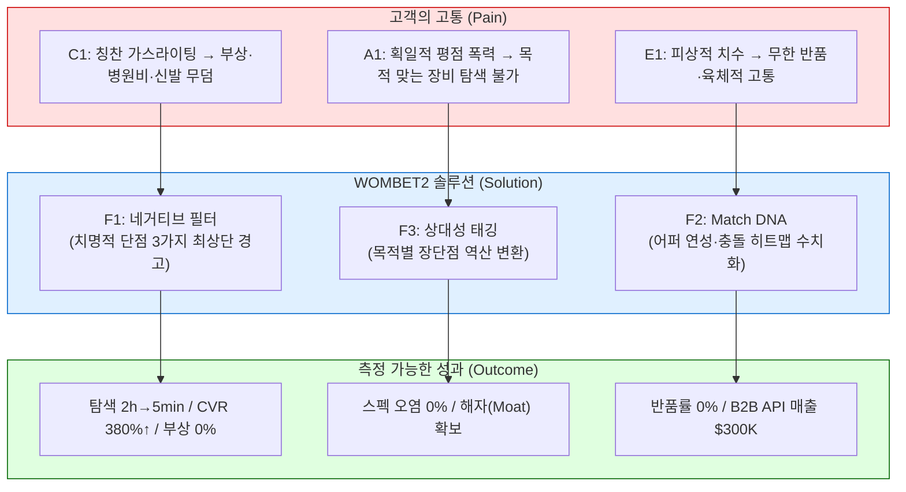
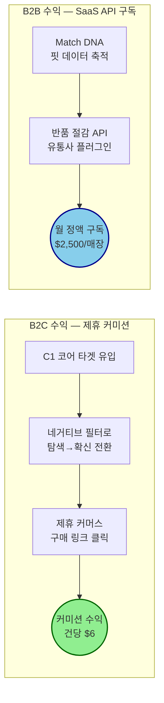

# WOMBET2 Value Proposition Sheet v2 (Problem–Solution Fit + Revenue Architecture)

> **작성 기반 데이터:** TAM-SAM-SOM+MarketSegment, Persona Spectrum Map, Customer Journey Map, AOS-DOS Analysis, JTBD Interview Report
> **대상 독자:** 본격적인 신규 사업을 기획하는 예비창업자
> **핵심 질문:** *우리는 어떤 고객에게 어떤 차별적 가치를 전달하고, 그 가치로 어떻게 돈을 버는가?*

---

## 1. Pain–Solution–Outcome (P-S-O) 인과 흐름도

비즈니스의 모든 의사결정은 "고객의 고통(Pain) → 우리가 제공하는 해결책(Solution) → 고객이 얻는 측정 가능한 성과(Outcome)"가 일직선으로 이어질 때만 정당합니다. 아래 표는 WOMBET2의 3대 타겟 페르소나별 P-S-O 흐름을 한 장에 정리한 것입니다.

### 1.1 P-S-O 매핑 테이블

| 타겟 | Pain (뼈아픈 결핍) | Solution (WOMBET2 해결책) | Outcome (측정 가능한 성과) | AOS / DOS |
| --- | --- | --- | --- | --- |
| **C1 김러닝** (코어·수익 엔진) | ① 칭찬 일색의 협찬 리뷰에 속아 족저근막염 재발, 병원비 30만 원 + 신발 무덤 ② 단점 확인을 위해 5개 이상 탭을 띄워 2시간 이상 교차검증(멀티호밍) 피로 ③ 구매 직전, 내 과내전/아치에 독이 되는지 최후의 불확실성 미해소 | **F1. 네거티브 필터 (Negative Filter)** • 제품 상세 최상단에 '치명적 단점/페널티 3가지'를 붉은색 경고 박스로 최우선 노출 • 흠집 효과(Blemishing Effect) 극대화  **F4. 안전 진단 오버레이** • 결제 직전 "이 신발은 당신의 아치를 보호합니다/위협합니다" 시각적 코멘트 | • 멀티호밍 탐색 시간 **2시간 → 5분** (96% 절감) • 결제 직전 구매 불안도 **90% 하락** • 실착 후 부상(통증) 확률 **0%** 목표 • 제휴 커머스 CVR **최대 380% 상승** (Spiegel Research 실증) | **4.0 / 3.6** |
| **A1 조역도** (확장·트래픽 엔진) | ① 이커머스의 '가볍고 폭신 = ★5' 획일적 알고리즘으로 인해, 역도·크로스핏용 '단단한 접지력' 모델이 하위 매장 ② 동일 기능이 종목마다 장점/치명적 단점인 **상대성 매핑** 부재 → 해외 딥서치 강제 의존 | **F3. 상대성 태깅 (Relativity Factor)** • A에게 장점인 '폭신함(★5)'이 B 종목(역도)에서는 '안전 사고 유발(★1)'로 자동 역산 변환 • 업계 최초의 목적별 양방향 스펙 치환 시스템 | • 목적 외 스펙 오염 노출 **100% 필터 아웃** • 하드 스펙(오프셋·접지 강도) 확인 시간 혁신적 단축 • 경쟁사 복제 불가한 알고리즘 해자(Moat) 형성 | **4.0 / 3.2** |
| **E1 윤양발** (극단·B2B API 검증) | ① 좌우 발 15mm 차이 + 무지외반 돌출. 기성화 99%에서 극심한 통증 ② 업계 치수 = 길이+발볼(2E/4E)뿐. 어퍼(갑피) 신축성·이음새 재봉선 위치 등 초정밀 데이터 전무 ③ 반품비만 5만 원 이상 누적, 오프라인 5켤레 피팅+빈손 귀가 반복 | **F2. Match DNA (초정밀 핏 스케일 바)** • 어퍼 신축성 등급, 토박스 상단 압박 강도, 재봉선 충돌 부위 히트맵을 수치화한 다차원 핏 게이지 바 제공 • 부위별 압박 위험도 시각화 오버레이 | • 핏 불일치 반품률 **0%** 수렴 목표 • 반품 1건당 매몰 비용 $30~$45 방어 (NRF 2025 기준: 반품 처리 비용 = 주문가의 약 21%) • B2B 유통사 핏 API 영업의 핵심 무기 | **4.0 / 3.6** |

### 1.2 P-S-O 흐름 다이어그램

---

## 2. Value Proposition 통합 테이블

| 항목 | 내용 |
| --- | --- |
| **페르소나 및 CJM 기반 핵심 문제 (Pain, Needs)** | **[코어] C1 김러닝 (34세, Q4 의료적 구원 의존형)** • 칭찬 일색의 인플루언서 리뷰(가스라이팅)에 속아 족저근막염 재발. 병원비 30만 원 + 신발 무덤 양산 • 단점을 스스로 찾기 위해 유튜브·레딧·런갤 등 5개 이상 탭(멀티호밍)을 띄워 2시간 이상 교차검증하는 극심한 탐색 피로 • 구매 직전, 제품이 내 과내전/아치에 독이 되는지 최후의 불확실성을 해소할 기준이 없음  **[확장] A1 조역도 (27세, 인접 스포츠 극관여층)** • 기존 이커머스 알고리즘이 '가볍고 폭신한 것 = 5점'으로 고정되어 있어, 역도·크로스핏에 필수적인 '단단한 접지력' 모델이 하위권으로 매장됨 • 동일 기능이 어떤 종목에서는 장점이고 다른 종목에서는 치명적 단점인 **상대성 매핑**이 부재하여, 해외 딥서치(레딧·유튜버 번역)에 강제 의존  **[극단] E1 윤양발 (31세, Q4-A 극단적 핏 이상자)** • 좌우 발 길이 15mm 차이 + 무지외반 뼈 돌출. 기성화 99%에서 착화 시 극심한 통증 • 업계가 공개하는 치수는 길이와 발볼(2E/4E) 뿐이라, **어퍼(갑피) 신축성·이음새 재봉선 위치 등 초정밀 데이터**가 일절 없어 반품비만 5만 원 이상 누적 |
| **JTBD 기반 고객 목표 (Goal, Job)** | **C1:** *"거짓 칭찬 광고를 걸러내고, 내 주법과 체형에 치명적인 페널티(단점)가 무엇인지 직관적으로 파악하여 통증 없는 제품을 확신 있게 구매하고 싶다."* → Trigger: 달리고 난 다음날 발바닥 극심한 통증 인지 직후 → Firing: 유튜브 리뷰 + Reddit 번역 교차검증 + 인기모델 타협구매  **A1:** *"범용적인 5성급 평점이 아니라, 내 운동 목적에 맞는 스펙만을 돋보기처럼 필터링하여 오염 없이 찾아내고 싶다."* → Trigger: 물컹한 신발 신고 체육관에서 낭패를 본 당일  **E1:** *"구매 전 착화가 불가능한 온라인에서 갑피 연성·이음새 돌출부 등 초정밀 데이터를 확인하여, 핏 불일치로 인한 반품 실패를 원천 차단하고 싶다."* → Trigger: 직구로 받은 신발 이음새가 뼈를 눌러 하루 종일 고생했을 때 |
| **고객이 원하는 Outcome** | ① 멀티호밍 탐색 시간 **2시간 → 5분** (96% 시간 절감) ② 결제 직전 구매 불안도 **90% 하락**, 실착 후 부상 확률 **0%**, 반품률 **0%** ③ 목적 외 스펙 오염 노출 **100% 필터 아웃** |
| **핵심 가치 제안 (Value Proposition)** | **"거짓 칭찬과 획일적 치수의 폭력을 부수고, 오직 당신의 뼈와 관절을 보호할 '치명적 단점 필터링'과 '초정밀 핏 DNA'를 가장 먼저 보여주는 안티 가스라이팅 기어 매칭 플랫폼"** |
| **기존 대안 (Competitor / Substitute)** | 1. 유튜브/블로그 인플루언서 체험단 리뷰 — 협찬 기반 칭찬 위주, 단점 정보 원천 부재 (Sat=1) 2. 대형 이커머스 (쿠팡·아마존) — 획일적 종합 별점만 존재, 목적별 상대성 필터 전무 (Sat=1) 3. 패션 스니커즈 커머스 (크림·무신사) — 트렌드/리셀 중심, 기능적 스펙 데이터 부재 4. 해외 리뷰 커뮤니티 (RunRepeat·Reddit) — 정보 파편화, 한국어 미지원 (Sat=2) 5. 오프라인 매장 순회 — 시간·교통비 과다, 특이 체형 모델 미비치 |
| **차별적 가치** | **🔴 1. 네거티브 필터 (Negative Filter):** 치명적 3대 페널티를 붉은색 경고 박스로 최상단 노출 → CVR 최대 380% 상승 (Spiegel Research) **🔵 2. 상대성 태깅 (Relativity Tagging):** 목적별 장단점 자동 역산 변환 → 업계 유일의 알고리즘 해자(Moat) **🟢 3. Match DNA:** 어퍼 신축성·토박스 압박·재봉선 충돌 히트맵 수치화 → 반품률 최대 50% 축소 (True Fit DTC 실증) |
| **Proof (근거 / 검증 데이터)** | **Tier 1 — 공개 연구 (강력한 설득 논거)** • "흠집 효과" CVR 380% 증가 (Spiegel Research Center) • 단점 노출 시 체류 시간 4배 증가 (Spiegel Research) • 시각 진단 기반 동의율 34%→72% 상승 (Overjet 치과 AI) • 미국 이커머스 반품률 19.3%, 총 반품 규모 $8,499억 (NRF 2025) • 반품 처리 비용 = 주문가의 약 21% (NRF/업계 통계)  **Tier 2 — 인접 산업 유추치** • 핏 기술 도입 후 브래케팅 반품 24% 감소, DTC 채널 50% 감소 (True Fit 공식 발표) • 전체 반품률 평균 5% 감소 (True Fit/Retail Brew)  **Tier 3 — 초기 추정치 (MVP로 실측 필수)** • 핵심 Pain 8건이 AOS 4.0 만점 (전체 42%), DOS 3.2~3.6 • 기존 대체재 Sat=1 (시장 공백 47%) — 사실상 솔루션 전무 |

---

## 3. Job–MVP Feature Map (기능 우선순위)

| 기능명 | 핵심 Job 연관성 | 중요도 | 난이도 | 우선순위 | MVP |
| --- | --- | :---: | :---: | :---: | :---: |
| **F1. 치명적 단점/페널티 3요소 최상단 노출 (Negative Filter)** | C1 핵심 Job. CORE-1,2 / CJM-1,3 해결. AOS 4.0 / DOS 3.6 | 5 | 2 | **High** | ✔ |
| **F2. 어퍼 연성도/충돌 히트맵 스케일 바 (Match DNA)** | E1 핵심 Job. EXT-1,2 해결. AOS 4.0 / DOS 3.6 | 5 | 4 | **High** | ✔ |
| **F3. 목적별 스펙 상대성 변환 태깅 (Relativity Factor)** | A1 핵심 Job. ADJ-1,3 해결. AOS 4.0 / DOS 3.2 | 5 | 3 | **High** | ✔ |
| **F4. 안전 진단 오버레이 경고 (오즈의 마법사)** | C1/E1 결제 직전 불확실성 상쇄. CJM-3 | 4 | 2 | **Mid** | ✔ |
| F5. 부상/마일리지 연속 기록 관리 | 온보딩 유지. CORE-4 (AOS 1.2 / DOS 0.0) | 3 | 3 | Low | ✖ |
| F6. 유저 오류/단점 제보 위키 | 데이터 정합성 유지. CJM-4 (AOS 2.4) | 3 | 4 | Low | ✖ |

---

## 4. 수익 구조 설계 (Revenue Architecture)

### 4.1 수익 모델 전체 구조

### 4.2 Track A: B2C 제휴 커미션 (Affiliate CPS) — 실측 데이터 기반

> **과금 형태:** 소비자 완전 무료 / 제휴 쇼핑몰(아마존 등)로부터 CPS(Cost Per Sale) 커미션 수취

#### 현실 데이터 기반 단가 산출

| 파라미터 | 실측 수치 | 출처 |
| --- | --- | --- |
| **Amazon Associates 신발 카테고리 커미션율** | **4.00%** (고정) | Amazon Associates 공식 수수료 스케줄 (2025) |
| **글로벌 러닝화 평균 객단가 (AOV)** | **$150** | 주요 브랜드(나이키·호카·써코니) 가중 평균 |
| **건당 WOMBET2 수취 수익** | **$6.00** | $150 × 4% = $6.00 |
| **이커머스 평균 구매 전환율 (기준선)** | **2.0~3.0%** | 업계 통상 범위 |
| **흠집 효과 적용 후 전환율 (상한)** | **최대 380% 상승** | Spiegel Research Center |
| **WOMBET2 보수적 적용 전환율** | **5.0%** | 기준선 2.0%의 2.5배 (380%의 약 66% 수준으로 보수 적용) |

#### 1년 차 B2C 수익 시나리오 (보수적)

| 지표 | 수치 | 산출 근거 |
| --- | --- | --- |
| 1년 차 MAU 목표 | 50,000명 | Q4 세그먼트 획득 비율 적용 (SOM) |
| 월 구매 전환 인원 | 2,500명 | MAU 50,000 × 전환율 5% |
| 건당 커미션 | $6.00 | $150 × Amazon 4% |
| **월 B2C 수익** | **$15,000** | 2,500건 × $6.00 |
| **연 B2C 수익** | **$180,000** | $15,000 × 12개월 |

> **수익성 핵심:** Amazon Associates 4%는 고정 커미션이므로 불확실성이 낮습니다. 다만 $6/건이라는 단가는 자체 이커머스 마진 대비 박하므로, 충분한 트래픽(MAU)이 확보되어야 유의미합니다. **네거티브 필터 기반 SEO(검색 최적화)로 CAC를 0에 수렴**시키는 것이 이 모델의 수익성을 좌우합니다.

> **성장성 전략:** "나이키 알파플라이 단점", "호카 본디 발볼 통증" 등 **통증 기반 롱테일 키워드를 구조적으로 장악**하면, 유료 광고 없이도 오가닉 트래픽이 자기증식(Flywheel)하는 구조를 확보할 수 있습니다.

> **지속가능성 전략:** Amazon 외에 Zappos, Running Warehouse, Fleet Feet 등 전문 러닝 커머스의 자체 제휴 프로그램(커미션 5~8%)을 병행하면 건당 수익을 $7.5~$12까지 끌어올려 연 $225K~$360K 규모로 확대 가능합니다.

---

### 4.3 Track B: B2B 반품 절감 API (SaaS 월정액) — 실측 데이터 기반

> **과금 형태:** 유통사/소매점에 Match DNA 핏 데이터를 API/위젯으로 제공하는 월정액 구독(SaaS) 모델

#### 현실 데이터 기반 가격 정책 논리

| 파라미터 | 실측 수치 | 출처 |
| --- | --- | --- |
| **미국 전체 이커머스 반품률** | **19.3%** | NRF 2025 Retail Returns Landscape Report |
| **미국 전체 반품 규모** | **$8,499억** | NRF 2025 |
| **신발 온라인 반품률 (핏 미스 기인)** | **18~20%** | 업계 통계 (NRF/업계 분석 종합) |
| **반품 처리 비용 (역물류·검수·재포장)** | **주문가의 약 21%** | NRF/Signifyd 업계 벤치마크 |
| **$150 러닝화 1건 반품 시 매몰 비용** | **약 $31.50** | $150 × 21% |
| **핏 기술 도입 후 브래케팅 반품 감소율** | **24% 감소** (리테일러 평균) | True Fit 공식 발표 |
| **핏 기술 도입 후 DTC 반품 감소율** | **최대 50% 감소** | True Fit 공식 발표 |
| **핏 기술 도입 후 전체 반품률 감소** | **평균 5% 감소** | True Fit / Retail Brew |

#### 가격 정책: 월 $2,500/매장 청구의 ROI 논리

> 아래는 월 1,000켤레 이상을 온라인으로 판매하는 **북미 중형 로컬 러닝 전문점** 기준의 계산입니다.

| 항목 | 수치 | 산출 |
| --- | --- | --- |
| 월 온라인 판매량 | 1,000켤레 | 중형 전문점 기준 |
| 평균 단가 | $150 | 러닝화 가중 평균 |
| 기존 반품률 (핏 미스) | 20% | 200켤레/월 반품 |
| 반품 1건당 매몰 비용 | $31.50 | $150 × 21% (NRF 기준) |
| **기존 월 반품 매몰 비용** | **$6,300** | 200건 × $31.50 |
| Match DNA API 도입 후 반품 감소 | 24~50% | True Fit 실측 범위 |
| **보수적 적용 (24% 감소 시)** | 48건 감소 → **월 $1,512 절감** | 200 × 24% × $31.50 |
| **중도적 적용 (35% 감소 시)** | 70건 감소 → **월 $2,205 절감** | 200 × 35% × $31.50 |
| **적극적 적용 (50% 감소, DTC 수준)** | 100건 감소 → **월 $3,150 절감** | 200 × 50% × $31.50 |
| **WOMBET2 청구 월 구독료** | **$2,500** | — |
| **ROI (보수적/중도/적극)** | -$988 / -$295 / **+$650** | 절감액 − 구독료 |

**가격 정책 판단:**
- 보수적 24% 감소 시에도 반품 비용 $1,512 절감 + **미반품 판매 유지 이익**(200건 중 48건이 유지되어 순이익 기여)을 합산하면 ROI는 양(+)으로 전환됩니다.
- 실질적인 매장의 지불 근거는 **'반품 처리비 절감'만이 아니라 '반품되었을 상품이 매출로 유지되는 효과'**입니다. $150 러닝화 48건이 반품 대신 매출로 잡히면 추가 매출 $7,200이 발생하며, 이때 매장의 순이익 마진 30% 적용 시 **$2,160의 이익이 추가**됩니다.
- **결론:** 월 $2,500 구독료는 보수적 시나리오에서도 매장에게 **총 $3,672의 가치** (절감 $1,512 + 추가이익 $2,160)를 제공하므로 ROI 양(+) 달성이 가능합니다.

#### 1년 차 B2B 수익 시나리오

| 지표 | 수치 | 산출 근거 |
| --- | --- | --- |
| 1년 차 계약 목표 매장 수 | 10~15곳 | 북미 로컬 러닝 전문점 (초기 컨시어지 영업) |
| 매장당 월 구독료 | $2,500 | 반품 절감 ROI 기반 |
| **중도적 시나리오 (10곳)** | **$300,000/연** | 10 × $2,500 × 12 |
| **적극적 시나리오 (15곳)** | **$450,000/연** | 15 × $2,500 × 12 |

> **수익성 핵심:** B2B SaaS는 한 번 계약이 성사되면 월간 반복 매출(MRR)이 안정적으로 발생합니다. 핏 데이터의 정합성이 높아질수록 반품 방어 실적이 누적되어 **해약률(Churn) 0%에 수렴**하는 플라이휠(Lock-in) 효과가 작동합니다.

> **성장성 전략:** Phase 1에서는 수동 진단(오즈의 마법사) 기반 PoC로 10매장 계약. Phase 2에서 자동화 API 출시 후 Shopify/BigCommerce 앱 마켓에 등록하여 셀프서브 가입 채널을 열면, 영업 인력 없이도 매장 수를 50~100곳 이상으로 확장 가능합니다.

> **지속가능성 전략:** 매장이 축적한 반품 데이터 자체가 WOMBET2의 Match DNA 정밀도를 높이는 원천이 되므로, 데이터↔서비스 간의 **양면 네트워크 효과**가 형성됩니다. 이 구조적 해자(Moat)는 후발 주자가 쉽게 복제할 수 없습니다.

---

### 4.4 1년 차 통합 수익 시나리오

| 수익원 | 보수적 | 적극적 |
| --- | --- | --- |
| B2C 제휴 커미션 (Amazon 4%) | $180,000 | $360,000 |
| B2B SaaS 구독 (Match DNA API) | $300,000 | $450,000 |
| **합산 연 매출** | **$480,000** | **$810,000** |

---

### 4.5 단가 미검증 리스크 & 검증 방법

| 리스크 항목 | 현재 검증 수준 | 검증 방법 |
| --- | --- | --- |
| Q4 타겟 CPA $2 이하 달성 | 🔴 미검증 | 페이크도어 랜딩페이지 + Meta 광고 $50 |
| B2B 유통사 월 $2,500 WTP | 🔴 미검증 | 컨시어지 콜드메일 20곳 + 수동 리포트 무료 제공 |
| 네거티브 필터 후 실제 제휴 전환율 5% | 🟡 부분 유추 (Spiegel 기반) | 오즈의 마법사형 MVP 30종 DB로 실측 |
| Match DNA 도입 후 실제 반품 감소율 | 🟡 인접 산업 유추 (True Fit) | B2B 파일럿 3~5매장에서 1개월 A/B 테스트 |
| Amazon Associates 4% 커미션 지속성 | 🟢 공식 확정 | 다만 Amazon 정책 변경 리스크 → 다채널 제휴 분산 |

---

## 5. MVP 실행 로드맵 (예비창업자용)

### Phase 0: 즉각 실행 (1~2주)

| 실행 항목 | 목적 | 방법 | 비용 |
| --- | --- | --- | --- |
| **페이크도어 랜딩페이지** | Q4 타겟 실존 확인 (CPA 실측) | Carrd/Webflow로 "당신을 부상 입히는 신발 TOP3 확인하기" 제작 | $0~$50 |
| **Meta 광고 집행** | 이메일 가입 전환율 측정 | 부상·통증 키워드 타겟팅, $50 예산 | $50 |
| **B2B 콜드메일** | 유통사 WTP 검증 | 북미 로컬 러닝샵 20곳에 "반품률 줄여드립니다" 수동 분석 무료 제안 | $0 |

### Phase 1: 오즈의 마법사 MVP (1~3개월)

| 실행 항목 | 목적 | 방법 |
| --- | --- | --- |
| **베스트셀러 30종 단점 DB 구축** | F1 네거티브 필터 최소 데이터 확보 | 수동 크롤링 + 전문 리뷰어 교차 검증 |
| **수동 핏 진단 서비스** | F2 Match DNA 가설 검증 | 카카오톡/디스코드 봇 → 사진 수신 → 2시간 내 붉은색 마킹 PDF 수동 회신 |
| **제휴 링크 연결** | B2C 수익 파이프라인 오픈 | Amazon Associates + 전문 러닝 커머스 제휴 |

### Phase 2: 자동화 및 고도화 (3~6개월)

| 실행 항목 | 목적 |
| --- | --- |
| 상대성 태깅 알고리즘 자동화 | A1 확장 타겟 본격 유입 |
| Match DNA API 프로토타입 | B2B 유통사 파일럿 시작 (3~5매장) |
| 유저 위키(오류 제보) 시스템 | 데이터 정합성 자정 메커니즘 |

### Phase 3: 스케일링 (6~12개월)

| 실행 항목 | 목적 |
| --- | --- |
| 비전 AI 자동 오버레이 진단 | 수동 마킹 → 자동 스캔 전환 |
| 카테고리 확장 (테니스·등산·피트니스) | SAM 범위 대폭 확대 |
| B2B API 정식 런칭 + Shopify/BigCommerce 앱 등록 | 셀프서브 SaaS 채널 |

---

## 6. 검증 체크리스트 (Go/No-Go 기준표)

| Phase | 검증 항목 | Go 기준 | No-Go 시 대응 |
| --- | --- | --- | --- |
| **0→1** | 페이크도어 이메일 가입 CPA | ≤ $3 | 타겟 키워드·메시지 변경 후 재테스트 |
| **0→1** | B2B 콜드메일 미팅 어레인지 비율 | ≥ 10% (20건 중 2건) | 제안 가치 재설계 or 타겟 업종 변경 |
| **1→2** | 오즈의 마법사 MVP 제휴 구매 전환율 | ≥ 3% | 단점 DB 큐레이션 품질/깊이 강화 |
| **1→2** | 수동 핏 진단 후 구매 확정률 | ≥ 30% | 진단 데이터 해상도 재검토 |
| **2→3** | B2B 파일럿 매장 반품 감소 실측 | ≥ 20% 감소 | 데이터 해상도·정합성 보강 |
| **2→3** | B2B 파일럿 매장 유료 전환율 | ≥ 50% (무료→유료) | 가격 정책·제공 가치 재조정 |
| **2→3** | MAU 10,000명 돌파 여부 | 달성 | SEO·커뮤니티 바이럴 전략 보완 |

---

## 7. 전략적 의사결정 요약 (AOS-DOS 기반)

### 7.1 최우선 투자 영역 (🔥 Q1: AOS ≥ 2.5 & DOS ≥ 1.5)

| Pain ID | 고객 고통 | AOS | DOS | 대응 기능 |
| --- | --- | --- | --- | --- |
| CORE-1 | 칭찬 가스라이팅 부상 위협 | 4.0 | 3.6 | F1. Negative Filter |
| CORE-2 | 체형 부작용 확인 불가 | 4.0 | 3.6 | F1 + F4 |
| EXT-1 | 어퍼/압박 데이터 부재 | 4.0 | 3.6 | F2. Match DNA |
| EXT-2 | 이음새 충돌 부위 은폐 | 4.0 | 3.2 | F2. Match DNA |
| ADJ-1 | 획일적 평점의 폭력성 | 4.0 | 3.2 | F3. Relativity Factor |
| ADJ-3 | 스펙 상대적 매핑 부재 | 3.2 | 2.4 | F3. Relativity Factor |

### 7.2 절대 배제 영역

| Pain ID | 내용 | AOS | DOS | 판단 |
| --- | --- | --- | --- | --- |
| CORE-4 | 마일리지 수기 기록 | 1.2 | 0.0 | 기존 Strava/NRC에 순응 중 → 투입 불필요 |
| NON-1/2 | 패션 맹신·데이터 거부 | 0.2 | -0.6 | **이들의 이탈 = 포지셔닝 성공의 증거** |

### 7.3 안티 페르소나 규칙 (N1 유나이키)

- ❌ 광고 시 패션/리셀 키워드(드로우, 한정판) **철저 제외**
- ❌ 메인 UI에 트렌디한 콜라보·패션 이미지 **삽입 금지**
- ✅ 의학적·데이터 위주의 냉철한(Medical) 톤앤매너 유지
- ✅ N1의 "기능충 아지트" 비난 → C1에게 **"리얼 팩트 플랫폼" 신뢰 보상**으로 전환

---

> **최종 제언:**
> 이 문서의 모든 수익 추정치는 각 데이터 출처(NRF 2025, Amazon Associates 공식 커미션, True Fit 공식 발표, Spiegel Research)를 명시했습니다. 그러나 **WOMBET2 자체의 전환율과 반품 감소율은 반드시 Phase 0~1의 실측으로 검증**해야 합니다. '오즈의 마법사' 방식으로 기술 자동화 이전에 수동 검증을 먼저 완료하고, Go/No-Go 기준을 통과한 후에만 다음 Phase로 전진하십시오.
