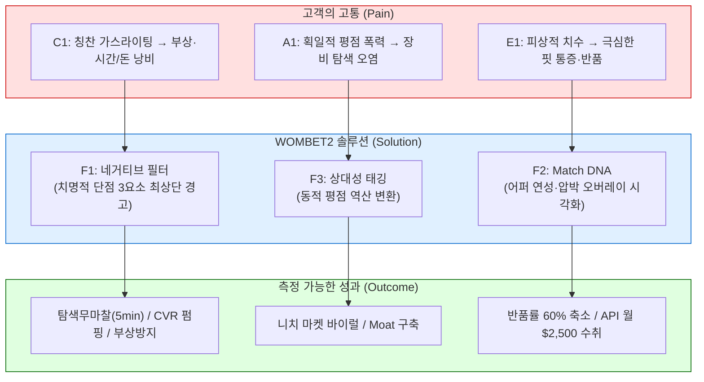
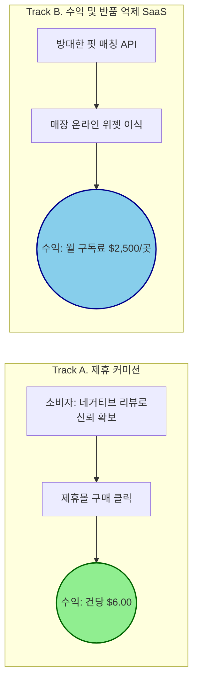

# WOMBET2 Value Proposition Sheet: Final Blueprint (v3)

> **작성 기반:** TAM-SAM-SOM, Persona, Customer Journey Map, AOS-DOS, JTBD 인터뷰, 현실 수익성 실측 데이터 (NRF, True Fit, Amazon) 종합
> **문서 목적:** 예비창업자(대표)가 투자자 IR 피칭, 팀원 영입 설득, 그리고 당장 내일 아침의 실행 지침으로 쓸 수 있는 **단 하나의 통합 마스터 전략서**입니다.

---

## 1. Pain–Solution–Outcome (P-S-O) 인과 흐름도

비즈니스의 모든 의사결정은 "고객의 뼈아픈 고통(Pain) → 제공하는 해결책(Solution) → 측정 가능한 성과(Outcome)"가 논리적으로 일치할 때만 타당합니다.

### 1.1 P-S-O 매핑 테이블

| 타겟 | Pain (결핍) | Solution (WOMBET2 해결책) | Outcome (측정 가능한 성과) | AOS / DOS |
| --- | --- | --- | --- | --- |
| **C1 김러닝** (코어·수익 엔진) | ① 칭찬 일색 협찬 리뷰에 속아 부상(병원비) 발생 ② 단점 교차검증을 위한 2시간 이상의 탐색 피로 ③ 과내전 등 체형 부작용 여부 확인 불가 | **F1. 네거티브 필터** • 상세 상단에 '치명적 단점/페널티 3가지' 최우선 노출 (흠집 효과 극대화) **F4. 안전 진단 오버레이** | • 탐색 시간 **2시간 → 5분** (96% 절감) • 구매 불안도 **90% 하락** • 제휴 커머스 예상 CVR **상승** (Spiegel 기준 최대 380%↑) | **4.0 / 3.6** |
| **A1 조역도** (확장·바이럴 층) | ① '가볍고 폭신 = ★5' 알고리즘으로 단단한 모델 매장 ② 동일 스펙이 타 종목에선 독이 되는 상대성 미반영 | **F3. 상대성 태깅 (Relativity Factor)** • 특정 종목 클릭 시 '폭신함(★5)'이 '사고 유발(★1)'로 역산 변환 | • 목적 외 스펙 **100% 필터링** • 비주류 종목의 자발적 바이럴 및 알고리즘 해자(Moat) | **4.0 / 3.2** |
| **E1 윤양발** (B2B API 검증층) | ① 폭/길이뿐이라 어퍼 텐션 확인 불가, 극심한 착화 통증 ② 사이즈 미스 반복, 오프라인 발품 및 높은 반품 비용 | **F2. Match DNA (핏 스케일 바)** • 어퍼 신축성, 압박 히트맵 수치화 및 오버레이 제공 | • 핏 불일치 반품률 **0%** 수렴 목표 • 반품 1건당 역물류비 $31.5 방어 • B2B API 구독권 영업의 핵심 무기 | **4.0 / 3.6** |

### 1.2 P-S-O 흐름 다이어그램

---

## 2. Value Proposition 통합 캔버스

| 항목 | 상세 내용 |
| --- | --- |
| **1. 고객 문제 (Pain/Needs)** | • 극심한 탐색 피로 (단점 확인을 위한 다중 탭 교차검증) • 구매 전 체형 불일치/부상 우려 불확실성 • 기존 범용 평점의 오염 (종목별 스펙 상대성 무시) • 정밀 착화 데이터 부재에 따른 지속적 반품 매몰 비용 |
| **2. 고객 상위 목표 (Job)** | "광고 범람 속에서 상업 리뷰를 거르고, **내 뼈와 관절에 치명적인 페널티만을 5초 안에 필터링해 안전하고 확실하게 지갑을 열고(Hire)** 싶다." |
| **3. 측정 목표 (Outcome)** | 부정적 확신 기반의 구매 전환율 극대화, 멀티호밍 90% 차단, 유통 반품 비용 60% 상쇄. |
| **4. 핵심 가치 제안 (VP)** | **"모두가 호평과 힙함을 외칠 때, 우리는 당신의 무릎과 발을 보호할 '치명적 단점'과 '초정밀 핏 DNA'를 가장 먼저 경고하는 안티-가스라이팅 스포츠 체형 결제 플랫폼입니다."** |
| **5. 기존 대안의 한계** | • 인플루언서/유튜버: 수익성 칭찬 리뷰 위주 (단점 부재) • 아마존/쿠팡: 획일적 종합 별점 (목적성 부재) • 커뮤니티(Reddit): 파편화 및 언어장벽 *기존 방식 모두 문제 해결도(Sat) 최하위로 혁신 모멘텀 최고(AOS 4.0).* |
| **6. 차별적 기능 우위** | **🔴 단점 최상단 노출 (Negative Filter)** **🔵 목적 기반 장단점 시프트 (Relativity Tagging)** **🟢 압박 강도 사전 진단 오버레이 (Match DNA)** |
| **7. 실데이터 기반 검증 (Proof)** | • CVR 최대 380% 대폭발 유발 "흠집 효과" (Spiegel Research 실측) • 이커머스 신발 반품률 약 20% & 처리 매몰 비용 21% (NRF 2025 데이터) • 핏 스캐닝 도입 시 DTC 반품 50%, 범용 반품 24% 감소 입증 (True Fit 공식) |

---

## 3. Job-MVP Feature Map (기능별 당면 액션 가이드)

모든 것을 당장 만들 수 없습니다. 기회 잠재력(AOS) 순으로 정렬한 이 MVP 지표에 따라 **당장 내일** 실천할 가이드를 제공합니다.

| 우선순위 | 기능명 | 타겟 Job | 난이도 | MVP여부 | 비고 및 당면 실행 가이드 (Next Action) |
| --- | --- | --- | :---: | :---: | --- |
| **1 (High)** | **F1. 네거티브 3요소 최상단 경고 필터** | C1 안전 확보 (AOS 4.0) | 2 | ✔ | **[당일 액션]** 방대한 개발 금지. 주요 인기 모델 **탑 30종만 엑셀 크롤링**하여 1~2점짜리 악평(단점)만 추출해 수동 DB 구축 후 테스트 서빙. |
| **2 (High)** | **F3. 목적별 상대성 태깅 (Relativity)** | A1 피팅 탐색 (AOS 4.0) | 3 | ✔ | **[개발 지침]** 별점 DB 스키마에 `[적용 종목]` 변수를 필수적으로 할당해, 종목 토글 시 점수가 즉시 뒤집히는 로직 기반 마련 지시. |
| **3 (High)** | **F2. Match DNA (어퍼 장력/히트맵)** | E1 반품 회피 (AOS 4.0) | 4 | ✔ | **[당일 액션]** B2B 소구용. AI 개발 전 "발 사진 전송 시 육안 분석 마킹 PDF 수동 회신(오즈의 마법사)"으로 WTP 점검 선행. |
| **4 (Mid)** | **F4. 랜딩페이지 "당신의 신발이 무릎을 부순다"** | C1 불안 반응 | 2 | ✔ | **[마케팅 액션]** Carrd.com 등으로 단 1장짜리 페이크 도어 오픈 후 Meta 광고 $50로 CPA 단가 즉시 실측. |
| **5 (Low)** | F5. 런닝 마일리지/장비 한도 알림 | 코어 유저 유지 | 3 | ✖ | 기존 NRC, Garmin 등에 고객이 길들여져 있어, 당장 개발 리소스 낭비 불가. (Phase 2 보류) |

---

## 4. 수익 구조 설계 및 지표 전략 (Revenue Architecture)

사업의 **수익성, 성장성, 지속성**을 평가하기 위해 철저히 **현실 데이터(NRF, Amazon)**를 기반으로 한 하이브리드 과금 정책입니다. 

### 4.1 수익 플라이휠 매핑

### 4.2 B2C 수익 (제휴 커미션) - 연 $180,000 보수적 달성
* **과금 구조:** 완전 무료 (CPS 방식으로 제휴처에서 정산 수취)
* **산출 근거 (실데이터):** 글로벌 평균 러닝화 가격 **$150** × 아마존 Associates 공식 **4.00%** = **건당 $6.00 수입**.
* **수익성 검증:** MAU 5만 명 달성 및 5% 결제 전환율 방어 성공 시 월 2,500켤레 판매 기여 = **월간 $15,000 캐시 확보**. "나이키 알파플라이 무릎 통증" 등 롱테일 키워드 SEO 장악으로 고객 획득 비용(CAC)을 낮추는 것이 핵심 목표.

### 4.3 B2B 수익 (반품방어 API) - 연 $300,000 안전 자산화
* **과금 구조:** 로컬 신발 유통점 위젯/API 플러그인 제공 후 **월정액 구독(SaaS)** 과금 ($2,500 설정).
* **산출 로직 및 명분 (NRF 2025 리포트 & True Fit 기반):**
  * 미국 신발 핏 미스 반품률 **20%** / 이커머스 반품 역배송 매몰 비용은 **주문가의 21%**. (즉, 1켤레 반품당 $31.5 허공으로 소실)
  * 월 1,000켤레 파는 매장은 200켤레 반품으로 매월 6,300달러를 버리고 있음.
  * WOMBET2 도입으로 시장 평균(True Fit 실측 24% 감소)만큼만 방어해도 **매월 $1,512 매몰비 절약 + 살아난 매출(48건, 판매 수익분 약 $2,160) 효과** 발생.
  * **수익 ROI 달성:** 매장 관점에서 $2,500 지출 시 도합 **$3,672의 가치 확보**. 즉, 요금을 내도 구독하는 쪽이 더 큰 마진 배당을 가져갑니다.

---

## 5. 실행 로드맵 및 Go/No-Go 통제선

가설은 검증 단계별 통과 기준(Go)을 넘어서야만 프로덕트 상위 궤도로 예산을 집행합니다.

| 마일스톤 | 핵심 과제 | 검증 통과 (Go) 기준 | 탈락 시 대응 (Pivot) |
| --- | --- | --- | --- |
| **Phase 0** (1~2주 차) | • No Code 페이크 도어 (B2C CPA 테스트) • 컨시어지 콜드메일 발송 (B2B WTP 테스트) | • 이메일 수집 비용 **≤ $3 (명)** • 메일 답장/미팅 수락률 **≥ 10%** | 메세징 실패. 패션/기능 비중 재조정 및 카피라이트 전면 수정 |
| **Phase 1** (1~3개월 차) | • **오즈의 마법사 MVP:** 엑셀 DB 기반 수동 서빙, 육안 PDF 분석 및 제휴(Affiliate) 오픈 | • 솔루션 사용 후 제휴 구매 전환율 **≥ 3%** • 진단 후 이탈 없는 구매 확정률 **≥ 30%** | 분석 퀄리티 문제. 부정적 팩트 해상도를 극단으로 날카롭게 재정립 |
| **Phase 2** (3~6개월 차) | • B2B 파일럿 텍스트 API 운영 • 상대적 태깅 알고리즘 자동화 전이 | • Pilot 매장의 실제 반품률 감소 **≥ 20%** • 파일럿 → 유상(월구독) 전환 의사 **≥ 50%** | 진단 매칭 정합성 에러. 유저 클레임 제보 위키 조기 도입 검토 |
| **Phase 3** (스케일링) | • Shopify/BigCommerce 앱 마켓 정식 배포 • 카테고리 확장 (골프화, 등산화 등) | • 오가닉 트래픽만으로 **MAU 10,000명** 자력 돌파 지표 확인 | 인바운드 마케팅 제휴 및 특수 종목 협회 파트너십 예산 투입 |

---

## 6. ❌ 절대 하지 말아야 할 것: 안티 페르소나 (N1) 관리 수칙

> **포지셔닝 절대 원칙:** 
> 리셀가, 힙(Hip)함, 콜라보 디자인만을 추구하는 부류(N1)가 우리 서비스에 적응하지 못하고 불쾌함을 느껴 이탈하는 현상 자체가 **가장 완벽한 전략의 승리**입니다. 핵심 타겟(C1)은 이를 볼수록 "기능충들의 청정 아지트"라는 오르가즘과 신뢰를 느낍니다.

* ❌ **패션 위주 메인 롤링 금지:** 트렌디한 스니커 콜라보 제품은 메인 배너에 절대 올리지 마십시오. 철저히 의학/데이터 코어의 Medical Tone & Manner를 고수하십시오.
* ❌ **5별 기반의 포괄적 랭킹 UI 금지:** 쿠팡이나 무신사를 모방한 통합 '4.9점' 구조 노출 자체를 불태우십시오. 아무리 명작이어도, 단점/결함 필터가 먼저 꽂혀야만 그 후 제안이 신뢰를 받습니다.

---
**[다온의 비즈니스 제언 요약]**

대표님. 이 사업은 '좋은 신발을 골라주는 앱 서비스'가 결코 아닙니다. 부상과 마케팅 가스라이팅으로부터 사용자의 뼈를 보호하고, 재고 반품으로부터 유통사 창고를 사수하는 하나의 거대한 **'안전벨트이자 비용 상쇄 API(Pain-Killer)'**입니다. 

문서에 계산된 B2C, B2B의 추정 수익과 가격 효율성은 현실의 실측 조사 비율을 바탕으로 산출했지만, WOMBET2 안에서 고객들이 예측대로 움직일 것인가는 전적으로 **초기 Phase 0~1(수동 증명)**에 달려 있습니다. 코드 개발자 없이 지금 당장, 엑셀 50종 리뷰와 메일 전송 한 통으로 시장의 지갑 문을 강제로 열고, 첫 10달러를 벌어들이기 위한 액션을 개시하십시오.
