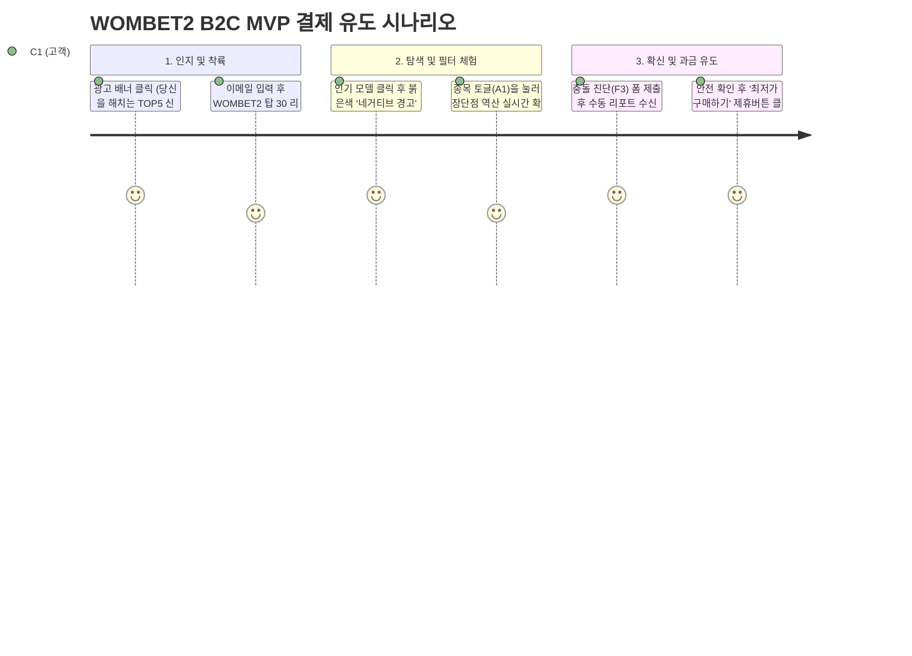

# WOMBET2 MVP 개발 목표 및 솔루션 기획 아웃라인 (Draft)

> **문서 목적:** 비즈니스 분석(TAM-SAM-SOM, AOS-DOS, JTBD 등)과 통합 Value Proposition(15_merged_VPS.md)을 바탕으로, 실제 소프트웨어를 개발하기 위한 **'매우 가볍고 뼈대만 남긴' 초기 제품 명세서(PRD Outline)**입니다.
> **문서 성격:** 개발자, 디자이너, 기획자가 길을 잃지 않도록 가장 중요한 '제품의 한계(Boundary)'와 '핵심 동작 모델'을 자비 없이 통제하는 실무 체크리스트입니다.

---

## 1. Product Core & Boundary (무엇을 만들고 무엇을 포기하는가)

MVP(최소 기능 제품)의 생명은 '하지 말아야 할 것'을 명확히 하는 데 있습니다. 1년 차 수익 모델(제휴 커미션 & B2B API) 검증에 기여하지 않는 모든 기능은 무자비하게 잘라냅니다.

| 항목 | DO (반드시 개발할 것) | DO NOT (절대 개발하지 않을 것) |
| --- | --- | --- |
| **데이터베이스** | 인기/베스트셀러 러닝화 **탑 30~50종**의 수동 단점 DB | 전체 브랜드 라인업 자동 크롤링 구축 (불필요) |
| **인증 / 계정** | **회원가입/로그인 없이** 100% 개방형으로 탐색 및 제휴 아웃바운드 클릭 유도 | 개인 프로필 페이지, 마일리지 연동 인증 (기기·Strava API 연동 금지) |
| **UI 컴포넌트** | 붉은색의 **치명적 단점/페널티 3요소** 최상단 노출 모듈 (네거티브 필터) | 종합 평점(예: 4.8 / 5.0)을 나타내는 노란색 별점 UI 완전 배제 |
| **피팅 진단 방식** | **오즈의 마법사형(수동) 핏 진단** 신청 폼 (카카오톡/이메일로 접수→사람이 회신) | 머신러닝/비전 AI 기반 자동 스캐닝 엔진 자체 개발 (1년 차 이후로 연기) |

---

## 2. Core Feature Specifications (핵심 솔루션 명세)

AOS/DOS 분석에서 4.0 만점을 기록한 상위 3가지 결핍 인자를 해결할 '소프트웨어 기능 단위'입니다.

### 🎯 F1. 네거티브 필터링 모듈 (Negative Warning Box)
*   **목적:** (C1 김러닝) 거짓 칭찬 가스라이팅을 돌파하고 신뢰감을 부여해 제휴 구매로 전환(CVR 상승).
*   **UI/UX 행동:**
    *   사용자가 특정 러닝화를 클릭하면, 가장 먼저 화면 최상단에 **경고 아이콘(⚠️)과 붉은색 박스**가 노출됨.
    *   내용: "이 모델은 훌륭하지만, **[과내전 사용자], [발볼 4E 이상 사용자], [착지 시 발뒤꿈치를 쓰는 사용자]**에게는 독이 될 수 있습니다."
*   **개발 포인트:**
    *   긍정 리뷰 노출 영역은 하단으로 완전히 내림.
    *   이 붉은 박스 바로 아래에 `[그래도 이 신발이 내 핏에 맞는지 진단하기]` 또는 `[안전 확인 완료 - 최저가 구매하기]` (제휴 링크) 버튼을 배치.

### 🎯 F2. 동적 스펙 상대성 변환 로직 (Relativity Engine)
*   **목적:** (A1 조역도) 획일적 평점을 부수고 "어떤 운동을 하는가"에 따라 장단점이 뒤바뀌는 구조 체감.
*   **UI/UX 행동:**
    *   화면 상단에 글로벌 토글 스위치 제공: `[ 🏃 러닝 모드 ]` ↔ `[ 🏋️ 리프팅/크로스핏 모드 ]`
    *   토글 전환 시, 방금 전 보던 동일 기어의 쿠션 스펙 점수 표기가 **[장점]에서 → [단점/위험]**으로 인터랙티브하게 애니메이션 됨 (애플리케이션 상태 변경).
*   **개발 포인트:**
    *   데이터베이스 내 스펙 컬럼의 값을 절대값이 아닌, **`Factor × 종목 가중치(Multiplier)`** 형태로 응답하게 하는 백엔드/프론트엔드 매핑 룰 필요.

### 🎯 F3. 수동 핏 진단 게이트웨이 (Match DNA - Wizard of Oz)
*   **목적:** (E1 윤양발) 어퍼 연성/이음새 히트맵을 제공하여 주문 전 반품 원인을 척결(B2B API의 가치 증명).
*   **UI/UX 행동:**
    *   상세 페이지 내 `[내 발 사진으로 충돌 위험부위 검사하기 (무료)]` 버튼 제공.
    *   클릭 시 구글 폼(Typeform) 또는 카카오톡 플러스친구 채팅방으로 아웃링크 연결.
*   **개발 포인트 (수동화):**
    *   시스템 구축은 '요청 접수 채널'까지만 만들면 끝. 진단 알고리즘 코드는 작성하지 않음.
    *   운영진이 사진을 받아 태블릿으로 이음새 마킹을 붉게 칠한 PDF 리포트를 2시간 내로 전송함.

---

## 3. Data Architecture (초기 DB 스키마 뼈대안)

데이터가 방대할 필요는 없습니다. MVP 성공을 위해 필요한 가장 얇은 구조입니다.

**Table 1: `Gears` (기어 원장)**
*   `gear_id` (PK)
*   `brand`, `model_name`, `thumbnail_url`
*   `affiliate_url` (Amazon 등 외부 제휴망 구매 링크)

**Table 2: `Negative_Factors` (네거티브 요인)**
*   `factor_id` (PK)
*   `gear_id` (FK)
*   `danger_category` (Enum: 아치, 쿠션, 이음새, 발볼 등)
*   `penalty_description` (예: "미드솔 외측 지지력 부족으로 무릎 바깥쪽 데미지 발생 가능")
*   `target_warning_persona` (해당 단점에 특히 취약한 족형 조건 태깅)

**Table 3: `Relativity_Rules` (동적 변환 룰)**
*   `rule_id` (PK), `factor_id` (FK)
*   `sport_type` (러닝, 크로스핏 등)
*   `severity_score` (1~5)

---

## 4. MVP User Flow (초기 유저 여정 시나리오)

---

## 5. Success Metrics (가설 검증을 위한 핵심 성과 지표 - KPI)

MVP 배포 후 1~2개월 차에 확인하고 Go/No-go를 결정할 실질적인 소프트웨어 런칭 지표입니다.

1. **상호작용 지표 (Relativity Toggle):**
    - 방문자의 **30% 이상**이 `[운동 종목 토글 스위치]`를 조작해 보는가? (A1 타겟 반응성 증명)
2. **리드(Lead) 발생 지표 (Match DNA 수동 신청):**
    - 네거티브 필터를 확인한 트래픽 중 **10% 이상**이 수동 핏 진단을 신청하는가? (E1/B2B 문제 심각성 증명)
3. **핵심 수익액 지표 (B2C CVR):**
    - 진단 리포트 열람 혹은 네거티브 필터 열람 후 하단 제휴 링크(Affiliate)를 눌러 실제 커머스로 넘어간(Outbound Clicks) 비율이 전체 인입의 **5.0% 이상**인가? (수익 보수적 달성선 증명)

---

> **기획자/개발자를 위한 다온의 코멘트:**
> "우리 시스템의 본질적인 기술적 해자(Technical Moat)는 '비전 AI'나 '화려한 3D 렌더링'에 있지 않습니다. `[데이터베이스 구조를 역산/상대평가 하도록 선형적으로 설계한 아키텍처]` 자체가 해자입니다. 가장 먼저 30개의 데이터를 엑셀에 올려두고, 프론트엔드에서 '클릭 시 단점에 붉은 형광펜을 칠해주는 UI'를 최우선으로 프로토타이핑 하십시오."
