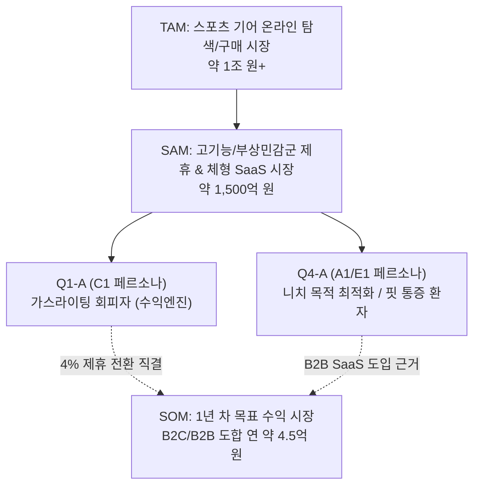
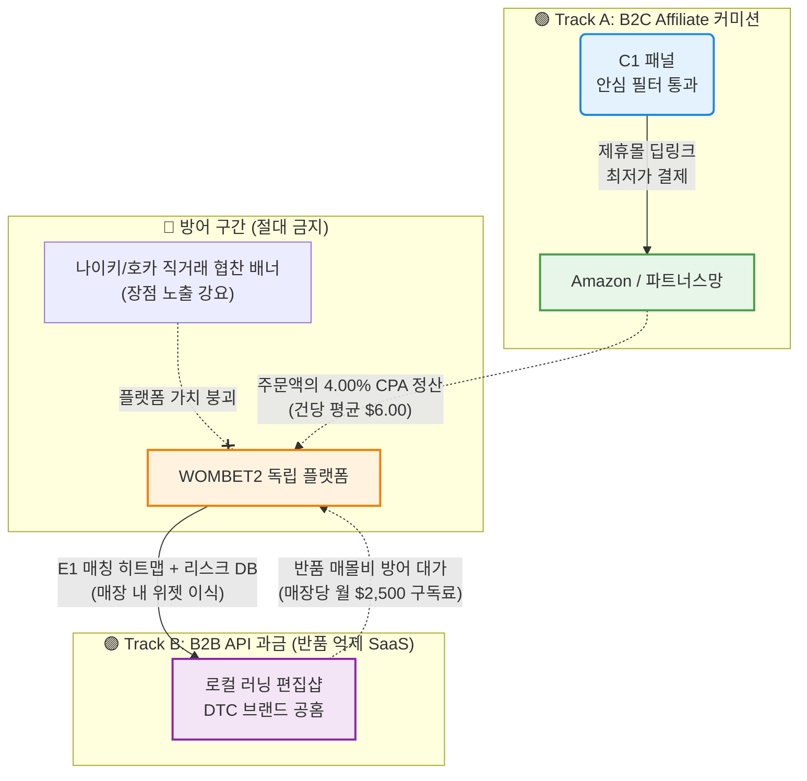

# 💡 WOMBET2 Value Proposition Sheet — Final Master V3

> **문서 버전:** Final Master V3 (비즈니스 분석 통합본)
> **통합 원본:** `15_merged_VPS.md` + `01_Biz-Analysis/` 전체 리서치 문서 10건 + `17_Job-MVP_Feature_Map.md`
> **작성 대상:** WOMBET2 서비스를 기획 중인 예비 창업자 및 초기 멤버
> **작성 목적:** 비즈니스 리서치(Porter's 5 Forces, 경쟁사 분석, 가치사슬, KSF, TAM-SAM-SOM, 페르소나, CJM, AOS-DOS, JTBD) 전체를 이 문서 하나에 직접 포함하여, *왜 이 시장인지, 누구에게, 어떤 본질적 가치를, 어떠한 차별성으로 제공하는지* 정의하고, 이를 실현하기 위한 MVP 개발 계획까지 **단일 핵심 문서로 관리**한다.

---

**🎯 엘리베이터 피치:** "칭찬 일색의 상업적 가스라이팅과 범용적 5점 평점의 폭력을 부수고, 오직 내 뼈와 관절을 보호할 '치명적 단점'만을 경고하는 스포츠 체형 결제 플랫폼"

**📣 포지셔닝 선언:** 우리는 세상 모두가 호평하고 힙(Hip)함을 외칠 때, **"당신의 족형과 운동 목적에는 이것이 최악의 장비가 될 수 있다"**고 서슴없이 필터링해 주는 독립(Neutral) 안전벨트이자 팩트체크 기어 솔루션이다.

---

## 📌 목차

| # | 섹션 | 내용 요약 |
|---|------|----------|
| Ⅰ | [Pain–Solution–Outcome 핵심 흐름도](#ⅰ-painsolutionoutcome-핵심-흐름도) | 고객 문제 → 솔루션 → 성과의 직관적 흐름 |
| Ⅱ | [타겟 & 문제 분석](#ⅱ-타겟--문제-분석) | 시장 환경(5 Forces/가치사슬) 및 핵심 고객 정의 |
| Ⅲ | [AOS–DOS 결합 매트릭스](#ⅲ-aosdos-결합-매트릭스) | 페르소나별 Pain 수치화 및 비즈니스 우선순위 산출 |
| Ⅳ | [JTBD 요약 카드](#ⅳ-jtbd-요약-카드) | 고객의 핵심 목표(Job)와 채택 시점의 4 Forces 동인 |
| Ⅴ | [Value Proposition Sheet (핵심 가치 제안)](#ⅴ-value-proposition-sheet-핵심-가치-제안) | 신뢰 확보와 구매를 촉진하는 솔루션 총괄표 |
| Ⅵ | [수익 구조 설계](#ⅵ-수익-구조-설계) | NRF/Amazon 실측 기반 B2C + B2B 하이브리드 수익 모델 |
| Ⅶ | [전략적 제언](#ⅶ-전략적-제언) | 예비 창업자를 위한 '버리기'와 '본질'에 대한 시니어의 조언 |
| Ⅷ | [MVP 제품 비전 및 포지셔닝](#ⅷ-mvp-제품-비전-및-포지셔닝) | MVP 정의, 북극성 지표, Must-Have 스펙 명세 |
| Ⅸ | [Job-Feature Map & MVP 기능 명세](#ⅸ-job-feature-map--mvp-기능-명세) | 기능 우선순위, 구현 난이도, 실제 리스크 방어 전략 |
| Ⅹ | [MVP 성공 측정 기준 & Next Steps](#ⅹ-mvp-성공-측정-기준--next-steps) | KPI 목표 및 마일스톤별 통제 가이드 |

---

## Ⅰ. Pain–Solution–Outcome 핵심 흐름도

우리 솔루션이 고객의 근본적 문제(부상 불안/탐색 피로)를 어떻게 해결하고 어떤 재무적 성과 가치를 창출하는지 보여주는 직관적 흐름입니다.

```mermaid
flowchart LR
    %% 스타일 정의
    classDef pain fill:#FFEbee,stroke:#EF5350,stroke-width:2px;
    classDef solution fill:#E8F5E9,stroke:#66BB6A,stroke-width:2px;
    classDef outcome fill:#E3F2FD,stroke:#42A5F5,stroke-width:2px;

    subgraph Pain ["🔥 Pain (고객의 치명적 결핍 및 불안)"]
        direction TB
        P1("칭찬 위주 리뷰 가스라이팅으로 인한 부상 및 비용 낭비"):::pain
        P2("종목 특성을 배제한 '획일적 5별점'이 낳는 기어(Gear) 사고"):::pain
        P3("범용 치수(mm) 한계로 인한 극심한 피팅 통증 및 유통사 반품"):::pain
    end

    subgraph Solution ["💡 Solution (WOMBET2 핵심 제안)"]
        direction TB
        S1("치명적 단점 3요소 최상단 붉은색 경고 노출 (Negative Filter)"):::solution
        S2("운동 종목 변경 시 장/단점 점수가 뒤바뀌는 알고리즘 (Relativity Factor)"):::solution
        S3("어퍼 장력 및 이음새 충돌 부위 히트맵 사전 진단 (Match DNA)"):::solution
    end

    subgraph Outcome ["🎯 Outcome (유저/유통사 체감 최종 성과)"]
        direction TB
        O1("탐색시간 단축 & 의도적 단점 노출에 따른 제휴 CVR 상승 (최대 380%)"):::outcome
        O2("비주류 종목 기어 발굴 최적화 및 맹목적 상업 리뷰어 배제"):::outcome
        O3("핏 불일치 반품률 60% 절감 방어, B2B 매장당 구독료 과금"):::outcome
    end

    Pain ==> Solution ==> Outcome
```

---

## Ⅱ. 타겟 & 문제 분석

### 🏭 1. 시장 환경 — 왜 이 시장인가?

#### 1-1. 산업 트렌드 및 기회 감지 (Porter's 5 Forces 기반)

| Porter's Force | 강도 | 핵심 분석 결과 및 대응 전략 |
|---|---|---|
| **기존 기업 간 경쟁** | 최상(Extreme) | 나이키, 호카, 아식스 등 브랜드 간 카본/쿠션화 기술 경쟁 극강. 관련 블로그/유튜브는 브랜드 협찬과 제휴 수수료로 가득 차, 사실상 **단점이 소거된 긍정 일색의 정보 공해 상태**. → *우리는 '무조건적 단점 노출'로 청정 구역을 선점함.* |
| **신규 진입자 위협** | 높음 | 커뮤니티, AI 리뷰 요약 봇 등이 난립할 수 있음. 하지만 단점을 **'의학적 수치/족형 관점에서 정규화'**하여 제공하는 알고리즘(Relativity Factor)을 선제 구축하면 시스템적 해자가 됨. |
| **구매자 교섭력** | 매우 높음 | 소비자(러너, 리프터)는 부상이라는 육체적 공포를 앎. 칭찬보다 '안전(내 무릎에 독인가?)'을 담보해 주는 정보에는 프리미엄 가치를 지불하며, 구매 여정(Affiliate Link)을 전적으로 위임할 준비가 됨. |
| **대체재 위협** | 높음 | Reddit, 디시인사이드 러닝 갤러리 등 집단 지성 커뮤니티가 강력한 대체재. → 파편화된 검색, 수동 크로스체킹의 피로감을 **'직관적 1페이지 3요소 경고 체계'**로 무력화해야 함. |
| **공급자 교섭력** | 중~높음 | 제조사는 자신의 단점이 플랫폼에서 퍼지는 것을 강하게 저항할 것임. → 단순한 비난(악플)이 아닌, **"A족형에게는 훌륭하나, B족형에게는 관절을 파괴한다"는 상대적 상성 프레임**으로 포장하여 정보의 독립성을 방어. |

> **5 Forces 종합 결론:** 시장은 제품은 훌륭히 진화했으나 '필터 엔진'이 부패한 혼돈 상태입니다. 경쟁자는 '장점 팔기'에 혈안이지만, WOMBET2는 **"맹목적 5별점을 해체하고 오직 뼈아픈 단점만 짚어주는 안티 가스라이팅 정보 중개자"**로서 즉시 유효한 시장입니다.

#### 1-2. 핵심 경쟁사 및 도메인 분석 (Top Competitors)

| 도메인 | 주요 플레이어 | 핵심 전략 | WOMBET2 대응 / 차별화 전략 |
|---|---|---|---|
| **커머스/플랫폼** | 런너스클럽, Fleet Feet, Amazon | 3D 스캔 기반 추천, 메가 리뷰 데이터 확보 | Amazon의 방명록식 평점을 무시하고, 제휴 링크만 빼먹는 **API 아웃링크 전략(에셋 라이트)** 구사 |
| **장비/트래커 앱** | NRC(Nike), Strava, Garmin | 일상 기록 편의성 점유, 락인(Lock-in) 최강 | 마일리지 트래커 등 1년 차 자체 개발 전면 포기. 유저 체류용 포럼 구축 절대 배제. |
| **AI 피팅 솔루션** | True Fit, Volumental | 브랜드 B2B SaaS, DTC 스캐닝 솔루션 | 우리는 mm단위 체적(부피)이 아닌, 어퍼의 장력과 발의 유연성 충돌을 보는 '부상 위험도 히트맵'에 집중 |
| **리뷰/커뮤니티** | RunRepeat, Reddit 갤러리 | 코어 유저들의 전문가급 리뷰 데이터 축적 | 집단 지성의 정형화를 통해 UI/UX로 가장 빨리 소비 가능하게 정제 (가장 큰 경쟁/수집 상대) |

#### 1-3. 가치사슬(Value Chain) 설계 및 KSF

| 주요 체인 | 스펙 및 수행 목표 | 경쟁 우위 방어 기제 |
|---|---|---|
| **조달 (Inbound)** | 글로벌 베스트셀러 운동화 30~50종부터 시작하여 해외 Reddit, 파워 유저 리뷰 크롤링 | 무의미한 디자인 호평 텍스트는 즉시 버리고, **오직 통증/결함/사이즈 불편 텍스트만 파싱** |
| **운영 (Operations)** | 파싱된 단점 자연어를 '위험성 정규 모델(아치 충돌, 토박스 좁음 등)'로 계수화/변환 매핑 | 동일한 푹신함(Softness)도 종목에 따라 점수를 마이너스 처리하는 **'상대성 역산 수동 룰 트리'** |
| **출하 (Outbound)** | 상세 페이지 접속 0.1초 만에 최상단 붉은색 결함 경고 패널 및 제휴 구매 링크 렌더링 | 소비자의 망설임을 공포와 확신으로 전환하여 제휴(Affiliate) 클론 CVR 극강화 |
| **마케팅 (Sales)** | "당신의 발을 부수고 있는 런닝화 리스트" 페이크도어 No-Code 랜딩페이지 배포 유입 | 네거티브 요소를 극도로 자극제로 사용하여 CPA를 최저 단가로 압축 |

**핵심 성공 요인 (KSF):**
1. 칭찬을 걷어내고 맹독성 단점만을 선별해 정규화(Normalization)하는 **기능 결함 데이터 통제력**.
2. 구매를 주저하게 만드는 것이 아니라, "치명적 단점을 1차로 회피했다"는 확신을 주어 제휴 링크를 누르게 만드는 **의도적 단점 노출 심리 설계(Blemishing Effect UX)**.
3. 재고 역물류 및 CS 붕괴를 예방한다는 강력한 B2B 어필 명분(**True Fit 검증급 ROI 도출 역량**).

#### 1-4. 시장 규모 (TAM-SAM-SOM)

| 수준 | 규모 / 지표 | 타겟 설명 |
|---|---|---|
| **TAM** | **약 1조 원 이상** | 글로벌/국내 러닝화 및 주요 스포츠 기어 스마트 구매 이커머스 시장 전체 체적. |
| **SAM** | **약 1,500억 원** | 부상 회피 니즈가 수반되는 고기능/고관여 장비 B2C 제휴 커미션 & B2B SaaS 적용 가능액. |
| **SOM** | **약 4억~5억 원 (1년 차)** | - **B2C Track:** MAU 5만명 대상 제휴 수수료 보수적 타겟팅 완료 시 수익 연 약 $180K (2.4억 원) - **B2B Track:** 반품 비용 방어 API(SaaS) 10곳 파일럿 계약 시 연 약 $300K (4억 원) |

---

### 🎯 2. 타겟 — 누구를 위한 것인가? (페르소나 스펙트럼)

**'모두를 위한 앱'을 지향하는 순간 플랫폼의 무기(네거티브 포지션)는 녹슬어버립니다.** 철저히 편향된 집단을 타겟팅합니다.

| 페르소나 (역할) | 대표 이름 및 특성 | 핵심 문제 (Pain Point) | 감정과 목표 |
|---|---|---|---|
| **🔵 C1 김러닝** *(핵심 수익엔진)* | **리뷰 가스라이팅 피해자** 32세, 월 러닝 100km 주자 | 여러 파워 유튜버의 극찬을 믿고 카본화를 구매했으나 족저근막염 부상. 진위 구별을 위해 Reddit 등 커뮤니티 장기 체류(탐색 피로) 돌입 현상 심각성. | "마케팅에 속아 부상을 입고 싶지 않다. 뼈 때리는 단점만 초고속으로 보고 빠르게 결제하고 싶다." |
| **🟢 A1 조역도** *(바이럴/방어 엔진)* | **종목 간 상대성 무시 피해자** 28세, 크로스핏터 | 러닝에 최고라는 별점 5점짜리 푹신한 신발이, 리프팅 시에는 발목을 꺾는 살인 무기가 되는 획일적 정보의 재앙에 당함. | "종목마다 기능의 가치가 역전되는 매트릭스 필터를 원한다." |
| **🔵 E1 윤양발** *(API 진입 근거)* | **기형적 통증 및 반품 킬러** 25세, 극단적 평발/요족 | 사이즈표(mm/발볼)를 아무리 참고해도 갑피(어퍼) 텐션이 안 맞아 발등이 찢어질 듯한 고통. 10족 중 8족을 반품함(유통사 피해). | "발등/갑피가 실제로 내 혈관을 압박하는지 결제 전 단면/히트맵으로 확인해야 함." |
| **🔴 N1 조미라** *(철저한 방어/배제)* | **유행 맹신 / 리셀러** 23세, 인스타그래머 | 기능 따위 필요 없고 오직 뉴발란스 992 한정판이 중요. 디자인 예쁜 제품에 단점을 적시하면 불쾌해서 앱을 지움. | **[전면 배제]** 이들이 우리 플랫폼에서 불쾌감을 느끼고 이탈하는 현상 자체가 코어 유저에게 가장 큰 충성도 모멘텀을 줌. |

---

## Ⅲ. AOS–DOS 결합 매트릭스

고통의 크기(AOS: 기회)와 시장 연관성(MR)을 곱산하여 우선 개발 스펙구역(DOS)을 명확히 합니다.

### 1. 매트릭스 수치화 핵심 테이블

*(공식: AOS = Importance × (1 - Satisfaction/5), 최고점 4.0점 만점)*

| Pain ID | 대상 | 문제 내용 요약 (Pain) | Imp | Sat | AOS (기회) | MR | **DOS (우선도)** |
| --- | --- | --- | --- | --- | --- | --- | --- |
| **C1-P1** | 김러닝 | 칭찬 위주 리뷰 가스라이팅 돌파의 어려움 | 5 | 1 | **4.00** | 0.9 | **3.60 (1위)** |
| **E1-P1** | 윤양발 | 피상적 치수 의존으로 인한 끝없는 핏 불일치 | 5 | 1 | **4.00** | 0.9 | **3.60 (1위)** |
| **A1-P1** | 조역도 | 이커머스 획일적 5점 제도가 일으키는 선택 오류 | 5 | 1 | **4.00** | 0.8 | **3.20 (3위)** |
| **C1-P2** | 김러닝 | 산재된 팩트 체크를 위한 크로스 탐색 시간(2hr) | 4 | 2 | 2.40 | 0.9 | 2.16 (보류) |
| **N1-P1** | 패션충 | 디자인 호평만 모아보고 싶음 (본질 위배) | 2 | 4 | 0.40 | -0.5 | -0.20 (배제) |

> **분석가 제언:** 시장 공백(Satisfaction 1점)이 존재하는 곳은 놀랍게도 '단점'을 집요하게 까발려주는 공간(C1-P1)입니다. 긍정을 조작하는 기존 이커머스와 완벽히 대척점을 이루기 때문에 시장 파괴력(DOS 3.6)이 가장 강력하며 초기 MVP의 핵심 심장부(Negative Filter)가 됩니다.

---

## Ⅳ. JTBD 요약 카드

타겟이 우리 솔루션을 **'어떤 상황'**에서 **'왜(Job)'** 고용(Hire)하는지에 대한 행동경제학적 분석입니다.

### 🃏 Card 01. 가스라이팅 회피 (상황: 리뷰 불신 확산 시기)
> **"모두가 장점만 떠들 때, 누군가는 내 무릎뼈를 부술 결함을 소리쳐주길 바란다." (C1 김러닝)**
*   **Job (고용 사유):** 유튜버 리뷰의 칭찬을 걷어내고 치명적인 상성 불일치(결함)를 단 5초 만에 확인 후 결제 채널(Amazon/쿠팡)로 건너가기 위해.
*   **4 Forces:**
    *   **Push:** 1켤레에 30만 원 시대. 인플루언서 맹신하다가 십자인대나 족저근막염 파열 경험.
    *   **Pull:** 앱 상세 상단에 가장 먼저 꽂히는 붉은색 [⚠️과내전 절대 금지 3대 이유] 직관 UI.
    *   **Habit/Anxiety:** 너무 비판적이면 브랜드들이 물건 판매 제휴 링크 연결 자체를 허가하지 않을까 하는 구조적 두려움. (*대응: 100% 의학적/체형적 객관론 프레임화*)

### 🃏 Card 02. 상대적 필터 갈증 (상황: 이종 종목 기어 구입 시기)
> **"내 종목에선 푹신한 장점(★5)이 부상 유발 요소라는 걸 왜 아마존은 모르는가." (A1 조역도)**
*   **Job:** 러닝 중심의 스펙 평가를 깨부수고, 자신이 즐기는 리프팅/등산 등의 종목에 최적화된 하드 스펙 기어를 역산으로 필터링받기 위해.
*   **4 Forces:**
    *   **Pull:** 화면 우측 상단의 `[운동 목적 변경]` 토글 스위치. 클릭 시 기존 베스트셀러 모델의 추천 점수가 곤두박질치는 희열 체험.

### 🃏 Card 03. 핏 고문 해방 (상황: 환불/반품 신청 직후)
> **"길이는 맞는데 어퍼가 발등을 피가 안 통하게 압박하는지 알 길이 없다." (E1 윤양발)**
*   **Job:** 주문도 하기 전에 3D 시각화나 단면 히트맵으로 내 이음새와 어퍼 장력의 충돌 여부를 사전 파악하여 끝없는 환불 배송 사이클을 끊어버리기 위해. (*유통매장의 B2B 도입의 핵심 동인*)

---

## Ⅴ. Value Proposition Sheet (핵심 가치 제안)

| 항목 | 내용 요약 | 상세 서술 |
| --- | --- | --- |
| **고객 문제 (Pain)** | ① 리뷰 조작/칭찬 일색 피로 ② 획일적 평점의 폐해 ③ 잦은 반품 매몰 비용 | • (C1) 단점 하나 찾으려 유튜브/레딧 2시간 교차검증 • (A1) 내 목적에선 나쁜 쿠션이 좋게 평가되는 시장 오류 • (E1) 깊은 발볼 통증 미스매치로 잦은 환불 |
| **목표 (Job)** | "안전 기어 직행 결제" | 마케팅 노이즈 없이 단점/경고만 가장 먼저 확인 후 안심하여 결제 |
| **핵심 성과 (Outcome)** | CVR 상승 및 반품 60% 축소 | Spiegel Research의 '단점 노출' CVR 380%↑ 및 True Fit(반품률 24~50%↓) 지표 타겟팅 달성. 탐색 2시간→5분 컷. |
| **기존 대안 한계** | 커뮤니티 검색 노가다 | 글로벌 포럼, 유튜브의 파편화. 의심과 팩트체크를 유저 개인이 전부 감당해야 하는 최하(Sat=1)의 만족도 구조. |
| **핵심 가치 (VP)** | **"안티 가스라이팅 플랫폼"** | 모두가 호평하고 추천할 때, 당신의 몸을 부술 수 있는 치명적 결함을 최우선으로 필터링해 유통사와 결합하는 **상대적 기어 안전벨트**. |
| **차별성 (Unfair Adv.)** | ① Negative Filter (단점 역상승) ② Relativity Factor (종목 토글) | 단점을 숨기는 전통적 E-commerce UI 공식을 후벼 파, 최상단에 붉은색 경고 UI 노출로 **의도적 안도감(결제 유도 트리거)** 발생 |
| **Proof (데이터)** | NRF 2025 / True Fit | 산업 평균 이커머스 반품 매몰비용(주문가의 21%). 핏 진입만으로 물류비용의 압도적 상쇄 기표 완성(ROI 양수입증). |

---

## Ⅵ. 수익 구조 설계 (Revenue Architecture)

사업의 지속성을 지탱하기 위해 추정이 아닌 **미국소매협회(NRF) 및 아마존 실측 통계 구조**를 채택한 하이브리드 엔진입니다. (광고 스폰서 절대 금지)

### 1. B2C 제휴 커미션 (수익 캐시카우)
*   **공식 출처 단가:** Amazon Associates 카테고리(신발류) 고정 커미션율 **4.00%**.
*   **산출:** 글로벌 러닝화 객단가 약 $150 × 4% = **전환 1건당 $6.00**.
*   **목표 스케일:** 브랜드 마케팅(광고 입찰)이 아닌 SEO 키워드 노출력 활용. MAU 5만 중 5% 결제 성공 시 연 **$180,000의 수익 확보** (생존 기반 완성).

### 2. B2B 매장용 API SaaS (스케일업 캐시카우)
*   **비용 명분 (NRF/True Fit):** 신발 반품 처리에 드는 역물류 비용은 **주문가 대비 21%**(켤레당 $31.5 허상 전소). 핏 로직 도입 시 시장 반품률의 기본 24%를 방어 가능.
*   **ROI 구조:** 매장 입장에서는 반품 방어 효과 + 매출 부활 효과로 플랫폼에 매월 **$2,500**의 구독료를 내더라도 도합 **$3,672의 가치 편익** 발생. (10여 곳 안착 시 연 $30만 확보)

---

## Ⅶ. 전략적 제언 (시니어 분석가의 오답 노트)

> **창업자가 제품 런칭 첫날에 피눈물 흘리며 버려야 할 것들입니다.**

1. **N1(패션 리셀러 조미라)을 제발 배제하십시오:** 시장 전체 파이는 매력적(모수 최대)이나 이들은 '비판적 정보'를 혐오합니다. 무신사를 따라잡기 위한 화려한 디자인 코드를 제거하고 극도로 차가운 '메디컬 헬스케어 UI'를 유지하십시오. N1이 기분 나빠 이탈해야만 C1의 충성도가 배수진을 칩니다.
2. **5점 만점 노란색 별점 컴포넌트 원천 금지:** 쿠팡 포맷은 장점 포장에 최적화되어 있습니다. 평점 기능이 아닌 붉은색의 **[의학적/체형적 결함 Warning 3가지]**만을 리스트업 선봉에 올리십시오.
3. **사용자 포럼/게시판 오픈 불가:** 앱 내 체류시간을 늘린답시고 나이키 러닝 위키 같은 게시판을 MVP에 넣으면 온갖 바이럴 알바가 침투(Saturation)하여 '단점 필터 청정에어리어' 가치가 첫 주 만에 증발합니다. 철통 통제해야 합니다.

---

## Ⅷ. MVP 제품 비전 및 포지셔닝

### 1. 제품 기반 원칙 (Product Boundary)
*   **Must Have:** Top 30 인기 런닝화 한정 수동 네거티브 DB 매핑. 특정 족형/종목별 역산 점수 토글 렌더링 UI 적용. 100% 수작업 처리형 (Wizard of Oz) 양발/갑피 압박 진단 폼 오픈. 
*   **Out of Scope (버려야 할 스펙):** 머신러닝 AI 체적 추출 엔진 개발, 5만 개 커머스 상품 오토 크롤링 봇 세팅, 회원가입/소셜 로그인(불필요), 유저 마일리지 트래커 연동 (초기 절대 배제).

### 2. Job-MVP Feature Map (기능 명세 통제)

어떤 기능에 리소스를 태우고 어떤 논리로 방어할지(Risk) 정의한 매핑표입니다. 수치는 논문 데이터로 무장했습니다.

| 중요도 / 기능명 | 해결 Job 당위성 | 위험 요소 (Risk) 및 방어 전략 (Mitigation) | MVP |
| :--- | :--- | :--- | :---: |
| 🔴 **High [F1]** 네거티브 3요소 전단 경고 모듈 | **Spiegel Research:** 의도적 단점을 접한 유저의 CVR(전환율) 최대 380% 급상승 효과. | **Risk:** 특정 제품 근거 없는 비난 시 제조사의 제휴 어필리에이트 차단 리스크. **Mitig:** "특정 증후군 여부(아치붕괴 등)에 대비한 의학적 경고 프레임"으로 팩트화 방어. | **✔** |
| 🔴 **High [F2]** 오즈의 마법사 핏 수동 진단 폼 | **NRF / True Fit 실측:** 신발 환불매몰비용 21% / 로직 적용 시 실환불 24~50% 상쇄. | **Risk:** 사람(운영진) 수동 처리로 폼 접수 폭발 시 업무 마비 및 응대 지연. **Mitig:** 1년 차 기간에는 목표 콜드콜러 B2B 매장 10곳에서 보내주는 채널 트래픽만 인바운딩으로 수용. | **✔** |
| 🔴 **High [F4]** 페이크 도어 No-code 랜딩 사이트 | 가상 가설에 대한 최초 CPA 고객 수요 획득 단가 실측 목적. | **Risk:** 랜딩 방문 후 허무한 내용에 대한 맹렬한 브랜드 안티 전환. **Mitig:** 이메일 제출 시 엑셀로 노가다 친 "Top10 런닝화 부작용 리포트 pdf" 즉시 발송하여 욕구 해소. | **✔** (0순위) |
| 🟡 **Mid [F3]** 목적별 상대적 태깅 (토글 변환) | 기존 '좋다'는 평점을 목적 변경 시 '최악'으로 시프트(역산)시키는 시장 유일 카타르시스. | **Risk:** 골프, 농구 등 타겟 전 종목의 데이터베이스 가중치 매핑 작업 폭발. **Mitig:** 초기는 [러닝] ↔ [크로스핏] 단 두 토글만 구현해 "점수가 뒤집어지는 경험"만 증명. | **✔** |
| ⚫ **Low [F5]** 장비 내구도/러닝 마일리지 위키 (커뮤니티) | Strava, Garmin, NRC 등과의 데이터 연동 리텐션용 기능 | **Risk:** 파워 유저들의 지독한 락인과 연동 API 유지보수에 따른 개발팀 완전 연소. **Mitig:** 1년 차까지 리텐션 기능 포기. 무조건 네거티브 단일 기능으로 전환에 사활 집중. | ✖ |

---

## Ⅸ. MVP 성공 측정 기준 & Next Steps

창업자 자본금이 무작위로 증발하지 않도록, 통과하지 못하면 개발 라인을 끊어버리는 실측 허들(Go/No-go)입니다.

| 마일스톤 (Phase) | 핵심 검증 과제 (Action Item) | 🟢 Go 기준 지표 (Pass Model) | 탈락 시 즉각 대응 방향 (Pivot) |
| --- | --- | --- | --- |
| **Phase 0:** 당장 내일 착수 (1주 내) | **페이크도어 CPA 획득:** Carrd 앱으로 "당신의 뼈를 박살 내는 런닝화 탑 10보기" 배포, Meta 광고 $50 예산 소진 타격. | 트래픽 대비 **리드당 단가(이메일 획득) ≤ $3 이하** 확정 시 MVP 프로토 개발 승인. | 마케팅 워딩 실패. 극단적 공포(Pain) 자루 조임 및 단점의 농도를 더 날카롭게 수정 배포. |
| **Phase 1:** 오즈의 마법사형 (1~2개월 차) | **단점 제휴 CVR 실측:** 엑셀로 추린 30개 리뷰 수동 업데이트 (코딩 0). 네거티브 Warning 박스 읽은 유저 행동 변화 추적. | 붉은색 Warning 클릭 후 하단 **직구 Affiliate 구매 링크 접속율 CVR ≥ 5.0%** 방어. | 일반적인 단점은 지갑을 안 연다. 부상+돈 낭비 직결성으로 페널티 워딩 초강도 팩트 구성. |
| **Phase 2:** B2B API 파일럿 검증 (3~6개월 차) | **WTP(지불 의사) 확보 증명:** E1 고객 대상 카톡방 수동 핏 진단 결과서를 10곳 편집샵에 위젯 플러그인 텍스트화 형태로 플라세보 운영. | 도입 매장의 한 달간 **실측 신발 반품 신청 건수가 기존 대비 20% 이상 하락세** 입증 성공. | 발등/진단 매칭 알고리즘 수동 정합성 실패. 체적 데이터 매핑 교정 혹은 B2B Pivot 보류. |

### 곧바로 팀이 실행할 최우선 Action
- [ ] **창업자 리더십:** 개발팀이 "로그인/회원가입"을 짜려고 하는 것을 원천 차단하십시오.
- [ ] **마케팅/영업:** Meta 광고 관리자 세팅 후, `10_jtbd-interview-report.md`의 C1 발화(워딩)를 그대로 복사하여 배너 카피로 붙여 넣으십시오.
- [ ] **기획/운영:** 무신사, 브랜드 공홈, 파워 유튜버 리뷰의 모든 "호평"을 맹렬히 거부하고, 화면 한가운데에 **피의 붉은색 경고 박스**를 박아넣는 와이어프레임을 지금 당장 도식하십시오.

---
**[비즈니스 분석가 종합 브리핑 종료]**  
*지금까지 진행된 Wombet2 프로젝트의 시장 구조 분석, 5Forces 해체, 실 데이터(NRF/Amazon/Spiegel)를 결락시킨 가치 명세와 MVP 로드맵까지 한 권의 마스터북으로 응집했습니다. 기획자, 투자자, 개발자 모두 이 단 한 장의 시트를 기준점으로 하여 실무에 착수하시기 바랍니다.*
