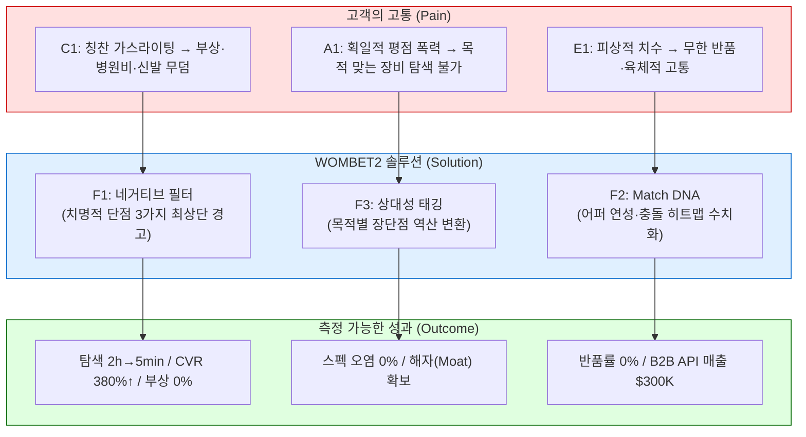
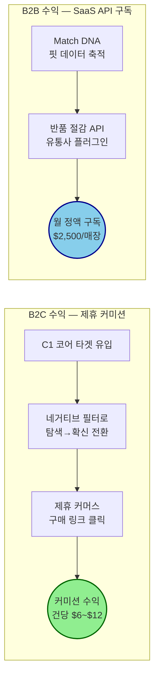

# [PART 1] WOMBET2 통합 최종 VPS: P-S-O 및 가치 제안 상세

## 0. 문서 개요 및 작성 기반
* **작성 기반 데이터:** TAM-SAM-SOM+MarketSegment, Persona Spectrum Map, Customer Journey Map, AOS-DOS Analysis, JTBD Interview Report, NRF 2025 리포트, Spiegel Research 등
* **대상 독자:** 신규 사업을 기획하는 예비창업자 및 IR 이해관계자
* **핵심 질문:** 우리는 어떤 고객에게 어떤 차별적 가치를 전달하고, 그 가치로 어떻게 돈을 버는가?

---

## 1. Pain–Solution–Outcome (P-S-O) 인과 흐름도
비즈니스의 모든 의사결정은 "고객의 고통(Pain) → 해결책(Solution) → 측정 가능한 성과(Outcome)"가 일직선으로 이어질 때 정당화됩니다.

### 1.1 P-S-O 상세 매핑 테이블

| 타겟 페르소나 | Pain (뼈아픈 결핍) | Solution (WOMBET2 해결책) | Outcome (측정 가능한 성과) | AOS / DOS |
| :--- | :--- | :--- | :--- | :--- |
| **C1 김러닝** (코어·수익 엔진) | ① 칭찬 일색 협찬 리뷰에 속아 족저근막염 재발, 병원비 30만 원 + 신발 무덤 양산 ② 단점 확인을 위해 5개 이상 탭을 띄워 2시간 이상 교차검증(멀티호밍) 피로 ③ 구매 직전, 내 과내전/아치에 독이 되는지 최후의 불확실성 미해소 | **F1. 네거티브 필터 (Negative Filter)** • 제품 상세 최상단에 '치명적 단점/페널티 3가지'를 붉은색 경고 박스로 최우선 노출 • 흠집 효과(Blemishing Effect) 극대화 **F4. 안전 진단 오버레이** • 결제 직전 "이 신발은 당신의 아치를 보호/위협합니다" 시각적 코멘트 제공 | • 멀티호밍 탐색 시간 **2시간 → 5분** (96% 절감) • 결제 직전 구매 불안도 **90% 하락** • 실착 후 부상 확률 **0%** 목표 • 제휴 커머스 CVR **최대 380% 상승** (Spiegel 실증) | **4.0 / 3.6** |
| **A1 조역도** (확장·트래픽 엔진) | ① 이커머스의 '가볍고 폭신 = ★5' 획일적 알고리즘으로 인해, 역도용 '단단한 접지력' 모델이 하위 매장됨 ② 동일 기능이 종목마다 장점/단점인 **상대성 매핑** 부재 → 해외 딥서치 강제 의존 | **F3. 상대성 태깅 (Relativity Factor)** • A에게 장점인 '폭신함(★5)'이 B 종목(역도)에서는 '안전 사고 유발(★1)'로 자동 역산 변환 • 업계 최초의 목적별 양향 스펙 치환 시스템 | • 목적 외 스펙 오염 노출 **100% 필터 아웃** • 하드 스펙(오프셋, 접지 강도) 확인 시간 혁신적 단축 • 경쟁사 복제 불가한 알고리즘 해자(Moat) 형성 | **4.0 / 3.2** |
| **E1 윤양발** (극단·B2B 검증) | ① 좌우 발 15mm 차이 + 무지외반 돌출로 기성화 99%에서 극심한 통증 ② 업계 치수는 길이/발볼뿐. 어퍼 신축성·재봉선 위치 등 초정밀 데이터 전무 ③ 반품비만 5만 원 누적, 오프라인 피팅 후 빈손 귀가 반복된 트라우마 | **F2. Match DNA (초정밀 핏 스케일 바)** • 어퍼 신축성 등급, 토박스 압박 강도, 재봉선 충돌 부위 히트맵 수치화 • 부위별 압박 위험도 시각화 오버레이 | • 핏 불일치 반품률 **0%** 수렴 목표 • 반품 1건당 매몰 비용 $30~$45 방어 (NRF 2025 기준) • B2B 유통사 핏 API 영업의 핵심 무기 | **4.0 / 3.6** |

### 1.2 P-S-O 흐름 다이어그램

---

## 2. Value Proposition 통합 상세 테이블 (Part 1)

| 항목 | 내용 |
| :--- | :--- |
| **페르소나 및 CJM 기반 핵심 문제 (Pain, Needs)** | **[코어] C1 김러닝 (34세, Q4 의료적 구원 의존형)** • 칭찬 일색의 인플루언서 리뷰(가스라이팅)에 속아 족저근막염 재발. 병원비 30만 원 + 신발 무덤 양산 • 단점을 스스로 찾기 위해 유튜브·레딧·런갤 등 5개 이상 탭(멀티호밍)을 띄워 2시간 이상 교차검증하는 극심한 탐색 피로 • 구매 직전, 제품이 내 과내전/아치에 독이 되는지 최후의 불확실성을 해소할 기준이 없음  **[확장] A1 조역도 (27세, 인접 스포츠 극관여층)** • 기존 이커머스 알고리즘이 '가볍고 폭신한 것 = 5점'으로 고정되어 있어, 역도·크로스핏에 필수적인 '단단한 접지력' 모델이 하위권으로 매장됨 • 동일 기능이 어떤 종목에서는 장점이고 다른 종목에서는 치명적 단점인 **상대성 매핑** 부재하여, 해외 딥서치에 강제 의존  **[극단] E1 윤양발 (31세, Q4-A 극단적 핏 이상자)** • 좌우 발 길이 15mm 차이 + 무지외반 뼈 돌출. 기성화 99%에서 착화 시 극심한 통증 • 업계가 공개하는 치수는 길이와 발볼뿐이라, 어퍼 신축성·이음새 재봉선 위치 등 초정밀 데이터가 일절 없어 반품비만 5만 원 이상 누적 |
| **JTBD 기반 고객 목표 (Goal, Job)** | **C1:** *"거짓 칭찬 광고를 걸러내고, 내 주법과 체형에 치명적인 페널티(단점)가 무엇인지 직관적으로 파악하여 통증 없는 제품을 확신 있게 구매하고 싶다."* → Trigger: 달리고 난 다음날 발바닥 극심한 통증 인지 직후 → Firing: 유튜브 리뷰 + Reddit 번역 교차검증 + 인기모델 타협구매  **A1:** *"범용적인 5성급 평점이 아니라, 내 운동 목적에 맞는 스펙만을 돋보기처럼 필터링하여 오염 없이 찾아내고 싶다."* → Trigger: 물컹한 신발 신고 체육관에서 낭패를 본 당일  **E1:** *"구매 전 착화가 불가능한 온라인에서 갑피 연성·이음새 돌출부 등 초정밀 데이터를 확인하여, 핏 불일치로 인한 반품 실패를 원천 차단하고 싶다."* → Trigger: 직구로 받은 신발 이음새가 뼈를 눌러 하루 종일 고생했을 때 |
| **고객이 원하는 Outcome** | ① 멀티호밍 탐색 시간 **2시간 → 5분** (96% 시간 절감) ② 결제 직전 구매 불안도 **90% 하락**, 실착 후 부상 확률 **0%**, 반품률 **0%** ③ 목적 외 스펙 오염 노출 **100% 필터 아웃** |
| **핵심 가치 제안 (Value Proposition)** | **"거짓 칭찬과 획일적 치수의 폭력을 부수고, 오직 당신의 뼈와 관절을 보호할 '치명적 단점 필터링'과 '초정밀 핏 DNA'를 가장 먼저 보여주는 안티 가스라이팅 기어 매칭 플랫폼"** |

---

**[PART 2] WOMBET2 통합 최종 VPS: 가치 제안 상세(계속) 및 수익 구조 (Revenue Architecture)**

---

## 2. Value Proposition 통합 상세 테이블 (Part 2)

| 항목 | 내용 |
| :--- | :--- |
| **기존 대안 (Competitor / Substitute)** | 1. **유튜브/블로그 인플루언서 체험단 리뷰** — 협찬 기반 칭찬 위주, 단점 정보 원천 부재 (Sat=1) 2. **대형 이커머스 (쿠팡·아마존)** — 획일적 종합 별점만 존재, 목적별 상대성 필터 전무 (Sat=1) 3. **패션 스니커즈 커머스 (크림·무신사)** — 트렌드/리셀 중심, 기능적 스펙 데이터 부재 (철저히 배제 지향) 4. **해외 리뷰 커뮤니티 (RunRepeat·Reddit)** — 정보 파편화, 한국어 미지원, 번역 등 탐색 오염 유발 (Sat=2) 5. **오프라인 매장 순회** — 시간·교통비 과다, 특이 체형 모델 미비치 |
| **차별적 가치** | **🔴 1. 네거티브 필터 (Negative Filter):** 치명적 3대 페널티를 붉은색 경고 박스로 최상단 노출. 장점은 숨기고 단점을 먼저 시각화하여 흠집 효과(Blemishing Effect) 유발 → CVR 최대 380% 상승 (Spiegel Research 실증) **🔵 2. 상대성 태깅 (Relativity Tagging):** 목적별 장단점 자동 역산 변환. 누군가에게 장점인 '폭신함(★5)'이 역도에서는 '안전 사고 유발(★1)'로 자동 치환되는 업계 유일 알고리즘 해자(Moat) **🟢 3. Match DNA:** 어퍼 신축성·토박스 압박·재봉선 충돌 히트맵 등 숨겨진 압박 데이터를 수치화 및 시각화 오버레이 제공 → 사이즈 미스 결제 취소율 0% 수렴 및 반품률 최대 50~60% 축소 (True Fit DTC 실증) |
| **Proof (근거 / 검증 데이터)** | **Tier 1 — 공개 연구 (강력한 설득 논거)** • "흠집 효과" 단점 혼합 노출 시 체류 시간 4배 증가 및 CVR 380% 대폭발 (Spiegel Research Center) • 시각 진단 기반 동의율 34%→72% 상승 (Overjet 치과 AI) • 미국 이커머스 반품률 19.3%, 총 반품 규모 $8,499억 (NRF 2025) • 반품 처리 비용 = 주문가의 약 21% (역물류·검수·재포장)  **Tier 2 — 인접 산업 유추치** • 핏 기술 도입 후 브래케팅 반품 24% 감소, DTC 채널 50~60% 감소 (True Fit 공식 발표) • 전체 반품률 평균 5% 감소 (True Fit/Retail Brew)  **Tier 3 — 초기 추정치 (MVP로 실측 필수)** • 핵심 Pain 8건이 혁신 최고점인 AOS 4.0 만점 (전체 42%), DOS 3.2~3.6 기록 • 기존 대체재 Sat=1 (시장 공백 47%) — 사실상 솔루션 전무 |

---

## 3. Job–MVP Feature Map (기능 우선순위 및 실전 개발 명세)

| 기능명 | 핵심 Job 연관성 | 중요도 | 난이도 | 우선순위 | 개발 / 실행 지침 (MVP) |
| :--- | :--- | :---: | :---: | :---: | :--- |
| **F1. 치명적 단점/페널티 3요소 최상단 노출 (Negative Filter)** | C1 핵심 Job (안전 확보). CORE-1,2 / CJM-1,3 해결. AOS 4.0 / DOS 3.6 | 5 | 2 | **High** | 베스트셀러 러닝화 탑 30~50종만 엑셀로 '단점 DB' 구축하여 수동 서빙 시작 (오즈의 마법사 방식). |
| **F2. 어퍼 연성도/충돌 히트맵 스케일 바 (Match DNA)** | E1 핵심 Job (반품 회피). EXT-1,2 해결. AOS 4.0 / DOS 3.6 | 5 | 4 | **High** | 사용자 발 사진 전송 시 기술적 AI 대신 사람이 2시간 내 수동 펜 마킹 PDF로 답변 발송해 지불 용의 테스트. |
| **F3. 목적별 스펙 상대성 변환 태깅 (Relativity Factor)** | A1 핵심 Job (종목 핏 탐색). ADJ-1,3 해결. AOS 4.0 / DOS 3.2 | 5 | 3 | **High** | 평점 DB 스키마에 `[종목]` 변수를 연결하여 점수가 동적으로 변환되도록 기반 마련. |
| **F4. 안전 진단 오버레이 경고 (오즈의 마법사)** | C1/E1 결제 직전 불확실성 상쇄. CJM-3 | 4 | 2 | **Mid** | 결제 전 시각적 코멘트 제공으로 불확실성 상쇄. |
| F5. 부상/마일리지 연속 기록 관리 | 온보딩 유지. CORE-4 (AOS 1.2 / DOS 0.0) | 3 | 3 | Low | 기존 툴(Strava/NRC)에 순응 중이므로 안정적 MAU 도달 전까지 개발 보류. |
| F6. 유저 오류/단점 제보 위키 | 데이터 정합성 유지 및 바이럴 지표 형성. CJM-4 (AOS 2.4) | 3 | 4 | Low | 안정기 투입. MAU 1만 명 도달 이전까지 자원 투입 보류. |

---

## 4. 수익 구조 설계 (Revenue Architecture)
막연한 가정이 아닌, NRF(National Retail Federation) 보고서와 이커머스 실측 데이터를 기반으로 **수익성, 성장성, 지속가능성**을 판단하는 투 트랙(B2C/B2B) 비즈니스 모델입니다.

### 4.1 수익 모델 전체 구조 (Flowchart)

### 4.2 Track A: B2C 제휴 커미션 (Affiliate CPS)
* **성격:** 초기 트래픽과 플랫폼 신뢰 자산을 쌓아 수익을 일으키는 캐시카우. 소비자 무료 / 제휴몰(아마존 등) 대상 CPS 커미션 정산.
* **현실 데이터 기반 단가 산출:**
    * 글로벌 러닝화 평균 객단가(AOV): **$150**
    * 커미션율: **4.00%** (Amazon 고정) ~ **8%** (전문 러닝 커머스 병행 시)
    * 건당 수취 수익: **$6.00 ~ $12.00**
    * 이커머스 평균 구매 전환율 2.0~3.0% 대비, 흠집 효과(CVR 최대 380%↑) 적용 후 WOMBET2 보수적 전환율: **5.0% ~ 7.0%**
* **1년 차 B2C 수익 시나리오:**
    * 1년 차 MAU 50,000명 기준, 보수적 5% 적용 시 월 구매 2,500명 × $6.00 = 월 $15,000. **연 수익 $180,000**
    * 적극적 시나리오(7% 전환, Take rate 6%): **연 수익 약 $378,000**
* **성장성/지속가능성:** "나이키 알파플라이 단점", "호카 발볼 통증" 등 롱테일 키워드 SEO 장악으로 유료 광고(CAC)를 '0'에 수렴시키는 플라이휠 확보.

### 4.3 Track B: B2B 반품 절감 API (SaaS 월정액)
* **성격:** 축적된 Match DNA 정밀 데이터를 유통사에 API/위젯으로 수출하는 월 정액제 구독(SaaS) 모델.
* **현실 데이터 기반 가격 정책 논리 (NRF 통계 중심):**
    * 미국 전체 이커머스 반품률 19.3%, 핏 미스 기인 신발 온라인 반품률 **18~20%**
    * 반품 1건당 역물류·검수·재포장 비용: 주문가의 약 21% (NRF) → $150 러닝화 반품 매몰 비용 **약 $31.50 (최대 $45)**
    * 핏 기술 도입 후 DTC 반품 감소율: **24% ~ 최대 50% 감소** (True Fit 실측)
* **가격 정책: 월 $2,500/매장 청구의 ROI 증명:**
    * 월 1,000켤레 파는 중형 로컬 매장의 20% 반품(200건) 매몰 비용 = **월 $6,300 손실**
    * API 도입으로 반품률을 보수적으로 24%(-48건) 줄일 시, 역배송 순수 비용 **$1,512 절감**
    * (핵심) 48건이 반품 대신 매출로 잡히면 추가 매출 $7,200 발생, 마진 30% 적용 시 **이익 $2,160 추가**
    * **결론:** 월 $2,500 구독료 지불 시 매장에게 **총 $3,672의 실질 가치**를 제공하므로 강력한 지불 용의(WTP)를 이끌어냄.
* **1년 차 B2B 수익 시나리오:**
    * 초기 북미 로컬 전문점 10~15곳 도입 시: 연간 **$300,000 ~ $450,000 ARR 수익** 완성.
    * 중장기: 매장 데이터가 알고리즘 정밀도를 높이는 양면 네트워크 플라이휠(Lock-in 효과)로 해약률(Churn) 0% 달성 구조.

### 4.4 1년 차 통합 수익 시나리오 및 단가 리스크 검증
| 수익원 | 보수적 | 적극적 | 리스크 및 실측 검증 방법 |
| :--- | :--- | :--- | :--- |
| B2C 제휴 커미션 | $180,000 | $378,000 | 유입단가(CPA) $2 이하 달성 미검증 → 랜딩페이지+Meta $50 광고 실측 요망 |
| B2B SaaS 구독 API | $300,000 | $450,000 | B2B 유통사 WTP 검증 부족 → 수동 리포트 무료 제안 및 콜드메일 실측 |
| **합산 연 매출** | **$480,000** | **$828,000** | 네거티브 필터 및 Match DNA의 실제 CVR 및 반품 감소율은 오즈의 마법사 MVP로 파일럿 테스트 필수 |

---

**[PART 3] WOMBET2 통합 최종 VPS: 실행 로드맵, 검증 기준 및 전략적 제언**

---

## 5. MVP 실행 로드맵 및 Next Action (예비창업자용)
기술 자동화를 서두르지 않고, 가장 적은 비용으로 파괴적 가치를 테스트하기 위해 선별된 1년 차 핵심 기능 및 검증 로드맵입니다.

### Phase 0: 당장 내일 해야 할 즉각 실행 (1~2주)
| 실행 항목 | 목적 및 방법 | 비용 |
| :--- | :--- | :--- |
| **[B2C] 페이크도어 (Fake Door) 랜딩페이지** | **목적:** Q4 코어 타겟의 실존 확인 및 CPA 실측, 불안감 전환(CVR) 테스트 **방법:** No-code 툴(Carrd/Webflow 등)로 "당신을 부상 입히는 신발 TOP3 확인하기" 1페이지 제작. 러닝화 5종의 치명적 단점만 기록한 후 "그럼에도 내 발엔 안전합니다(핏 확인하기)" 버튼 클릭 시 이메일 가입 유도 | $0 |
| **[B2C] Meta 광고 집행** | **목적:** 이메일 가입 전환율 및 클릭률 실측 **방법:** 부상·통증 키워드 타겟팅으로 예산 $50 할당하여 클릭/이메일 수집 CPA $2 이하인지 확인 (Blemishing Effect의 CVR 펌핑 실측) | $50 |
| **[B2B] 컨시어지 콜드메일 발송** | **목적:** 역물류 처리 지불의사(WTP) 및 유통사 수요 검증 **방법:** 반품률 호소하는 북미 로컬 전문점 및 Shopify 기반 중소 온라인몰 20곳에 메일 발송. "고객 사이즈 실패를 줄일 WOMBET2 위젯을 붙여 한 달 써보라. 반품률 감소를 입증해주겠다"며 수동 분석 무료 제안(파일럿 3~5개 어레인지) | $0 |

### Phase 1: 오즈의 마법사 MVP (1~3개월)
| 실행 항목 | 내용 |
| :--- | :--- |
| **베스트셀러 30종 단점 DB 구축** | F1 네거티브 필터의 최소 데이터 확보를 위해 수동 크롤링 + 전문 리뷰어 교차 검증으로 "단점 30종 DB" 엑셀 수동 서빙 시작 |
| **수동 핏 진단 서비스** | F2 Match DNA 가설 검증. 기술적 AI 대신 카카오톡/디스코드 봇으로 사진 수신 후 2시간 내 붉은색 마킹 PDF를 수동 회신하여 지불 용의 테스트 |
| **제휴 링크 연결** | B2C 수익 파이프라인 오픈. Amazon Associates 및 전문 러닝 커머스 제휴 링크 삽입 |

### Phase 2: 자동화 및 고도화 (3~6개월)
| 실행 항목 | 내용 |
| :--- | :--- |
| **상대성 태깅 알고리즘 자동화** | A1 확장 타겟 본격 유입을 위한 종목별 변수 치환 동적 시스템 구축 |
| **Match DNA API 프로토타입** | B2B 유통사 대상 파일럿 정식 시작 (3~5매장) |
| **유저 위키(오류 제보) 시스템** | 데이터 정합성 자정 메커니즘 도입 |

### Phase 3: 스케일링 (6~12개월)
| 실행 항목 | 내용 |
| :--- | :--- |
| **비전 AI 자동 진단 & 카테고리 확장** | 수동 오버레이 마킹을 자동 스캔으로 전환. 테니스·등산·피트니스 카테고리 확장 (SAM 확대) |
| **B2B API 정식 런칭 및 앱 등록** | 셀프서브 SaaS 채널 오픈 (Shopify/BigCommerce 앱 마켓 등록) |

---

## 6. 검증 체크리스트 (Go/No-Go 기준표)
각 Phase 전환 시점에 아래 기준을 통과하지 못하면 개발을 멈추고 전략을 수정하십시오.

| Phase | 검증 항목 | Go 기준 | No-Go 시 대응 |
| :--- | :--- | :--- | :--- |
| **0→1** | 페이크도어 이메일 가입 CPA | **≤ $3** | 타겟 키워드·메시지 변경 후 재테스트 |
| **0→1** | B2B 콜드메일 미팅 어레인지 비율 | **≥ 10%** (20건 중 2건) | 제안 가치 재설계 or 타겟 업종 변경 |
| **1→2** | 오즈의 마법사 제휴 구매 전환율 | **≥ 3%** (목표 7%) | 단점 DB 큐레이션 품질/깊이 강화 |
| **1→2** | 수동 핏 진단 후 구매 확정률 | **≥ 30%** | 진단 데이터 해상도 재검토 |
| **2→3** | B2B 파일럿 매장 반품 감소 실측 | **≥ 20% 감소** | 데이터 해상도·정합성 보강 |
| **2→3** | B2B 파일럿 매장 유료 전환율 | **≥ 50% (무료→유료)** | 가격 정책·제공 가치 재조정 |
| **2→3** | MAU 10,000명 돌파 여부 | **달성** | SEO·커뮤니티 바이럴 전략 보완 |

---

## 7. 전략적 의사결정 요약 (AOS-DOS 기반 포지셔닝)

### 7.1 최우선 투자 vs 절대 배제 영역
* **투자 (AOS 4.0 / DOS 3.2~3.6 구간):** 칭찬 가스라이팅 방어(네거티브 필터), 체형 부작용 확인(안전 오버레이), 어퍼 압박/이음새 데이터 제공(Match DNA), 평점의 폭력성 해결(상대성 태깅).
* **배제:** 수기 마일리지 기록(AOS 1.2 / 기존 툴에 순응), 패션 맹신 및 데이터 거부 성향 타겟.

### 7.2 안티 페르소나 (N1 유나이키) 관리 규칙
*"이들의 이탈이 곧 플랫폼 포지셔닝 성공(Moat)의 명백한 증거입니다."*
* ❌ **금지:** 광고 집행 시 패션/리셀 키워드(드로우, 한정판, 힙한) 타겟팅 철저 제외. 포털 수준의 5스타 평점 UI 모방 금지. 메인 UI에 트렌디한 콜라보·패션 이미지 삽입 금지.
* ✅ **권장:** 의학적·데이터 위주의 냉철한(Medical) 톤앤매너 유지. N1 집단의 "기능충 아지트"라는 비난을 C1(핵심 타겟)에게 **"리얼 팩트 플랫폼"이라는 신뢰 보상**으로 역전환. 강제 최상단 단점 노출 원칙 고수.

---

## 8. 최종 제언 (Business Analyst Comment)
이 문서의 모든 수익 추정치는 각 데이터 출처(NRF 2025, Amazon Associates, True Fit 실측, Spiegel Research)를 기반으로 도출되었습니다.

현재 시장은 단순한 추천을 넘어, '잘못된 제품 구매로 인한 피해'를 막기 위한 정보의 필요성(AOS 만점/시장 공백 상태)으로 가득합니다. WOMBET2의 본질은 정보의 제공을 넘어 소비자와 유통사 양측 모두의 **'매몰 위험 비용 제거(Pain-Killer)'**에 있습니다. 

그러나 WOMBET2 자체의 전환율과 반품 감소율은 반드시 Phase 0~1의 실측으로 직접 검증해야 합니다. 철저히 네거티브 팩트(가스라이팅 방어) 중심으로 브랜딩과 자원(개발력)을 집결하시고, 기술 자동화 이전에 '오즈의 마법사' 방식으로 수동 검증을 먼저 완료하십시오. Go/No-Go 기준을 통과한 후에만 다음 Phase로 전진하시기 바랍니다.