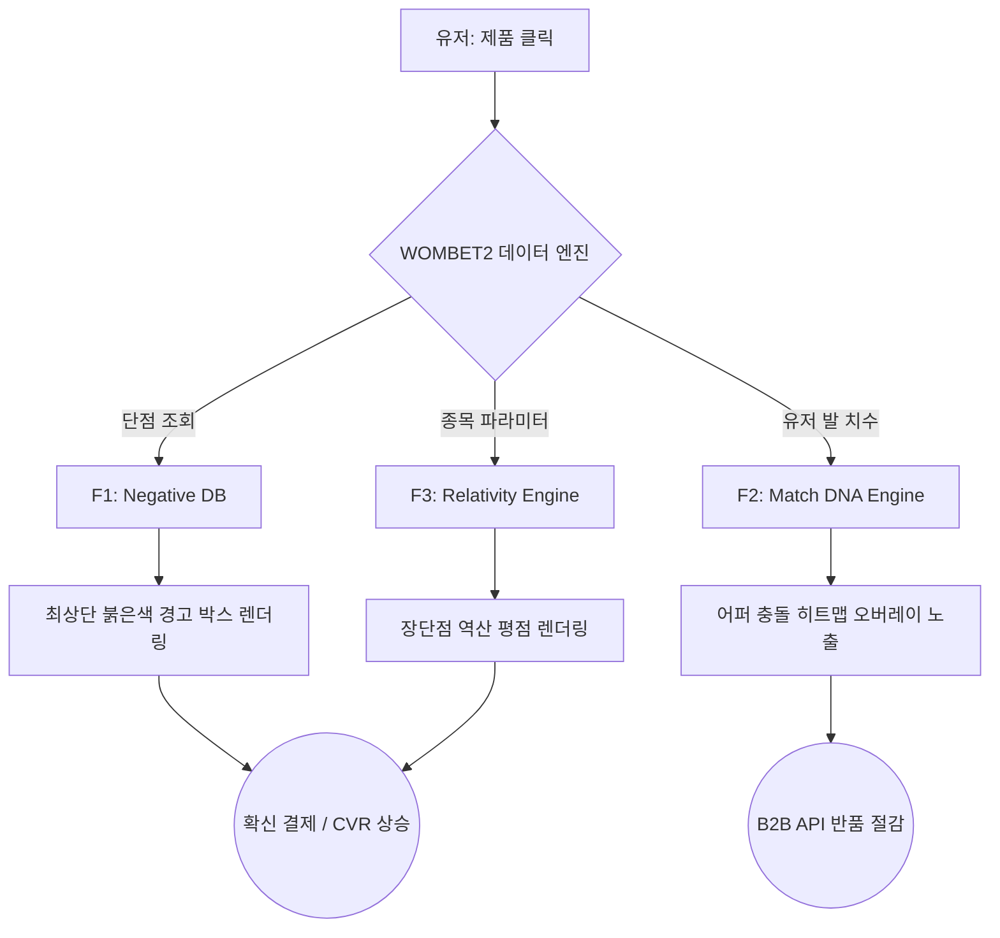

# WOMBET2 제품 요구사항 문서(PRD) v0.1
- Owner 팀: Product Strategy Team
- 최종 업데이트: 2026-04-27

## 1. 개요·목표
- **문제 정의(Pain지표 포함):**
  - 가짜 칭찬 리뷰와 획일적 별점으로 인한 극심한 탐색 피로 및 핏 불일치 오구매 확산.
  - 1차 실패 KPI: **핏 불일치 기인 반품률 19.3% 이상 지속**.
  - 2차 실패 KPI: **사용자 구매 교차검증 탐색 시간 평균 2시간(120분) 초과**.
  - 3차 실패 KPI: 잘못된 핏 매칭으로 인한 **특수 목적 탐색 포기율(Bounce Rate) 60% 이상**.
- **목표(Desired Outcome 수치화):**
  - 치명적 단점을 선제적으로 공개하고, 목적별 상대성 태깅과 초정밀 핏 데이터를 제공하여 소비자와 B2B 유통사의 매몰 위험 비용(Pain-Killer)을 완전히 제거.
- **성공 지표(북극성/보조 KPI):**
  - **북극성 KPI:** 전체 핏 불일치 및 단점 미인지로 인한 **반품률** (기준선 19.3% → 목표값 14.6% (24% 감축)[^1], 주간 측정).
  - **보조 KPI 1:** 방문 대비 구매 전환율(CVR) (기준선 2.5% → 목표값 5.0%[^2], 월간 측정).
  - **보조 KPI 2:** 핵심 목적(단점 파악) 달성을 위한 평균 리서치 체류 시간 (기준선 120분 → 목표값 5분, 주간 측정).

## 2. 사용자와 페르소나
- **C1 김러닝 (코어·수익 엔진):** 과장된 협찬 리뷰에 속아 족저근막염 재발 및 신발 무덤 양산. 단점 확인을 위해 멀티호밍 2시간 이상 수행.
  - *여정 Pain & Needs:* 결제 전 핏 불안 극대화, 정보 불균형. 치명적 단점에 대한 선제적 경고를 원함.
- **A1 조역도 (확장·트래픽 엔진):** 범용 5스타 평점 알고리즘으로 인해 특수 목적(역도 등)에 맞는 장비 탐색 불가.
  - *여정 Pain & Needs:* 획일화된 스펙 데이터. 내 종목에 맞는 장단점 역산 변환을 원함.
- **E1 윤양발 (극단·B2B 검증):** 비대칭 발 사이즈와 뼈 돌출로 기성화 99% 핏 불일치.
  - *여정 Pain & Needs:* 오프라인 한계 및 잦은 반품에 따른 트라우마. 구매 전 초정밀 압박 히트맵 검증을 원함.

## 3. 사용자 스토리와 수용 기준(AC, Acceptance Criteria)

### Story 1: 네거티브 필터 (C1 김러닝)
- **Story:** As a 코어 러너, I want 제품의 치명적 단점을 가장 먼저 확인하고 싶다, so that 내 발에 치명적인 제품을 피해 통증 없는 확신 구매를 할 수 있다.
- **AC 1:** Given 제품 상세 페이지를 로드할 때 / When 사용자가 진입하면 / Then 상단 붉은색 경고 박스로 치명적 단점 3가지를 **1초 이내(p95 ≤ 1,000ms)**에 노출해야 한다.
- **AC 2:** Given 결제 버튼을 클릭하기 직전 / When 등록된 유저 체형(예: 평발/아치)과 신발의 페널티가 충돌할 시 / Then "이 신발은 당신의 아치를 위협합니다"라는 안전 진단 오버레이가 **100% 확률로 노출**되어야 한다.
- **AC 3:** Given 단점 확인 기능 사용 시 / When 리뷰 교차 검증을 마칠 때까지 / Then 사용자의 해당 제품 평균 탐색 및 검증 완료 시간이 **5분 이내**로 측정되어야 한다.

### Story 2: 상대성 태깅 (A1 조역도)
- **Story:** As a 인접 스포츠(역도 등) 유저, I want 종목별로 스펙의 장단점이 변환되는 필터를 사용하고 싶다, so that 내 운동 목적에 맞는 스펙만을 획일적 알고리즘의 오염 없이 찾아낼 수 있다.
- **AC 1:** Given 목적 필터를 '역도'로 변경 시 / When 리스트가 렌더링 되면 / Then 러닝 기준 장점인 '폭신함(★5)'이 **≤ 500ms 이내에 '안전 위험(★1)'으로 역산 변환**되어야 한다.
- **AC 2:** Given 목적별 검색 적용 시 / When 스펙 오염도를 측정하면 / Then 목적 외 범용 스펙이 추천 상단에 노출되는 비율이 **0%**여야 한다.
- **AC 3:** Given 상대성 필터 적용 후 / When 구매가 발생하면 / Then 목적 불일치로 인한 7일 이내 환불/취소 요청 비율이 **3% 미만**이어야 한다.

### Story 3: Match DNA (E1 윤양발)
- **Story:** As a 극단적 핏 이상자, I want 어퍼 연성도와 재봉선 충돌 히트맵을 미리 확인하고 싶다, so that 구매 전 핏 불일치 반품을 원천 차단할 수 있다.
- **AC 1:** Given 발 사진 및 치수 데이터 제출 시 / When 오즈의 마법사 핏 진단을 요청하면 / Then 최대 **2시간 이내**에 정밀 펜 마킹 PDF가 발송되어야 한다. (MVP 파일럿 기준)
- **AC 2:** Given 웹에서 히트맵 오버레이 활성화 시 / When 사용자가 스크롤을 내리면 / Then 지연 없이(≤ 100ms) 5단계 어퍼 압박 위험도가 렌더링되어야 한다.
- **AC 3:** Given 핏 스케일 진단 기반 구매자 군에서 / When 배송 완료 14일 후 지표 측정 시 / Then 사이즈/핏 불일치 사유 반품률이 **≤ 2% (0% 수렴 목표)**여야 한다.

## 4. 기능 요구사항(Functional)
- **[M] F1. 네거티브 필터 (Must-have):** 치명적 단점/페널티 3요소 최상단 붉은색 경고 박스 노출.
  - *미국 대안(Amazon 등) 대비 가치:* 획일적 종합 평점, 리뷰 노출 중심 커머스 대비 "Blemishing Effect(흠집 효과)"를 유발하여 **구매 전환율(CVR)을 보수적으로 2배 이상 높이고**, 단점 탐색 시간을 24배 단축.
- **[M] F3. 상대성 태깅 (Must-have):** 종목별 장단점 자동 역산 치환 알고리즘 적용.
  - *미국 대안(Dick's Sporting Goods 등) 대비 가치:* 단방향 카테고리 분류 한계를 극복하고, 단일 제품의 스펙 점수가 타겟 운동에 따라 동적으로 변환되는 **목적 핏 100% 매칭 보장**.
- **[S] F2. Match DNA (Should-have):** 어퍼 연성/재봉선 충돌 히트맵 스케일 바 및 오버레이 시각화.
  - *미국 대안(Zappos 등) 대비 가치:* 미국 평균 온라인 사이즈 반품률(19.3%)을 타겟하여, **B2B 유통사 관점에서 반품 매몰 비용을 최소 24% 직접 방어** (반품 1건당 역물류비 최대 $31.5 세이브).
- **[C] F4. 안전 진단 오버레이 (Could-have):** 결제 직전 체형 충돌 불확실성 상쇄 팝업 노출.
- **[W] F5 & F6 (Won't-have):** 마일리지 기록, 유저 제보 위키 (초기 리소스 집중을 위해 MAU 1만 달성 시점까지 전면 배제).

## 5. 비기능 요구사항(NFR, Non-Functional Requirement)
- **성능:** 
  - 페이지 LCP(Largest Contentful Paint) **≤ 1.5초**.
  - 상대성 변환 및 네거티브 필터 데이터 조회 시 p95 응답 시간 **≤ 500ms**.
- **신뢰성:** 
  - 웹 서비스/위젯 월 가용성 **≥ 99.5%**.
  - B2B 위젯(API) 연동 시 외부 사이트 트래픽 간섭률/오류율 **≤ 0.1%**.
- **보안/비용:** 
  - 사용자 발 사진 및 신체 특수 데이터는 난독화 해시 처리 후 DB/S3 보관.
  - 초기 서버리스(Serverless) 기반 배포를 통해 월 인프라 비용 $100 이하 유지.
- **모니터링 항목:** 
  - CTA 클릭 전환율 (GA/Mixpanel 등).
  - 유저 탐색 체류 시간 추적 로그 및 이탈(Drop-off) 지점 대시보드 경고.

## 6. 데이터·인터페이스 개요

### 논리적 아키텍처 다이어그램

- **핵심 엔터티 및 주요 필드:**
  - `Product`: ID, Name, Category, Base_Score, **Negative_Tags(Array)**
  - `User`: ID, Persona_Type(C1/A1/E1), Foot_Profile(Arch_Type, Width, Imbalance_Level)
  - `Relativity_Rules`: Product_ID, Target_Sport(Running/Weightlifting 등), Transformed_Score, Risk_Reason
- **외부/내부 API 개요:**
  - `GET /api/v1/products/{id}/negatives` : 해당 모델의 치명적 단점 3가지 조회.
  - `POST /api/v1/products/relativity` : 특정 종목 기준 평점 역산 변환 요청(입력: 제품ID, 종목코드).
  - `[B2B] POST /api/v1/b2b/fit-score` : 유통사 쇼피파이 플러그인용 압박 히트맵 핏 매칭 점수 반환(입력: 유저 해시 토큰, 제품ID).

## 7. 범위(In/Out), 리스크·가정·의존성
- **In-Scope (MVP):** 
  - Top 30 베스트셀러 한정 단점 DB 수동 구축 (오즈의 마법사 방식).
  - 랜딩페이지 트래픽 수집 시스템 및 B2C 제휴 커미션(Amazon Associates) 링크 연동.
- **Out-of-Scope:** 
  - 비전 AI 기반 발 모양 자동 스캔 모델 학습 (수동 진단으로 핏 대체).
  - 유저 참여형 커뮤니티 및 자동화된 UGC 위키 생성.
- **리스크 (최소 3개):**
  1. *사용자 획득 비용(CAC) 상승:* 메타 타겟팅 광고 기반 CPA가 내부 목표선($3 이하)을 초과할 경우 초기 수익 구조 악화.
  2. *B2B 유통사 도입 저항:* 반품 절감의 ROI를 체감하기 전까지 월 $2,500(SaaS 모델)의 지불 용의가 낮을 수 있음.
  3. *단점 적시에 따른 외부 법적 리스크:* 강력한 네거티브 필터링으로 인해 제조사/브랜드의 과잉 방어(명예훼손 클레임) 발생 가능성.
- **가정·의존성:** 
  - 미국 내 Amazon Associates 기본 커미션(4%)이 단기 내 하향 조정되지 않는다고 가정.
  - '단점 선제 노출 시 신뢰도 및 CVR이 상승한다'는 흠집 효과 심리 기제가 타겟(미국 코어 스포츠 유저)에게도 동일하게 적용된다고 가정. (관련 ADR-001 참고)

## 8. 실험·롤아웃·측정
- **실험 1 (B2C CVR 가설 검증):**
  - **베타 채널 설계:** 페이크도어(Fake Door) 랜딩페이지 구축, Meta 광고 $50 예산 집행(n=1,000 유입 목표).
  - **가설:** 단점을 최상단에 강제 노출하는 그룹(Treatment)이 범용 평점 나열 그룹(Control) 대비 이메일 수집 전환율이 2배 이상 높을 것이다.
  - **측정 도구/성공 기준:** CPA ≤ $3, 이메일 전환율 ≥ 5%.
- **실험 2 (B2B SaaS API 가치 실증):**
  - **베타 채널 설계:** 미국 내 로컬 런/아웃도어 전문 온라인몰 대상 콜드메일 발송 및 '컨시어지 핏 진단 위젯' 한 달 무료 파일럿 론칭 (목표 n=5 매장).
  - **가설:** Match DNA 데이터를 선제공받은 구매 집단의 반품률이 평균치를 하회하여, 역물류 매몰 비용을 성공적으로 상쇄할 것이다.
  - **측정 도구/성공 기준:** 도입 전후 핏 불일치 반품률 비교. 기존 시장 반품률(19.3%) 대비 14.6% 이하로 하락 여부. (경쟁 대안 벤치마크: True Fit의 반품 방어율)

## 9. 근거(Proof)
- [NRF 2025 Returns Report] 미국 유통 반품 비용 및 신발 카테고리 매몰 비용 근거 데이터.
- [Spiegel Research Center] 상품 리뷰 평점과 구매 전환율의 비선형 관계, Blemishing Effect(흠집 효과) 실증 논문.
- [True Fit DTC Case Study] 핏 테크놀로지 도입 이후 브래케팅 구매 및 반품률 하락 실증 리포트.

---

> **문서 간 수치 데이터 상충에 따른 팩트체크 각주**
> [^1]: 본 PRD에서는 사업의 재무적 안정성을 위해 True Fit 실측 데이터의 **보수적 기준(24% 감소)**을 채택하여 작성함. 원본 문서(VPS)에서는 *'최대 50~60% 축소'*로 기재됨.
> [^2]: 본 PRD에서는 타겟 플랫폼의 이커머스 평균 CVR(2.5%) 대비 두 배 수준인 **보수적 5.0%**를 사업 목표치로 채택함. 원본 문서 및 Spiegel 리서치에 명시된 *'CVR 최대 380% 상승'* 수치는 잠재적 최상단 시나리오(Up-side) 관점으로만 참조함.
