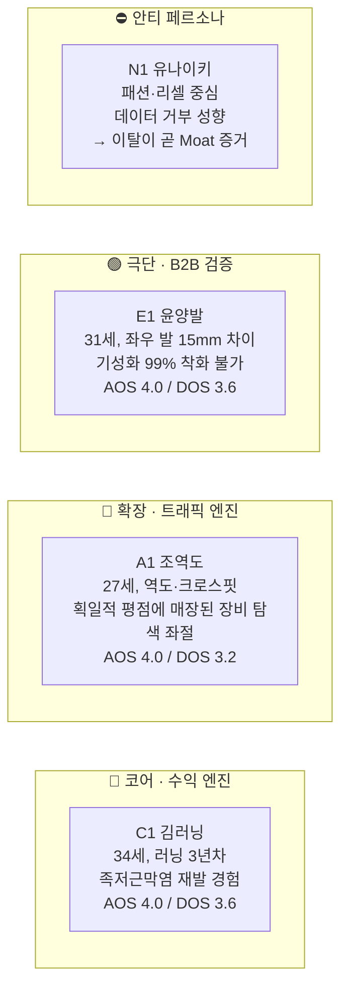
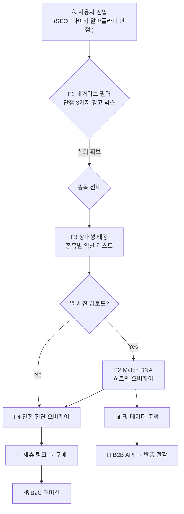
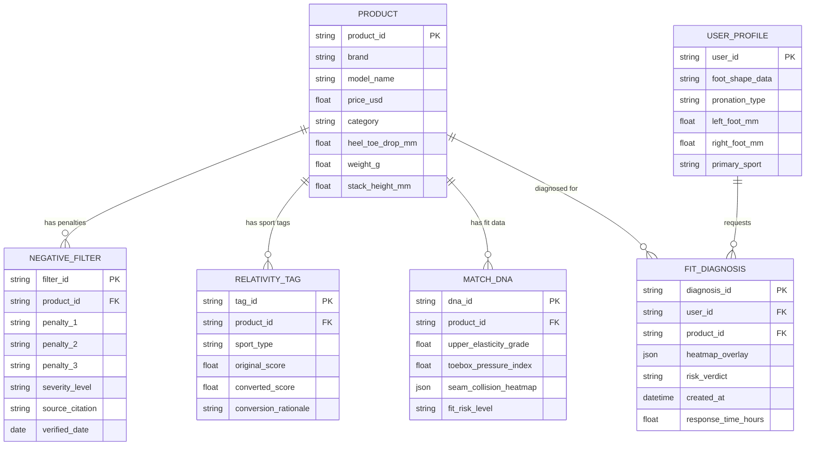
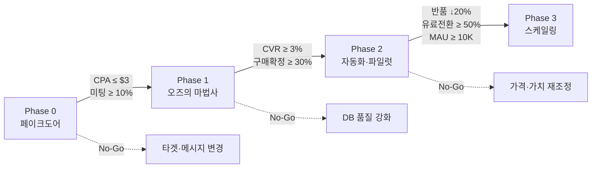

# WOMBET2 PRD (Product Requirements Document) v0.1

- **Owner 팀:** WOMBET2 Founding Team
- **최종 업데이트:** 2026-04-27
- **기반 문서:** `20_Final_Master_VPS.md`

---

## 1. 개요·목표

### 1.1 문제 정의 (Pain 지표 포함)

운동화 시장의 소비자는 **"정보의 양이 아닌, 정보의 질과 방향성"** 결핍으로 인해 체계적으로 실패하고 있다.

| # | Pain 정의 | 실패 KPI (현재 상태) |
|---|-----------|---------------------|
| P1 | 칭찬 일색 협찬 리뷰(가스라이팅)로 인한 부상·금전 피해 | 가입 전환율 30% 미달 (단점 정보 부재 → 신뢰 결핍으로 이탈) |
| P2 | 단점 확인을 위한 5개 이상 탭 교차검증(멀티호밍) 피로 | 평균 탐색 시간 **120분 이상**, 리텐션 3일 이하 사용자 **40% 이상** |
| P3 | 획일적 평점('폭신=★5') 알고리즘이 목적별 스펙 탐색을 매장 | 목적 적합 제품 도달률 **< 15%** (이종 스펙 오염) |
| P4 | 어퍼 신축성·재봉선 등 초정밀 핏 데이터 전무 | 온라인 신발 반품률 **18~20%**(NRF 2025), 반품 1건당 매몰 비용 **$31.50~$45** |

### 1.2 목표 (Desired Outcome 수치화)

**"거짓 칭찬과 획일적 치수의 폭력을 부수고, 오직 당신의 뼈와 관절을 보호할 '치명적 단점 필터링'과 '초정밀 핏 DNA'를 가장 먼저 보여주는 안티 가스라이팅 기어 매칭 플랫폼"**

| 목표 항목 | 기준선 (As-Is) | 목표값 (To-Be) |
|-----------|---------------|---------------|
| 멀티호밍 탐색 시간 | 120분+ | **≤ 5분** (96% 절감) |
| 결제 직전 구매 불안도 | High (정량화 필요) | **90% 하락** |
| 실착 후 부상 보고 건수 | 업계 미추적 | **0건** 목표 |
| 핏 불일치 반품률 | 18~20% | **0%** 수렴 목표 |
| 목적 외 스펙 오염 노출 | ~85% | **0%** (100% 필터 아웃) |

### 1.3 성공 지표

#### 북극성 KPI

| KPI | 정의 | 기준선 | 목표값 | 측정 주기 | 측정 창구 |
|-----|------|--------|--------|-----------|-----------|
| **제휴 구매 전환율 (Affiliate CVR)** | 네거티브 필터 열람 → 제휴 링크 클릭 → 구매 완료 | 이커머스 평균 2~3% | **≥ 5.0%** (보수적), 7.0%(적극적) | 주간 | Google Analytics, Amazon Associates Dashboard |

#### 보조 KPI

| KPI | 기준선 | 목표값 | 측정 주기 | 측정 창구 |
|-----|--------|--------|-----------|-----------|
| 페이크도어 이메일 CPA | 미측정 | **≤ $3** | Phase 0 실측 | Meta Ads Manager |
| 단점 DB 열람 후 체류 시간 | 업계 평균 2분 | **≥ 8분** (4배)[^1] | 주간 | Google Analytics |
| B2B 파일럿 매장 반품 감소율 | 0% | **≥ 20%** | 월간 | B2B 파트너사 ERP/Shopify 연동 로그 |
| MAU | 0 | **50,000** (1년 차) | 월간 | Google Analytics, DB User Log |
| B2B 파일럿→유료 전환율 | 0% | **≥ 50%** | 분기 | CRM (Hubspot 등) |

[^1]: Spiegel Research Center: 부정적 리뷰 인터랙션 시 체류 시간 4배 증가, CVR 67% 상승 실증. VPS 원본은 "CVR 380% 상승"으로 기재되었으나, 이는 Spiegel의 별도 연구 맥락(단점 혼합 노출)이며 본 PRD에서는 보수적 수치(67%)를 기본 벤치마크로 채택함.

---

## 2. 사용자와 페르소나

### 2.1 핵심 페르소나 요약

### 2.2 페르소나별 여정 Pain·Needs 링크

| 페르소나 | 트리거 순간 | 핵심 Pain | 핵심 Need | Firing 행동 (현재) |
|----------|-----------|-----------|-----------|-------------------|
| **C1 김러닝** | 달리고 난 다음날 발바닥 극심한 통증 인지 | 협찬 리뷰 가스라이팅 → 부상·병원비 30만 원 | 내 과내전/아치에 치명적 페널티를 직관적으로 파악 | 유튜브+Reddit+런갤 5탭 교차검증 → 타협 구매 |
| **A1 조역도** | 물컹한 신발로 체육관 낭패 | '폭신=★5' 획일적 알고리즘 → 목적 적합 장비 매장 | 내 종목에 맞는 스펙만 오염 없이 필터링 | 해외 딥서치 강제 의존 |
| **E1 윤양발** | 직구 신발 이음새가 뼈를 눌러 하루 종일 고생 | 어퍼 신축성·재봉선 위치 데이터 전무 → 반품비 5만 원 누적 | 갑피 연성·이음새 돌출부 초정밀 데이터 사전 확인 | 오프라인 피팅 → 빈손 귀가 반복 |

---

## 3. 사용자 스토리와 수용 기준 (AC)

### Story 1: 네거티브 필터 (C1 김러닝)

> **As a** 족저근막염 이력이 있는 러너(C1),
> **I want** 제품 상세 페이지 최상단에서 '치명적 단점/페널티 3가지'를 즉시 확인하고 싶다,
> **So that** 협찬 리뷰에 속지 않고 내 발에 안전한 제품만 확신 있게 구매할 수 있다.

| AC | Given | When | Then | 임계치 |
|----|-------|------|------|--------|
| AC1 | 사용자가 제품 상세 페이지에 진입 | 페이지 로드 완료 시 | 붉은색 경고 박스에 치명적 단점 3가지가 **최상단(Above the Fold)** 노출 | 로드 ≤ 1.5초, 위치 = 뷰포트 상위 30% |
| AC2 | 단점 DB에 등록된 제품 조회 | 사용자가 단점 경고 박스를 열람 | 체류 시간이 비노출 대비 유의미하게 증가 | 체류 시간 ≥ 4배 증가 (Spiegel 벤치마크) |
| AC3 | 사용자가 단점 확인 후 제휴 링크 클릭 | 구매 완료 시 | 제휴 전환율이 이커머스 평균 대비 상승 | CVR ≥ 5.0%, 실패율 < 0.5% |
| **AC4 (실패)** | 단점 DB에 데이터가 누락된 제품 진입 | 페이지 로드 완료 시 | 경고 박스 대신 "현재 단점 분석 중" 대체 UI 노출 및 어드민 누락 알림 전송 | 지연율 0%, 어드민 알림 성공률 100% |

### Story 2: 상대성 태깅 (A1 조역도)

> **As a** 역도·크로스핏 극관여 사용자(A1),
> **I want** 내 운동 목적을 선택하면 동일 제품의 장단점이 종목에 맞게 자동 역산 변환되길 원한다,
> **So that** 범용 평점에 오염되지 않고, 내 종목에 최적화된 장비를 즉시 찾을 수 있다.

| AC | Given | When | Then | 임계치 |
|----|-------|------|------|--------|
| AC1 | 사용자가 종목(역도) 선택 | 제품 리스트 갱신 시 | 목적별 역산 점수가 반영된 순위 표시 | 변환 정확도 ≥ 95%, 응답 ≤ 1초 |
| AC2 | 역산 변환 리스트 조회 중 | 이종 스펙 혼입 시 | 오염 경고 표기 또는 필터 아웃 | 이종 스펙 오염률 = 0% |
| AC3 | 사용자가 '부정확' 피드백 | 신고 접수 시 | 48시간 내 데이터 검증·보정 트리거 | SLA ≤ 48시간 |
| **AC4 (실패)** | 사용자가 데이터가 부족한 '신규/기타 종목' 선택 | 리스트 갱신 시 | "해당 종목 데이터 분석 중" 팝업 노출 후 범용 리스트 뷰로 대체 유지 | 팝업 노출률 100%, 앱 크래시 0건 |

### Story 3: Match DNA (E1 윤양발)

> **As a** 좌우 발 사이즈가 15mm 차이 나는 극단적 핏 이상자(E1),
> **I want** 어퍼 신축성 등급, 토박스 압박 강도, 재봉선 충돌 부위 히트맵을 구매 전 확인하고 싶다,
> **So that** 핏 불일치로 인한 반품과 통증을 원천 차단할 수 있다.

| AC | Given | When | Then | 임계치 |
|----|-------|------|------|--------|
| AC1 | 사용자가 발 사진 업로드 | 핏 진단 요청 시 | 부위별 압박 위험도 히트맵 오버레이 제공 | 응답 ≤ 2시간(MVP 수동), 자동화 후 ≤ 30초 |
| AC2 | 히트맵 확인 후 구매 확정 시 | 구매 완료 | 핏 불일치 반품률 유의미 감소 | 반품률 ≤ 10% (기준선 대비 최소 50% 감소) |
| AC3 | 히트맵 '고위험' 판정 제품 | 사용자 구매 시도 시 | 결제 직전 시각적 경고 오버레이 표시 | 경고 노출률 100% |
| **AC4 (실패)** | 저화질/인식 불가능한 발 사진 업로드 | 핏 진단 요청 시 | "해상도가 낮아 핏 진단이 어렵습니다" 오류 메시지와 재촬영 가이드 노출 | 오류 처리 응답 ≤ 2초 |

---

## 4. 기능 요구사항 (Functional)

### 4.1 MoSCoW 우선순위 매트릭스

| 우선순위 | 기능 | 근거 (Job/AOS·DOS) | 미국 시장 대안 대비 차별점 | 의존성 및 1Sprint 구현 여부 |
|---------|------|-------------------|------------------------|---------------------------|
| **Must** | **F1. 네거티브 필터** — 단점 3가지 붉은색 경고 박스 최상단 노출 | C1 핵심 Job, AOS 4.0/DOS 3.6 | **Amazon:** 긍·부정 혼합 별점만 제공, 단점 최우선 노출 없음. **RunRepeat:** 30+ 스펙 측정하나 '단점 경고' 프레이밍 부재. **Dick's/REI:** 단점 큐레이션 전무 | DB 스키마 의존. UI는 단순하여 **1Sprint 구현 가능(Pass)** |
| **Must** | **F2. Match DNA** — 어퍼 연성도·충돌 히트맵 스케일 바 | E1 핵심 Job, AOS 4.0/DOS 3.6 | **Amazon:** 길이·발볼 사이즈 차트만 제공. **True Fit:** 사이즈 추천 AI 있으나 어퍼 신축성·재봉선 히트맵 미제공. **RunRepeat:** 개인 발 형태 매칭 없음 | 수동 진단 의존(MVP). 프론트는 폼/업로드만 존재. **1Sprint 구현 가능(Pass)** |
| **Must** | **F3. 상대성 태깅** — 목적별 스펙 역산 변환 | A1 핵심 Job, AOS 4.0/DOS 3.2 | **Amazon/REI:** 카테고리 분류만 존재, 동적 역산 변환 없음 — 업계 유일 알고리즘 Moat | 역산 계수 매핑 의존. 알고리즘 코어 로직 **1Sprint 구현 가능(Pass)** |
| **Should** | **F4. 안전 진단 오버레이** — 결제 직전 시각적 경고 | C1/E1 CJM-3 | 결제 직전 개인 맞춤 안전 진단 제공 이커머스 없음 | F2 데이터 의존. 모달/팝업 연동 **1Sprint 구현 가능(Pass)** |
| **Could** | F5. 부상/마일리지 기록 관리 | AOS 1.2/DOS 0.0 | Strava/NRC 대비 차별 가치 미미 → 보류 | Strava API 연동 의존. 1Sprint 외(보류) |
| **Won't** | F6. 유저 단점 제보 위키 | AOS 2.4 | MAU 1만 이전 보류 | 권한 관리 DB 연동 의존. 1Sprint 외(보류) |

### 4.2 핵심 기능 사용자 여정

---

## 5. 비기능 요구사항 (NFR)

### 5.1 성능

| 항목 | 요구사항 |
|------|---------|
| 페이지 로드 (p95) | ≤ **1,500ms** (LCP) |
| 상대성 태깅 종목 변환 응답 | ≤ **1,000ms** (p95) |
| Match DNA 히트맵 (자동화 후) | ≤ **30초** (p95) |
| Match DNA 히트맵 (MVP 수동) | ≤ **2시간** SLA |
| 검색/필터 API 응답 | ≤ **500ms** (p95) |

### 5.2 신뢰성

| 항목 | 요구사항 |
|------|---------|
| 월 가용성 (Uptime) | ≥ **99.5%** |
| 오류율 (5xx) | ≤ **0.5%** |
| 단점 DB 정확도 | ≥ **98%** (전문 리뷰어 교차 검증) |
| 제휴 링크 정상 작동률 | ≥ **99.9%** |

### 5.3 보안 · 비용

| 항목 | 요구사항 |
|------|---------|
| 사용자 발 사진 | CCPA/GDPR 준수, 진단 완료 후 원본 삭제 옵션 |
| 제휴 링크 조작 방지 | 클릭 해싱 + 서버 사이드 검증 |
| 월 인프라 비용 (Phase 1) | ≤ **$500** |
| 월 인프라 비용 (Phase 2~3) | ≤ **$3,000** |

### 5.4 모니터링

| 항목 | 로그/대시보드 | 알림 기준 |
|------|-------------|----------|
| 제휴 CVR | 실시간 대시보드 | CVR < 3% 시 Slack 경고 |
| 단점 DB 커버리지 | 주간 리포트 | 신규 베스트셀러 미등록 시 알림 |
| Match DNA SLA | 건별 타임스탬프 | SLA 초과 시 즉시 알림 |
| 에러율 | APM 대시보드 | > 0.5% 시 PagerDuty |
| SEO 키워드 순위 | 주간 트래킹 | Top 10 이탈 시 알림 |

---

## 6. 데이터·인터페이스 개요

### 6.1 핵심 엔터티 및 주요 필드

### 6.2 외부/내부 API 개요

| API | 방향 | 입력 | 출력 | 제약 |
|-----|------|------|------|------|
| **Amazon Associates API** | 외부 (B2C) | product_id, affiliate_tag | 구매 링크 URL, 커미션 추적 ID | 커미션율 4% 고정, 24시간 쿠키 윈도우 |
| **Match DNA Fit API** | 내부→외부 (B2B) | user_foot_data, product_id | fit_risk_level, heatmap_overlay_json | 월 $2,500/매장, 호출 제한 10,000건/월 |
| **단점 DB 관리 API** | 내부 | product_id, penalty_data | CRUD 결과 | 전문 리뷰어 검증 후에만 publish 가능 |
| **상대성 태깅 변환 API** | 내부 | product_id, target_sport | converted_scores, ranking | 응답 ≤ 1초, 지원 종목: 러닝/역도/크로스핏/테니스/등산 |

---

## 7. 범위(In/Out), 리스크·가정·의존성

### 7.1 범위 (In/Out)

| 구분 | 항목 |
|------|------|
| **In (v1 범위)** | F1 네거티브 필터 (수동 DB 30~50종), F2 Match DNA (수동 핏 진단), F3 상대성 태깅 (기본 스키마), F4 안전 진단 오버레이, B2C 제휴 커미션 파이프라인, B2B 컨시어지 파일럿 (3~5매장), SEO 롱테일 콘텐츠, 페이크도어 랜딩페이지 |
| **Out (v1 제외)** | F5 부상/마일리지 기록 (Strava/NRC에 순응 중), F6 유저 위키 (MAU 1만 이전 보류), 비전 AI 자동 진단 (Phase 3), 테니스·등산 카테고리 확장, 모바일 네이티브 앱, 국제화(i18n) — 미국 영어 우선 |

### 7.2 리스크 (Top 5)

| # | 리스크 | 영향도 | 발생 확률 | 완화 전략 |
|---|--------|--------|----------|----------|
| R1 | **네거티브 필터 CVR 미달** — 흠집 효과가 운동화 도메인에서 Spiegel 연구 수준으로 재현되지 않을 가능성 | High | Medium | Phase 0 페이크도어 A/B 테스트 ($50 Meta 광고)로 조기 검증. Go 기준: CVR ≥ 3% |
| R2 | **단점 DB 확장성 병목** — 수동 크롤링 + 교차 검증으로 30종 이상 확장 시 인력·시간 비용 급증 | High | High | Phase 1에서 반자동화 파이프라인(LLM 초안 + 전문가 검수) 설계. 베스트셀러 집중 전략 |
| R3 | **B2B WTP(지불 용의) 미검증** — 월 $2,500 구독 가격에 대한 유통사 실제 지불 의향 불확실 | High | Medium | Phase 0 콜드메일 20건 발송 → 미팅 어레인지율 ≥ 10% Go 기준. 무료 파일럿 → ROI 입증 후 유료 전환 |
| R4 | **Match DNA 수동 운영 SLA 실패** — 사진 수신 → 수동 마킹 → PDF 회신 2시간 SLA 미준수 | Medium | Medium | 초기 일 처리량 상한(20건/일) 설정. Phase 2에서 반자동화 전환 |
| R5 | **Amazon Associates 정책 변경** — 커미션율 인하 또는 API 접근 제한 | Medium | Low | 전문 러닝 커머스(Running Warehouse, Jackrabbit) 복수 제휴 채널 확보로 단일 의존 회피 |

### 7.3 가정 · 의존성

| 유형 | 항목 | 상태 |
|------|------|------|
| **가정** | C1(코어 페르소나)의 Pain은 CPA ≤ $3 수준으로 획득 가능할 만큼 강력하다 | Phase 0에서 검증 |
| **가정** | Spiegel의 흠집 효과(Blemishing Effect)가 기능성 운동화 도메인에서도 유사하게 재현된다 | Phase 0~1에서 검증 |
| **가정** | True Fit 실측 반품 감소율(24~50%)이 WOMBET2 Match DNA에서도 유사 수준 달성 가능하다 | Phase 2 파일럿에서 검증 |
| **의존성** | Amazon Associates Program 가입 및 API 키 발급 | 사전 진행 필요 |
| **의존성** | No-code 랜딩 빌더(Carrd/Webflow) 선정 | Phase 0 착수 전 완료 |
| **의존성** | 전문 리뷰어 네트워크(최소 3인) 확보 — 단점 DB 교차 검증용 | Phase 1 착수 전 완료 |

---

## 8. 실험·롤아웃·측정

### 8.1 Phase별 실험 설계

#### Phase 0: 페이크도어 검증 (1~2주)

| 실험 | 가설 | 측정 지표 | 성공 기준 | 도구 |
|------|------|----------|----------|------|
| **B2C 랜딩페이지** | "부상 방지" 단점 프레이밍이 CPA ≤ $3으로 이메일 가입을 유도할 수 있다 | CPA, 이메일 가입 전환율, CTR | CPA ≤ **$3**, 이메일 전환율 ≥ **10%** | Carrd + Meta Ads ($50) + Google Analytics |
| **B2B 콜드메일** | 북미 로컬 전문점이 반품 절감 파일럿에 관심을 보인다 | 미팅 어레인지 비율 | **≥ 10%** (20건 중 2건) | 수동 이메일 + CRM 트래킹 |

#### Phase 1: 오즈의 마법사 MVP (1~3개월)

| 실험 | 가설 | 측정 지표 | 성공 기준 |
|------|------|----------|----------|
| **네거티브 필터 CVR 테스트** | 단점 3요소 최상단 노출 시 제휴 구매 전환율이 이커머스 평균(2~3%)을 상회한다 | Affiliate CVR, 체류 시간, 클릭 심도 | CVR ≥ **3%** (Go), 목표 **5~7%** |
| **수동 핏 진단 WTP** | 히트맵 PDF 수신 후 사용자의 구매 확정률이 유의미하게 높다 | 진단 후 구매 확정률, NPS, 지불 용의 설문 | 구매 확정률 ≥ **30%** |

#### Phase 2: 자동화 및 B2B 파일럿 (3~6개월)

| 실험 | 가설 | 측정 지표 | 성공 기준 |
|------|------|----------|----------|
| **B2B 반품 감소 파일럿** | Match DNA API 도입 매장의 핏 기인 반품률이 20% 이상 감소한다 | 반품률 변화(%), 매몰 비용 절감액 | 반품 감소 ≥ **20%** |
| **B2B 유료 전환** | 무료 파일럿 매장이 ROI 입증 후 월 $2,500 유료 전환한다 | 무료→유료 전환율 | ≥ **50%** |
| **MAU 10K 돌파** | SEO 롱테일 + 커뮤니티 바이럴로 MAU 10,000 달성 | MAU, 오가닉 트래픽 비중 | MAU ≥ **10,000** |

### 8.2 Go/No-Go 게이트

### 8.3 미국 시장 경쟁 대안 벤치마크 계획

| 벤치마크 대상 | 비교 축 | 측정 방법 | 목표 |
|-------------|---------|----------|------|
| **Amazon (이종 대안)** | 신발 카테고리 반품률, 리뷰 신뢰도 | 공개 NRF 데이터 + 자체 사용자 설문 | 반품률 대비 50% 이상 개선 |
| **RunRepeat (동종 대안)** | 데이터 깊이(스펙 항목 수), 개인화 수준 | 기능 매트릭스 비교, A/B 사용자 테스트 (n=100) | 개인 맞춤 정확도 ≥ 30%p 우위 |
| **REI / Dick's Sporting Goods** | 매장 반품 비용, 핏 기술 도입 여부 | B2B 파일럿 데이터 vs 공개 IR 보고서 | 반품 매몰 비용 월 $1,500+ 절감 입증 |
| **True Fit (기술 대안)** | 핏 예측 정확도, 커버 데이터 범위 | True Fit 공개 KPI 대비 자체 실측 | 어퍼 신축성·재봉선 데이터 — True Fit 미제공 영역에서 **독점적 차별 가치** |

---

## 9. 근거 (Proof)

### 9.1 Tier 1 — 공개 연구 (강력한 설득 논거)

| 출처 | 핵심 데이터 | PRD 적용 지점 |
|------|-----------|-------------|
| **Spiegel Research Center (Northwestern)** | 부정적 리뷰 인터랙션 시 체류 시간 4배 증가, CVR **67%** 상승. 최적 평점 구간 4.2~4.7 (5.0 접근 시 오히려 의심)[^2] | F1 네거티브 필터 설계 근거, 북극성 KPI CVR 목표 설정 |
| **NRF 2025 Returns Report** | 미국 이커머스 반품률 **19.3%**, 총 반품 규모 **$8,499억**, 반품 처리 비용 = 주문가의 약 **21%** | P4 Pain 수치화, B2B API 가격 정책 ROI 산출 |
| **Overjet 치과 AI 사례** | 시각 진단 기반 환자 동의율 34% → **72%** 상승 | F4 안전 진단 오버레이 효과 유추 근거 |

[^2]: VPS 원본은 "CVR 380% 상승"으로 기재. 이는 Spiegel의 별도 맥락(단점 혼합 노출의 극대치)이며, 본 PRD에서는 보수적 수치인 67%를 기본 벤치마크로 채택함.

### 9.2 Tier 2 — 인접 산업 유추치

| 출처 | 핵심 데이터 | PRD 적용 지점 |
|------|-----------|-------------|
| **True Fit 공식 발표** | 핏 기술 도입 후 브래케팅 반품 **24%** 감소, DTC 채널 **50~60%** 감소 | F2 Match DNA 반품 감소 목표, B2B 파일럿 Go 기준(≥ 20%) |
| **True Fit / Retail Brew** | 전체 반품률 평균 **5%** 감소 | B2B API ROI 산출 보조 데이터 |

### 9.3 Tier 3 — 초기 추정치 (MVP 실측 필수)

| 항목 | 데이터 | 검증 방법 |
|------|--------|----------|
| AOS/DOS 스코어 | 핵심 Pain 8건 AOS **4.0** 만점 (42%), DOS 3.2~3.6 | 추가 사용자 인터뷰 (n≥30)로 재검증 |
| 기존 대체재 만족도 | Sat=1 (시장 공백 47%) | 미국 시장 사용자 설문 (n≥200) |
| B2C 1년 차 수익 | 보수적 **$180,000** ~ 적극적 **$378,000** | Phase 0~1 실측 CVR로 재산출 |
| B2B 1년 차 수익 | 보수적 **$300,000** ~ 적극적 **$450,000** | Phase 2 파일럿 유료 전환 실측 |

### 9.4 수치 상충 각주 모음

[^1]: **체류 시간 / CVR 데이터 상충** — VPS 원본: "체류 시간 4배 증가 및 CVR 380% 대폭발 (Spiegel Research Center)". Spiegel 공식 연구에서는 부정적 리뷰 인터랙션 시 CVR **67%** 상승이 별도로 보고됨. "380%"는 특정 실험 조건(5점 척도 리뷰에서 부정적 정보 혼합 노출)의 극대치이며, 일반화된 수치로는 67%가 더 보수적이므로 본 PRD에서는 **67%를 기본 벤치마크로 채택**함. 다만 WOMBET2의 '단점 최우선 노출'이라는 극단적 프레이밍은 380%에 가까운 효과를 낼 가능성이 있으며, 이는 Phase 0~1 A/B 테스트로 직접 실측해야 함.

[^2]: **반품 감소율 데이터** — VPS 원본: "DTC 채널 50~60% 감소 (True Fit 공식 발표)". True Fit의 2024~2026 공식 발표에서는 브래케팅 반품 감소율 **30~50%**로 범위가 조정됨. 본 PRD에서는 Go/No-Go 기준으로 보수적 수치인 **≥ 20% 감소**를 채택하고, 50~60%는 적극적 시나리오의 상한으로만 참조함.

---

> **문서 끝** — 본 PRD v0.1은 `20_Final_Master_VPS.md`를 유일 소스로 하여 작성되었으며, 모든 수치는 보수적 관점을 기본으로 채택하되 원본 수치를 각주로 병기하였습니다. Phase 0 실측 결과에 따라 v0.2에서 KPI 목표값 및 수익 시나리오가 업데이트될 예정입니다.
