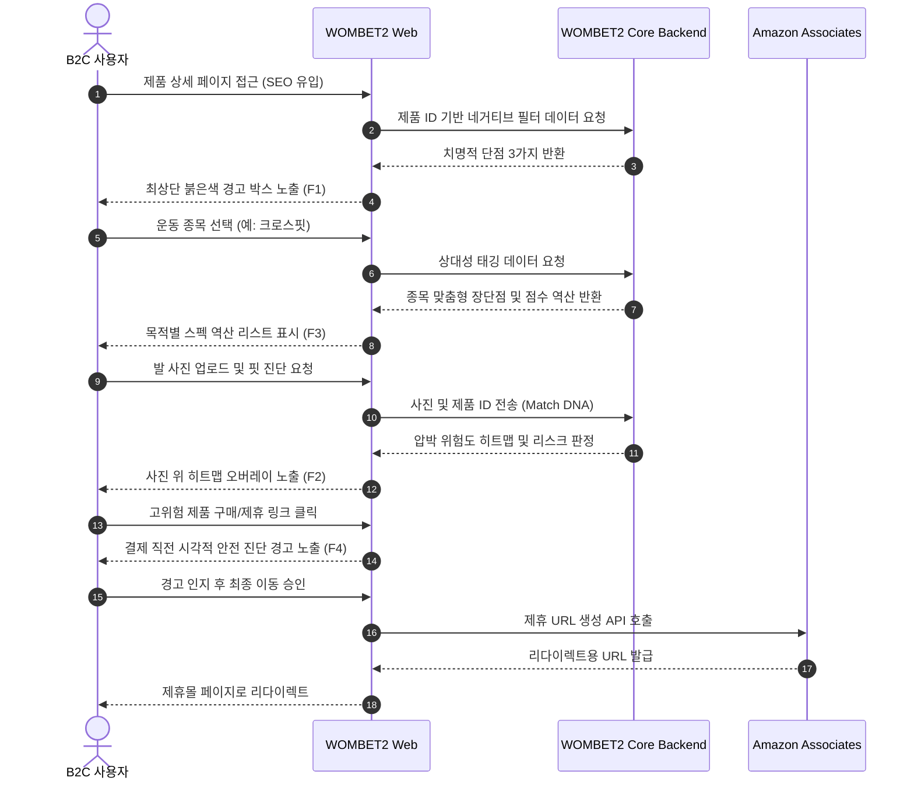
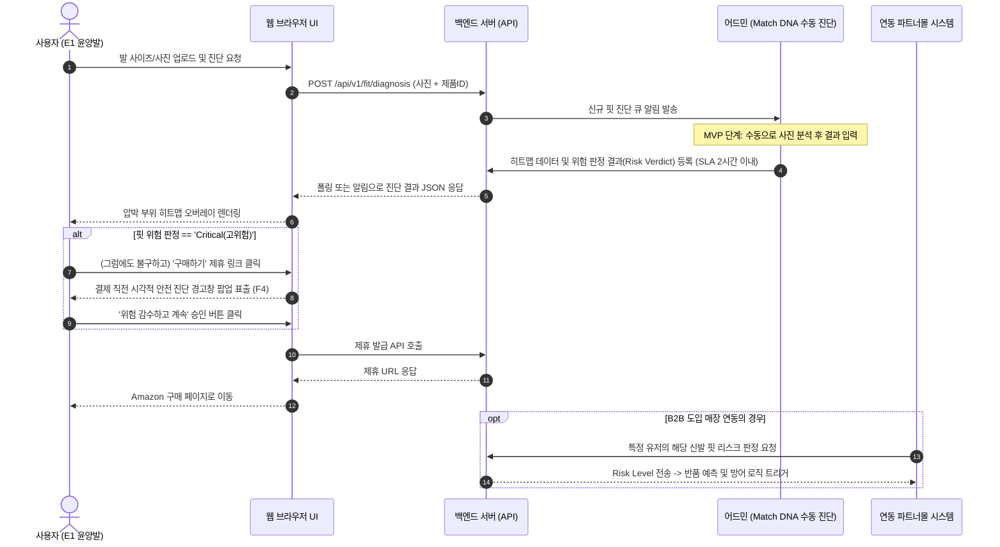

# Software Requirements Specification (SRS)
Document ID: SRS-001
Revision: 0.1
Date: 2026-04-27
Standard: ISO/IEC/IEEE 29148:2018

-------------------------------------------------

## 1. Introduction

### 1.1 Purpose
본 문서(SRS)의 목적은 운동화 시장의 소비자가 겪는 "정보의 양이 아닌, 정보의 질과 방향성" 결핍 문제를 해결하기 위한 **안티 가스라이팅 기어 매칭 플랫폼(WOMBET2)**의 소프트웨어 요구사항을 정의하는 것이다. 본 시스템은 획일화된 평가 시스템을 타파하고, 치명적 단점 필터링과 초정밀 핏(Fit) DNA를 구매 전 최우선으로 제공하여, 사용자(소비자)의 탐색 피로도를 획기적으로 줄이고 부상 및 핏 불일치 반품을 근원적으로 차단하는 것을 목표로 한다.

### 1.2 Scope
**In-Scope (v1 구축 범위)**
- **F1 네거티브 필터:** 30~50종 베스트셀러 모델에 대한 치명적 단점 DB 구축 및 제품 페이지 최상단 경고 렌더링.
- **F2 Match DNA:** 사용자가 업로드한 발 사진을 기반으로 어퍼 신축성 및 충돌 부위 히트맵 제공 (MVP 단계에서는 수동 진단 운영).
- **F3 상대성 태깅:** 기본 스키마 기반 종목별(예: 러닝, 역도) 스펙 역산 및 동적 점수 변환 로직.
- **F4 안전 진단 오버레이:** 위험 판정 제품 구매 직전에 노출되는 시각적 경고 모달.
- **B2C 제휴 파이프라인 연동:** Amazon Associates 링크를 통한 수익화.
- **B2B 컨시어지 파일럿 지원:** 반품 감소 입증을 위한 초기 B2B 파트너(3~5매장) 연동 체계.
- **SEO/마케팅 보조:** 롱테일 콘텐츠 및 Phase 0 페이크도어 랜딩페이지 구현.

**Out-of-Scope (v1 제외 대상)**
- **F5 부상/마일리지 기록:** Strava, NRC 등 기존 플랫폼 의존 유지, 자체 구현 보류.
- **F6 유저 위키 시스템:** MAU 1만 명 확보 이전에는 단점 제보 시스템(UGC) 구축 보류.
- **완전 자동화 비전 AI:** 발 사진 완전 자동 분석 모델 적용 보류 (Phase 3 적용 예정).
- **국제화(i18n) 및 모바일 네이티브 앱:** 미국 영어 최우선 지원, 모바일 반응형 웹 중심으로 구축하여 네이티브 앱 개발 제외.

### 1.3 Definitions, Acronyms, Abbreviations
- **Jobs to be Done (JTBD):** 사용자가 특정 상황에서 목적을 달성하기 위해 완수하고자 하는 핵심 과업.
- **AOS (Adjusted Opportunity Score):** 조정된 기회 점수. 기존 경쟁 대안 대비 미충족된 사용자 니즈의 크기를 의미함.
- **DOS (Discovered Opportunity Score):** 발견된 기회 점수. 신규 솔루션을 통해 파악된 개선 기회의 중요도.
- **Validator (검증자):** 특정 기능이나 비즈니스 가설이 유효한지 평가하는 기준 주체 (예: Phase 0 페이크도어 전환율, B2B 파일럿 참여 매장).
- **Match DNA:** 어퍼 연성도, 토박스 압박 강도, 재봉선 충돌 히트맵 등 신발의 초정밀 핏(Fit) 데이터 구조체.
- **네거티브 필터 (Negative Filter):** 과장/협찬 리뷰를 배제하고 제품의 가장 치명적인 단점을 붉은색 경고 박스로 화면 최상단(Above the fold)에 노출하는 핵심 기능 프레임.
- **상대성 태깅 (Relativity Tagging):** 사용자의 운동 목적(종목)에 따라 제품의 동일한 스펙을 서로 다른 장단점으로 자동 역산 변환하는 평가 엔진.

### 1.4 References
- **REF-01:** `20_Final_Master_VPS.md` (WOMBET2 최종 기획/비즈니스 마스터 문서)
- **REF-02:** Spiegel Research Center 연구 보고서 (부정적 리뷰 인터랙션이 체류 시간에 미치는 영향 및 CVR 67% 상승 근거 자료)
- **REF-03:** NRF 2025 Returns Report (미국 이커머스 평균 반품률 18~20% 및 건당 매몰 비용 지표)
- **REF-04:** Overjet Dental AI 사례 (시각 진단 오버레이가 구매 동의율 상승에 미치는 효과 유추 자료)
- **REF-05:** True Fit 기술 도입 케이스 스터디 (핏 예측 기술 적용 시 브래케팅 반품 24~50% 감소 근거)

### 1.5 Constraints and Assumptions
**Constraints (제약사항)**
- 시스템은 100% 로컬-퍼스트 환경(보안/권한 제어 외)을 우선 고려하며, 초기 MVP의 DB 및 아키텍처는 가볍게 유지해야 한다.
- F2 Match DNA 기능은 v1 단계에서 완전 자동화 없이 수동 진단 운영체계를 전제로 SLA(2시간)를 정의한다.
- Amazon Associates Program의 외부 API 정책, 커미션율 인하 또는 접근 제한 등에 구조적으로 종속된다.

**Assumptions (가정)**
- C1(핵심 코어 사용자)의 Pain point는 디지털 마케팅 상에서 획득 비용 CPA $3 이하 수준으로 유도할 만큼 강력하게 작용할 것이다.
- Spiegel 논문에서 나타난 흠집 효과(Blemishing Effect)가 운동화 도메인의 B2C 커머스 상에서도 동일하거나 더 큰 수준의 CVR(제휴 전환율) 상승을 견인할 것이다.
- B2B 파트너의 경우, Match DNA API 적용 시 실제 반품률이 최소 20% 이상 감소할 것이며 이를 근거로 유료 전환(월 $2,500)에 응할 것이다.

-------------------------------------------------

## 2. Stakeholders

| Role (역할) | Responsibility (책임 및 행동) | Interest (주요 관심사) |
|---|---|---|
| **C1 김러닝** (코어) | 시스템 내 네거티브 필터 확인 후 제휴 링크 클릭, 발 데이터 제공. | 협찬 리뷰 가스라이팅 탈피. 부상 방지를 위한 치명적 페널티 직관적 파악 및 안전한 신발 구매. |
| **A1 조역도** (확장) | 자신의 주력 종목 선택 및 장비 검색 시 필터 활용. 부정확 정보 신고. | 획일적 범용 평점에서 벗어나 역도/크로스핏 등 특정 목적에 부합하는 장비 발굴. |
| **E1 윤양발** (극단) | Match DNA 진단을 위한 발 사진 촬영 및 업로드. | 좌우 사이즈 비대칭 극복. 갑피 연성도 및 이음새 초정밀 데이터를 통해 착화 실패 원천 방지. |
| **B2B 파트너사** | 시스템 연동 파일럿 진행 및 고객 구매 데이터 분석, 구독료 지불. | 온라인 신발 반품률(현재 18~20%) 감소. 반품 1건당 발생하는 물류/매몰 비용(~$45) 절감. |
| **시스템 관리자** | 신규/기타 종목 피드백 검토, 수동 핏 진단(MVP) 응답 처리. | SLA(2시간) 이내 수동 진단 처리, 시스템 지연율 0% 및 데이터 누락 관리. |
| **전문 리뷰어** | 등록되는 단점 DB에 대한 교차 검증 및 검수. | 단점 DB 정확도(98% 이상) 보장, 오염되지 않은 양질의 팩트 데이터 유지. |

-------------------------------------------------

## 3. System Context and Interfaces

### 3.1 External Systems
- **Amazon Associates Platform:** B2C 구매 사용자의 리다이렉션을 처리하고 구매 전환 시 4% 커미션을 추적하는 제휴 마케팅 시스템.
- **B2B Partner E-commerce (Shopify/ERP):** API를 통해 WOMBET2 시스템과 연동, 특정 고객의 발 데이터를 검증받고 핏 리스크 판정 및 반품 예측 정보를 수신.
- **CRM 및 마케팅 추적기:** Google Analytics(체류 시간, CVR 등), Hubspot(B2B 유료 전환 트래킹), Meta Ads Manager(Phase 0 트래픽 및 CPA 관리).

### 3.2 Client Applications
- **B2C 웹 프론트엔드 (WebApp):** 사용자가 검색, 제품 진단, 네거티브 경고 열람, 제휴 리다이렉션을 수행하는 주요 인터페이스. 모바일 웹 브라우저 환경에 최적화된 반응형 웹 형태로 구동.

### 3.3 API Overview
| API Name | Direction | Input Parameters | Output / Response |
|---|---|---|---|
| **Amazon Associates API** | 외부 연동 | `product_id`, `affiliate_tag` | 제휴 구매 링크 URL, 커미션 추적 ID |
| **Match DNA Fit API** | 내부 → 외부 (B2B) | `user_foot_data`, `product_id` | `fit_risk_level`, `heatmap_overlay_json` |
| **단점 DB 관리 API** | 내부 통신 | `product_id`, `penalty_data` | 검증된 단점 데이터 CRUD 처리 응답 |
| **상대성 태깅 변환 API**| 내부 통신 | `product_id`, `target_sport` | 변환된 스코어(`converted_scores`), 종목 맞춤 랭킹 |

### 3.4 Interaction Sequences (핵심)

-------------------------------------------------

## 4. Specific Requirements

### 4.1 Functional Requirements

| Requirement ID | Source (Story/PRD) | Requirement Description | Acceptance Criteria (Given / When / Then) | Priority |
|---|---|---|---|---|
| **REQ-FUNC-001** | Story 1 / F1 | 네거티브 필터 최상단 노출 보장 | **Given:** 제품 상세 페이지 진입 시 **When:** 로드 완료 시점 **Then:** 붉은색 경고 박스로 치명적 단점 3가지가 뷰포트 상단 30% 이내에 즉시 노출됨 | Must |
| **REQ-FUNC-002** | Story 1 / F1 | 단점 인터랙션에 따른 체류 시간 로깅 | **Given:** 단점 DB에 등록된 제품 조회 중 **When:** 사용자가 단점 경고 박스를 클릭/열람 **Then:** 해당 세션의 체류 시간이 기록되며, 비노출 대비 4배 이상 증가해야 함 | Must |
| **REQ-FUNC-003** | Story 1 / F1 | 단점 데이터 누락 대응 UI | **Given:** 단점 데이터가 없는 제품 접근 **When:** 페이지 진입 시 **Then:** "현재 단점 분석 중" 대체 UI를 노출하고 관리자에게 누락 알림 100% 전송 | Must |
| **REQ-FUNC-004** | Story 2 / F3 | 목적별 스펙 역산 변환 | **Given:** 사용자가 종목 드롭다운 선택 **When:** 리스트 갱신 트리거 시 **Then:** 원본 점수가 아닌, 목적별 역산 점수가 반영된 새로운 제품 순위를 표시함 | Must |
| **REQ-FUNC-005** | Story 2 / F3 | 이종 스펙 오염 차단 필터 | **Given:** 역산 변환 리스트 출력 중 **When:** 설정된 종목과 무관한 스펙 정보가 혼입될 때 **Then:** 즉시 필터 아웃하거나 명시적인 오염 경고 라벨을 표시함 | Must |
| **REQ-FUNC-006** | Story 2 / F3 | 부정확 역산 피드백 및 신고 보정 | **Given:** 리스트 조회 중 **When:** 사용자가 데이터 '부정확' 피드백/신고 제출 **Then:** 48시간 내 검증·보정 워크플로우를 트리거함 | Must |
| **REQ-FUNC-007** | Story 2 / F3 | 신규/미지원 종목 선택 시 예외 처리 | **Given:** 데이터가 부족한 '신규/기타 종목' 선택 **When:** 리스트 갱신 요청 시 **Then:** "해당 종목 분석 중" 팝업 노출 후 범용 리스트 뷰를 유지함 (크래시 0건) | Must |
| **REQ-FUNC-008** | Story 3 / F2 | Match DNA: 발 사진 업로드 및 히트맵 처리 | **Given:** 발 사진 폼 업로드 **When:** 핏 진단 요청 시 **Then:** 부위별 압박 위험도 및 이음새 충돌 여부를 시각화한 히트맵 오버레이를 제공함 | Must |
| **REQ-FUNC-009** | Story 3 / F4 | 결제 직전 안전 진단 오버레이 노출 | **Given:** 히트맵 상 '고위험' 판정을 받은 제품 **When:** 제휴 링크/구매 버튼 클릭 시 **Then:** 리다이렉트 직전에 시각적 경고 오버레이를 노출하고 사용자 승인을 받음 | Should |
| **REQ-FUNC-010** | Story 3 / F2 | 저화질 발 사진 오류 처리 | **Given:** 저화질 또는 인식 불가 사진 업로드 **When:** 핏 진단 요청 시 **Then:** "해상도가 낮아 핏 진단이 어렵습니다" 오류 메시지와 재촬영 가이드를 노출함 | Must |

### 4.2 Non-Functional Requirements

| Requirement ID | Category | Requirement Description | Metrics / Threshold / Target SLA |
|---|---|---|---|
| **REQ-NF-001** | Performance | 네거티브 필터 화면 LCP 성능 | LCP (Largest Contentful Paint) 95백분위 수(p95) 기준 **≤ 1,500ms** |
| **REQ-NF-002** | Performance | 검색 및 필터 API 응답 | p95 응답 속도 **≤ 500ms** |
| **REQ-NF-003** | Performance | 상대성 태깅 종목 변환 응답 | 실시간 스코어 역산 p95 응답 속도 **≤ 1,000ms** |
| **REQ-NF-004** | Performance | Match DNA 히트맵 처리 | MVP 수동 운영 시 SLA **≤ 2시간** (향후 Phase 3 자동화 후 **≤ 30초**) |
| **REQ-NF-005** | Availability | 월 시스템 가용성 (SLA) | 최소 **99.5%** 이상 |
| **REQ-NF-006** | Availability | 서버 에러 통제 | 5xx HTTP 오류율 **≤ 0.5%** 유지 |
| **REQ-NF-007** | Reliability | 단점 DB 정확성 및 품질 | 전문 리뷰어 교차 검증을 거쳐 데이터 정확도 **≥ 98%** 유지 |
| **REQ-NF-008** | Reliability | 구매 리다이렉션 무결성 | 제휴 링크 정상 작동률 **≥ 99.9%** |
| **REQ-NF-009** | Security | 프라이버시 및 개인정보 보안 | 사용자의 발 사진 데이터는 CCPA/GDPR을 준수하며, 진단 완료 후 사용자가 원할 경우 즉시 파기하는 옵션 필수 제공 |
| **REQ-NF-010** | Security | 제휴 링크 하이재킹 방지 | 클릭 해싱 및 서버 사이드 URL 검증 프로세스 적용 |
| **REQ-NF-011** | Cost | 시스템 인프라 운영 비용 제한 | Phase 1: **월 ≤ $500** / Phase 2~3: **월 ≤ $3,000** |
| **REQ-NF-012** | Monitoring | 핵심 비즈니스 지표 알림 체계 | 제휴 구매 전환율(CVR) **< 3%** 연속 하락 시 Slack 알림 발송 / 오류율 **> 0.5%** 초과 시 PagerDuty 호출 |
| **REQ-NF-013** | Target KPI | 탐색 시간 및 비즈니스 전환 | 멀티호밍 탐색 시간 **≤ 5분**으로 단축 / 최종 제휴 구매 전환율 목표 **≥ 5.0%** |

-------------------------------------------------

## 5. Traceability Matrix

| Source (User Story) | Requirement ID | Requirement Name | Test Case ID |
|---|---|---|---|
| Story 1 (C1 김러닝) | REQ-FUNC-001 | 네거티브 필터 최상단 노출 보장 | TC-F01-001 |
| Story 1 (C1 김러닝) | REQ-FUNC-002 | 단점 인터랙션에 따른 체류 시간 로깅 | TC-F01-002 |
| Story 1 (C1 김러닝) | REQ-FUNC-003 | 단점 데이터 누락 대응 UI | TC-F01-003 |
| Story 2 (A1 조역도) | REQ-FUNC-004 | 목적별 스펙 역산 변환 | TC-F03-001 |
| Story 2 (A1 조역도) | REQ-FUNC-005 | 이종 스펙 오염 차단 필터 | TC-F03-002 |
| Story 2 (A1 조역도) | REQ-FUNC-006 | 부정확 역산 피드백 및 신고 보정 | TC-F03-003 |
| Story 2 (A1 조역도) | REQ-FUNC-007 | 신규/미지원 종목 선택 시 예외 처리 | TC-F03-004 |
| Story 3 (E1 윤양발) | REQ-FUNC-008 | Match DNA: 발 사진 업로드 및 히트맵 처리 | TC-F02-001 |
| Story 3 (E1 윤양발) | REQ-FUNC-009 | 결제 직전 안전 진단 오버레이 노출 | TC-F04-001 |
| Story 3 (E1 윤양발) | REQ-FUNC-010 | 저화질 발 사진 오류 처리 | TC-F02-002 |
| PRD 5. 성능 기준 | REQ-NF-001~004 | 성능 요구사항 전반 | TC-NFR-PRF |
| PRD 5. 가용성/신뢰성 | REQ-NF-005~008 | 가용성 및 신뢰성 전반 | TC-NFR-AVA |
| PRD 5. 보안/비용/KPI | REQ-NF-009~013 | 보안, 운영, 비즈니스 KPI 지표 충족 | TC-NFR-SEC |

-------------------------------------------------

## 6. Appendix

### 6.1 API Endpoint List
| Endpoint URI | Protocol | Type | Description |
|---|---|---|---|
| `/api/v1/products/{id}/penalties` | REST | Internal | 제품 상세 페이지 호출 시, F1 네거티브 필터에 필요한 3가지 치명적 단점을 조회함 |
| `/api/v1/products/{id}/tags` | REST | Internal | 사용자가 종목 선택 시(F3), 해당 종목의 역산 계수를 곱한 상대성 태깅 스코어를 조회함 |
| `/api/v1/fit/diagnosis` | REST | B2B/Ext | 발 사진 데이터와 제품 ID를 받아 핏 리스크 레벨(위험도) 및 JSON 형식의 히트맵 좌표를 반환 (Match DNA, B2B 지원) |
| `/api/v1/affiliate/link` | REST | External | 하이재킹 방지를 위해 서버사이드에서 제휴 마케팅 쿠키가 포함된 Amazon URL을 생성하여 반환 |

### 6.2 Entity & Data Model

| Entity (Table) | Field Name | Data Type | Constraint | Description |
|---|---|---|---|---|
| **PRODUCT** | `product_id` | String | PK | 고유 제품 식별자 UUID |
| | `brand` | String | Not Null | 제조사 명 (예: Nike, Asics) |
| | `model_name` | String | Not Null | 신발 모델 명 |
| | `price_usd` | Float | Not Null | 미국 시장 기준 판매 단가 ($) |
| | `category` | String | Not Null | 카테고리 (러닝화, 역도화 등) |
| | `heel_toe_drop_mm`| Float | | 구조 스펙: 힐-투-토 드롭 수치 |
| | `stack_height_mm` | Float | | 구조 스펙: 미드솔 두께 |
| **NEGATIVE_FILTER** | `filter_id` | String | PK | 필터 레코드 식별자 |
| | `product_id` | String | FK | 연관 상품 (PRODUCT 매핑) |
| | `penalty_1` | String | Not Null | 노출 1순위: 가장 치명적인 단점 정보 |
| | `penalty_2` | String | Not Null | 노출 2순위: 치명적 단점 |
| | `penalty_3` | String | | 노출 3순위: 단점 |
| | `severity_level` | String | Not Null | 위험도 등급 (High, Critical 등) |
| | `source_citation` | String | Not Null | 리뷰 참조 출처 (신뢰성 검증용) |
| **RELATIVITY_TAG** | `tag_id` | String | PK | 역산 태깅 레코드 식별자 |
| | `product_id` | String | FK | 연관 상품 |
| | `sport_type` | String | Not Null | 대상 종목 매핑 (예: 러닝, 역도) |
| | `original_score` | Float | Not Null | 획일적 기본 평점 |
| | `converted_score` | Float | Not Null | 알고리즘에 의해 역산된 맞춤형 평점 |
| | `conversion_rationale` | String | | 점수가 변환된 이유/설명 |
| **MATCH_DNA** | `dna_id` | String | PK | 제품별 핏 데이터 세트 식별자 |
| | `product_id` | String | FK | 연관 상품 |
| | `upper_elasticity`| Float | | 갑피의 연성도/신축성 등급 수치 |
| | `toebox_pressure` | Float | | 토박스 압박 강도 수치 |
| | `seam_collision_json` | JSON | | 재봉선 돌출부 좌표 및 충돌 위험 맵 |
| **FIT_DIAGNOSIS** | `diagnosis_id` | String | PK | 수동/자동 진단 이력 식별자 |
| | `user_id` | String | FK | 진단 요청 유저 (개별 프로필 테이블 연계) |
| | `product_id` | String | FK | 비교 대상 상품 |
| | `heatmap_overlay` | JSON | Not Null | 최종 산출된 진단 히트맵 렌더링 데이터 |
| | `risk_verdict` | String | Not Null | 핏 최종 판정 (Safety, Warning, Critical) |
| | `created_at` | Datetime | Not Null | 요청 및 기록 생성 일시 |

### 6.3 Detailed Interaction Models

### 6.4 Validation Plan (검증 계획)
1. **Phase 0 (페이크도어 조기 검증):**
   - **측정 지표:** CPA(고객획득비용), 이메일 가입 전환율, B2B 콜드메일 미팅 성사율.
   - **성공 기준:** B2C 이메일 가입 CVR ≥ 10%, CPA ≤ $3. B2B 파트너 미팅 성사율 ≥ 10%. 
2. **Phase 1 (MVP 및 F1/F2 실효성 검증):**
   - **측정 지표:** 네거티브 필터 화면 내 체류 시간, 실 구매 전환율(CVR), 수동 핏 진단 응답 SLA 및 진단 후 구매 확정률.
   - **성공 기준:** 체류 시간 노출 전 대비 4배(67% 전환 상승 견인), 실 CVR ≥ 3.0%, 핏 진단 이후 구매 확정률 ≥ 30%.
3. **Phase 2 (B2B 파일럿 및 ROI 증명):**
   - **측정 지표:** Match DNA API가 적용된 매장의 실 반품률 감소 폭, 무료 파일럿 업체의 유료 구독 전환율.
   - **성공 기준:** B2B 반품률 도입 전 대비 최소 20% 이상 절대 감소. 파일럿 매장의 월 $2,500 유료 전환율 ≥ 50%.
