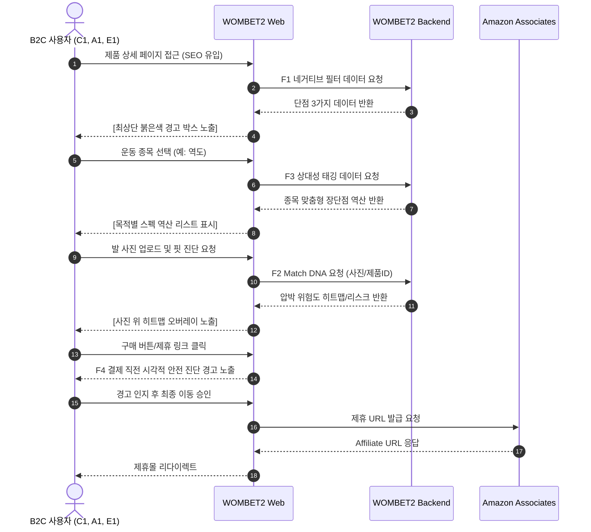
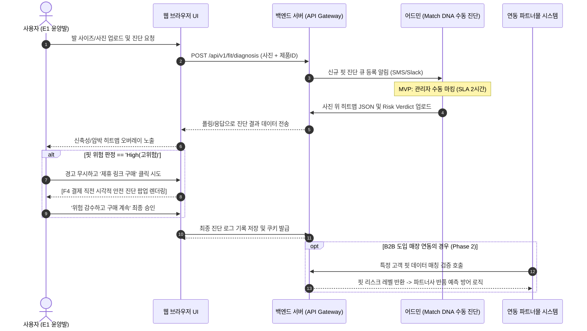
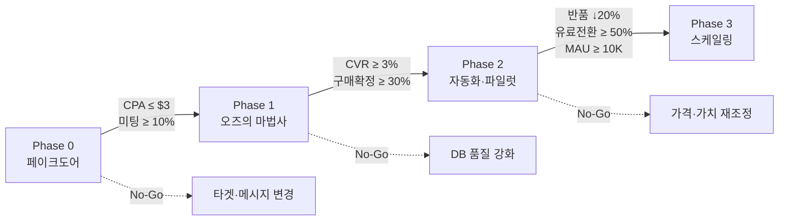

# Software Requirements Specification (SRS)
Document ID: SRS-001
Revision: 0.2
Date: 2026-04-27
Standard: ISO/IEC/IEEE 29148:2018

-------------------------------------------------

## 1. Introduction

### 1.1 Purpose
본 문서(SRS)의 목적은 운동화 시장의 소비자가 겪는 "정보의 양이 아닌, 정보의 질과 방향성" 결핍 문제를 해결하기 위한 **안티 가스라이팅 기어 매칭 플랫폼(WOMBET2)**의 소프트웨어 요구사항을 정의하는 것이다. 본 시스템은 거짓 칭찬과 획일적 치수의 폭력을 부수고, 오직 뼈와 관절을 보호할 '치명적 단점 필터링'과 '초정밀 핏 DNA'를 가장 먼저 보여주어 소비자의 탐색 실패를 차단한다. 

**해결하고자 하는 문제 정의 (Pain 지표 포함)**
| # | Pain 정의 | 실패 KPI (현재 상태) |
|---|-----------|---------------------|
| P1 | 칭찬 일색 협찬 리뷰(가스라이팅)로 인한 부상·금전 피해 | 가입 전환율 30% 미달 (단점 정보 부재 → 신뢰 결핍으로 이탈) |
| P2 | 단점 확인을 위한 5개 이상 탭 교차검증(멀티호밍) 피로 | 평균 탐색 시간 120분 이상, 리텐션 3일 이하 사용자 40% 이상 |
| P3 | 획일적 평점('폭신=★5') 알고리즘이 목적별 스펙 탐색을 매장 | 목적 적합 제품 도달률 < 15% (이종 스펙 오염) |
| P4 | 어퍼 신축성·재봉선 등 초정밀 핏 데이터 전무 | 온라인 신발 반품률 18~20%(NRF 2025), 반품 1건당 매몰 비용 $31.50~$45 |

### 1.2 Scope
**목표 수준 (Desired Outcome)**
| 목표 항목 | 기준선 (As-Is) | 목표값 (To-Be) |
|-----------|---------------|---------------|
| 멀티호밍 탐색 시간 | 120분+ | **≤ 5분** (96% 절감) |
| 결제 직전 구매 불안도 | High (정량화 필요) | **90% 하락** |
| 실착 후 부상 보고 건수 | 업계 미추적 | **0건** 목표 |
| 핏 불일치 반품률 | 18~20% | **0%** 수렴 목표 |
| 목적 외 스펙 오염 노출 | ~85% | **0%** (100% 필터 아웃) |

**범위 정의 (In/Out)**
| 구분 | 항목 |
|------|------|
| **In (v1 범위)** | F1 네거티브 필터 (수동 DB 30~50종), F2 Match DNA (수동 핏 진단), F3 상대성 태깅 (기본 스키마), F4 안전 진단 오버레이, B2C 제휴 커미션 파이프라인, B2B 컨시어지 파일럿 (3~5매장), SEO 롱테일 콘텐츠, 페이크도어 랜딩페이지 |
| **Out (v1 제외)** | F5 부상/마일리지 기록 (Strava/NRC에 순응 중), F6 유저 위키 (MAU 1만 이전 보류), 비전 AI 자동 진단 (Phase 3), 테니스·등산 카테고리 확장, 모바일 네이티브 앱, 국제화(i18n) — 미국 영어 우선 |

### 1.3 Definitions, Acronyms, Abbreviations
- **Jobs to be Done (JTBD):** 사용자가 특정 상황에서 목적을 달성하기 위해 완수하고자 하는 핵심 과업.
- **AOS (Adjusted Opportunity Score):** 기존 경쟁 대안 대비 미충족된 사용자 니즈의 크기 점수.
- **DOS (Discovered Opportunity Score):** 신규 솔루션을 통해 파악된 개선 기회의 중요도 점수.
- **Validator:** 기능 및 가치를 검증하는 주체 또는 기준 (예: B2B 파일럿 매장, Phase 0 페이크도어 지표).
- **Match DNA:** 어퍼 연성도, 토박스 압박 강도, 재봉선 충돌 히트맵 등 신발의 초정밀 핏 데이터.
- **네거티브 필터:** 과장 리뷰를 배제하고 제품의 가장 치명적인 단점 3가지를 최상단에 노출하는 핵심 기능.
- **상대성 태깅:** 사용자의 운동 목적에 따라 제품 스펙을 서로 다른 장단점으로 자동 역산 변환하는 평가 로직.
- **북극성 KPI (제휴 구매 전환율):** 네거티브 필터 열람 → 제휴 링크 클릭 → 구매 완료 비율. (이커머스 평균 2~3% → 목표: 보수적 ≥ 5.0%, 적극적 7.0%. 측정: Google Analytics, Amazon Associates Dashboard)
- **보조 KPI:** 
  - 페이크도어 이메일 CPA: ≤ $3 (측정: Meta Ads)
  - 단점 DB 열람 후 체류 시간: ≥ 8분 (업계 평균 2분 대비 4배 증가)
  - B2B 파일럿 매장 반품 감소율: ≥ 20%
  - MAU: 50,000 (1년 차)
  - B2B 파일럿→유료 전환율: ≥ 50%

### 1.4 References
- **REF-01:** `20_Final_Master_VPS.md` (원본 소스 문서)
- **REF-02 (Tier 1):** Spiegel Research Center (Northwestern) - 부정적 리뷰 인터랙션 시 체류 시간 4배 증가, CVR 67% 상승. 최적 평점 구간 4.2~4.7. (보수적 수치인 67% 상승을 기본 벤치마크로 채택함. 원본 문서의 380%는 혼합 노출의 극대치로 간주)
- **REF-03 (Tier 1):** NRF 2025 Returns Report - 미국 이커머스 반품률 19.3%, 반품 규모 $8,499억, 반품 처리 비용 = 주문가의 약 21%.
- **REF-04 (Tier 1):** Overjet 치과 AI 사례 - 시각 진단 기반 환자 동의율 34% → 72% 상승.
- **REF-05 (Tier 2):** True Fit 공식 발표 - 핏 기술 도입 후 브래케팅 반품 24% 감소, DTC 채널 50~60% 감소 (본 SRS에서는 B2B 파일럿 반품 감소 목표를 보수적으로 ≥ 20% 채택).

### 1.5 Constraints and Assumptions
**Constraints (제약사항 및 리스크)**
| # | 리스크 | 완화 전략 (제약/방향성) |
|---|--------|------------------------|
| R1 | 네거티브 필터 CVR 미달 | Phase 0 페이크도어 A/B 테스트 ($50 Meta 광고) 조기 검증. Go 기준: CVR ≥ 3% |
| R2 | 단점 DB 확장성 병목 | Phase 1에서 반자동화 파이프라인 설계 및 베스트셀러 집중 |
| R3 | B2B WTP(지불 용의) 미검증 | Phase 0 콜드메일 발송(미팅 ≥ 10%). 무료 파일럿 후 ROI 입증 시 월 $2,500 전환 |
| R4 | Match DNA 수동 운영 SLA 실패 | 초기 일 처리량 상한(20건/일) 설정. Phase 2 반자동화 전환 전까지 수동 응답 SLA 2시간 준수 |
| R5 | Amazon Associates 정책 변경 | 전문 러닝 커머스(Running Warehouse 등) 복수 제휴 채널 확보로 의존 분산 |

**Assumptions (가정)**
- C1(코어 페르소나)의 Pain은 CPA ≤ $3 수준으로 획득 가능할 만큼 강력하다.
- Spiegel의 흠집 효과(Blemishing Effect)가 기능성 운동화 도메인에서도 유사하게 재현된다.
- True Fit 실측 반품 감소율과 유사한 수준의 반품 감소가 달성 가능하다.

-------------------------------------------------

## 2. Stakeholders

| Role (페르소나) | Responsibility (책임 및 행동) / 여정 | Interest (관심사 / AOS & DOS) |
|---|---|---|
| **C1 김러닝** (34세, 러닝 3년차, 🔴 코어) | **트리거:** 부상(족저근막염) 재발 인지. **행동:** 네거티브 필터 확인 및 제휴 링크 구매. | **Pain:** 협찬 가스라이팅으로 인한 부상/병원비 30만 원. **Needs:** 내 발/아치에 치명적 페널티 직관적 파악. **AOS:** 4.0 / **DOS:** 3.6 |
| **A1 조역도** (27세, 크로스핏, 🔵 확장) | **트리거:** 물컹한 신발로 체육관 낭패. **행동:** 종목 선택 및 맞춤형 장비 검색. 부정확 정보 신고. | **Pain:** 획일적 평점에 목적 적합 장비 매장. **Needs:** 종목에 맞는 스펙만 오염 없이 필터링. **AOS:** 4.0 / **DOS:** 3.2 |
| **E1 윤양발** (31세, 극비대칭, 🟢 극단) | **트리거:** 직구 신발 이음새 압박으로 통증. **행동:** 발 사진 업로드 및 핏 진단(Match DNA) 요청. | **Pain:** 어퍼 신축성 데이터 전무로 반품비 5만 원 누적. **Needs:** 갑피 연성·이음새 돌출부 초정밀 데이터 사전 확인. **AOS:** 4.0 / **DOS:** 3.6 |
| **N1 유나이키** (패션·리셀, ⛔ 안티) | **행동:** 데이터 기반 핏 제공 거부 시 이탈. | **관심사:** 성능이 아닌 패션/리셀 가치. (이들의 이탈이 곧 WOMBET2의 데이터 무결성 Moat 증거) |
| **B2B 파트너사** | 고객 매칭(Match API 연동), 구독료 월 $2,500 지불. | 온라인 신발 반품 매몰 비용 감소 (최소 20% 절감 목표). |
| **전문 리뷰어** | 단점 DB 교차 검증 및 정확도 확보. | 단점 DB 정확도(98% 이상) 보장, 오염되지 않은 양질의 팩트 데이터 유지. |
| **시스템 관리자** | 핏 진단 수동 처리(MVP), 누락 데이터 모니터링. | SLA 2시간 내 히트맵 오버레이 응답 전송 및 시스템 관리. |

-------------------------------------------------

## 3. System Context and Interfaces

### 3.1 External Systems
- **Amazon Associates Platform:** B2C 구매 사용자의 리다이렉션을 처리하고 구매 전환 시 4% 커미션을 추적하는 제휴 마케팅 시스템 (24시간 쿠키 윈도우).
- **B2B Partner ERP/Shopify:** B2B API를 통해 고객의 핏 리스크 레벨 및 히트맵 연동.
- **Analytics & CRM:** Google Analytics (체류시간, CVR), Hubspot (유료 전환), Meta Ads Manager (CPA).

### 3.2 Client Applications
- **B2C 웹 프론트엔드 (WebApp):** 사용자가 검색, 제품 진단, 네거티브 경고 열람, 제휴 리다이렉션을 수행하는 주요 인터페이스. 모바일 반응형 웹 한정.

### 3.3 API Overview
| API Name | Direction | Input Parameters | Output / Response | 제약 |
|---|---|---|---|---|
| **Amazon Associates API** | 외부 (B2C) | `product_id`, `affiliate_tag` | 제휴 구매 링크 URL, 추적 ID | 커미션율 4% 고정, 쿠키 24시간 |
| **Match DNA Fit API** | 내부→외부 (B2B) | `user_foot_data`, `product_id` | `fit_risk_level`, `heatmap_json` | 월 $2,500/매장, 호출 제한 10K건/월 |
| **단점 DB 관리 API** | 내부 | `product_id`, `penalty_data` | 검증된 단점 데이터 CRUD | 전문 리뷰어 검증 후에만 publish 가능 |
| **상대성 태깅 API**| 내부 | `product_id`, `target_sport` | 역산된 랭킹 및 스코어 | 응답 ≤ 1초, 지원종목(러닝/역도 등) |

### 3.4 Interaction Sequences (핵심)

### 3.5 미국 시장 경쟁 대안 벤치마크 (시스템 설계 참조 방향)
| 벤치마크 대상 | 비교 축 | 측정 방법 / 목표 | WOMBET2 차별점 (Moat) |
|-------------|---------|----------|----------------|
| **Amazon** (이종) | 카테고리 반품률, 신뢰도 | NRF 데이터 대비 50% 이상 개선 | 긍·부정 혼합 별점이 아닌 **단점 최우선 노출** |
| **RunRepeat** (동종)| 데이터 깊이(스펙 항목 수) | A/B 사용자 테스트, 개인화 우위 30%p | 30+ 스펙 측정하나 **단점 경고 프레이밍 부재**, 개인발 매칭 없음 |
| **REI / Dick's** | 매장 반품 비용, 핏 기술 | 파일럿 데이터 기준 월 $1,500+ 절감 입증 | 카테고리 분류만 존재. **동적 역산 변환 없음 (유일 알고리즘)** |
| **True Fit** (기술) | 핏 예측 정확도, 데이터 범위 | 자체 실측으로 반품 감소율 입증 | 어퍼 신축성·재봉선 데이터는 **True Fit 미제공 영역의 독점적 가치** |

-------------------------------------------------

## 4. Specific Requirements

### 4.1 Functional Requirements

| Req ID | PRD Source | Description | Acceptance Criteria (Given/When/Then/Threshold) | Priority / 비고 |
|---|---|---|---|---|
| REQ-FUNC-001 | Story 1 / F1 | 네거티브 필터 최상단 노출 | **Given:** 제품 상세 진입 **When:** 로드 완료 시 **Then:** 붉은색 경고 박스 내 단점 3가지 노출 **Threshold:** LCP ≤ 1.5초, 뷰포트 상위 30% 이내 | Must / 1Sprint 구현 가능(Pass) |
| REQ-FUNC-002 | Story 1 / F1 | 단점 인터랙션에 따른 체류 시간 | **Given:** 제품 조회 중 **When:** 사용자가 단점 경고 박스 열람 **Then:** 체류 시간이 기록됨 **Threshold:** 비노출 대비 유의미한 증가 (≥ 4배 목표) | Must |
| REQ-FUNC-003 | Story 1 / F1 | 단점 데이터 누락 시 예외 처리 | **Given:** 단점 누락 제품 진입 **When:** 페이지 로드 시 **Then:** "현재 단점 분석 중" 대체 UI 노출 및 어드민 알림 전송 **Threshold:** 지연율 0%, 알림 성공률 100% | Must |
| REQ-FUNC-004 | Story 2 / F3 | 목적별 스펙 역산 변환 | **Given:** 종목(역도) 선택 **When:** 리스트 갱신 시 **Then:** 목적별 역산 점수 반영 순위 표시 **Threshold:** 변환 정확도 ≥ 95%, p95 응답 ≤ 1초 | Must / 1Sprint 구현 가능(Pass) |
| REQ-FUNC-005 | Story 2 / F3 | 이종 스펙 오염 차단 필터 | **Given:** 역산 리스트 조회 **When:** 이종 스펙 혼입 시 **Then:** 오염 경고 표기 또는 필터 아웃 **Threshold:** 이종 스펙 오염률 = 0% | Must |
| REQ-FUNC-006 | Story 2 / F3 | 부정확 피드백 신고 처리 | **Given:** 리스트 조회 중 **When:** 사용자가 '부정확' 피드백 접수 시 **Then:** 검증·보정 트리거 **Threshold:** 처리 SLA ≤ 48시간 | Must |
| REQ-FUNC-007 | Story 2 / F3 | 신규/미지원 종목 예외 뷰 | **Given:** 데이터 부족 '신규/기타 종목' 선택 **When:** 리스트 갱신 시 **Then:** "해당 종목 분석 중" 팝업 노출 후 범용 리스트 뷰 대체 유지 **Threshold:** 팝업 노출률 100%, 앱 크래시 0건 | Must |
| REQ-FUNC-008 | Story 3 / F2 | 발 사진 기반 Match DNA 핏 진단 | **Given:** 사진 업로드 **When:** 핏 진단 요청 시 **Then:** 부위별 압박 위험도 히트맵 오버레이 제공 **Threshold:** 응답 ≤ 2시간 (MVP 수동), 자동화 후 ≤ 30초 | Must / 수동 진단 의존, 1Sprint 구현 가능(Pass) |
| REQ-FUNC-009 | Story 3 / F2 | 히트맵 확인 후 구매 시 반품 모니터링 | **Given:** 히트맵 확인 후 구매 확정 시 **When:** 구매 완료 시점 **Then:** 핏 불일치 반품률이 유의미 감소하는지 트래킹 됨 **Threshold:** 반품률 ≤ 10% (기준 대비 50% 감소) | Must |
| REQ-FUNC-010 | Story 3 / F4 | 고위험 판정 결제 직전 오버레이 | **Given:** 히트맵 상 '고위험' 판정 제품 구매 시도 **When:** 제휴 링크 클릭/결제 진입 전 **Then:** 시각적 경고 오버레이 필수 표시 **Threshold:** 경고 노출률 100% | Should / F2 데이터 의존, 1Sprint 구현 가능(Pass) |
| REQ-FUNC-011 | Story 3 / F2 | 저화질 사진 예외 처리 | **Given:** 저화질/인식 불가 발 사진 업로드 **When:** 핏 진단 요청 시 **Then:** "해상도가 낮아 핏 진단이 어렵습니다" 오류 메시지와 재촬영 가이드 노출 **Threshold:** 오류 처리 응답 ≤ 2초 | Must |

### 4.2 Non-Functional Requirements

| Req ID | Category | Description | Metrics / Threshold / Target SLA |
|---|---|---|---|
| REQ-NF-001 | Performance | 화면 LCP 속도 | 페이지 로드 완료 (LCP 기준) p95 응답 속도 **≤ 1,500ms** |
| REQ-NF-002 | Performance | 상대성 태깅 변환 속도 | 종목별 스펙 역산 변환 요청 시 p95 응답 속도 **≤ 1,000ms** |
| REQ-NF-003 | Performance | 검색 및 필터 속도 | 제품 검색/필터 API 요청 시 p95 응답 속도 **≤ 500ms** |
| REQ-NF-004 | Performance | Match DNA 히트맵 응답 | MVP 수동 운영 시 SLA **≤ 2시간**, 향후 완전 자동화 후 p95 **≤ 30초** |
| REQ-NF-005 | Availability | 월 가용성 (Uptime) | 시스템 전체 가동률 **≥ 99.5%** |
| REQ-NF-006 | Availability | 오류율 통제 | 5xx HTTP 오류율 **≤ 0.5%** |
| REQ-NF-007 | Reliability | 단점 DB 정확도 유지 | 전문 리뷰어 교차 검증을 거쳐 정확도 **≥ 98%** 확보 |
| REQ-NF-008 | Reliability | 리다이렉트 정상 작동률 | Amazon 제휴 링크 정상 작동률 **≥ 99.9%** 보장 |
| REQ-NF-009 | Security | 발 사진 개인정보 보호 | CCPA/GDPR 준수, 진단 완료 후 사용자가 원본 삭제 요청 시 즉시 파기 |
| REQ-NF-010 | Security | 링크 하이재킹 방지 | 제휴 링크는 클릭 해싱 및 서버 사이드 URL 검증 프로세스 적용 |
| REQ-NF-011 | Cost | 인프라 비용 통제 | Phase 1 인프라 비용 **월 ≤ $500** / Phase 2~3 **월 ≤ $3,000** |
| REQ-NF-012 | Monitoring | CVR 저하 경보 | 제휴 CVR이 **< 3%** 연속 하락(또는 발생) 시 즉각적인 Slack 경고 발송 |
| REQ-NF-013 | Monitoring | 기타 운영 알림 | 에러율 **> 0.5%** 초과 시 PagerDuty 호출 / SLA 초과 시 즉시 알림 / 신규 베스트셀러 DB 미등록 시 주간 리포트 알림 / 검색어 순위 Top 10 이탈 시 알림 |
| REQ-NF-014 | Target KPI | 탐색 시간 및 CVR 목표 | 멀티호밍 탐색 시간 **≤ 5분**으로 96% 절감, 제휴 구매 전환율(CVR) 보수적 **≥ 5.0%** (적극적 7.0%), 단점 DB 체류 시간 **≥ 8분**, MAU 1년차 **50,000**, B2B 유료 전환율 **≥ 50%** |

-------------------------------------------------

## 5. Traceability Matrix

| Req ID | PRD Source (Story) | Description | Priority | Test Case ID |
|---|---|---|---|---|
| REQ-FUNC-001 | Story 1 (C1 김러닝) / F1 | 네거티브 필터 최상단 경고 노출 보장 | Must | TC-F01-001 |
| REQ-FUNC-002 | Story 1 (C1 김러닝) / F1 | 단점 인터랙션 시 체류 시간 로깅/검증 | Must | TC-F01-002 |
| REQ-FUNC-003 | Story 1 (C1 김러닝) / F1 | 단점 데이터 누락 시 예외 및 알림 전송 | Must | TC-F01-003 |
| REQ-FUNC-004 | Story 2 (A1 조역도) / F3 | 목적별 스펙 역산 변환 및 순위 표시 | Must | TC-F03-001 |
| REQ-FUNC-005 | Story 2 (A1 조역도) / F3 | 이종 스펙 오염 차단 필터 경고 | Must | TC-F03-002 |
| REQ-FUNC-006 | Story 2 (A1 조역도) / F3 | 부정확 역산 신고 접수 및 보정 트리거 | Must | TC-F03-003 |
| REQ-FUNC-007 | Story 2 (A1 조역도) / F3 | 신규/미지원 종목 예외 뷰 전환 | Must | TC-F03-004 |
| REQ-FUNC-008 | Story 3 (E1 윤양발) / F2 | 발 사진 기반 히트맵 분석 (수동 SLA) | Must | TC-F02-001 |
| REQ-FUNC-009 | Story 3 (E1 윤양발) / F2 | 히트맵 확인 구매 건 반품 모니터링 | Must | TC-F02-002 |
| REQ-FUNC-010 | Story 3 (E1 윤양발) / F4 | 결제 직전 시각적 안전 진단 경고 모달 | Should | TC-F04-001 |
| REQ-FUNC-011 | Story 3 (E1 윤양발) / F2 | 저화질 발 사진 오류 처리 가이드 표시 | Must | TC-F02-003 |
| REQ-NF-001~004 | PRD 5.1 성능 | LCP 1.5초, SLA 2시간 등 성능 지표 제어 | High | TC-NFR-PRF |
| REQ-NF-005~008 | PRD 5.2 신뢰성 | Uptime 99.5%, 단점 정확도 98% 보장 | High | TC-NFR-AVA |
| REQ-NF-009~011 | PRD 5.3 보안/비용 | CCPA 준수, 인프라 비용 통제 | Medium | TC-NFR-SEC |
| REQ-NF-012~014 | PRD 1.3, 5.4 알림 | CVR 3% 미만 Slack 알림 등 모니터링 | High | TC-NFR-KPI |

-------------------------------------------------

## 6. Appendix

### 6.1 API Endpoint List
| Endpoint URI | Protocol | Type | Description |
|---|---|---|---|
| `/api/v1/products/{id}/penalties` | REST | Internal | 제품 호출 시 F1 네거티브 필터용 치명적 단점 데이터 조회 |
| `/api/v1/products/{id}/tags` | REST | Internal | 종목 선택(F3) 시 역산된 상대성 태깅 스코어 리스트업 |
| `/api/v1/fit/diagnosis` | REST | B2B/Ext | 사용자 사진과 제품 ID를 기반으로 핏 리스크 및 JSON 히트맵 리턴 |
| `/api/v1/affiliate/link` | REST | External | 쿠키 하이재킹이 방어된 Amazon 리다이렉트 URL 보안 발급 |

### 6.2 Entity & Data Model
| Entity | Field Name | Data Type | Constraint | Description |
|---|---|---|---|---|
| **PRODUCT** | `product_id` | String | PK | 고유 제품 식별자 |
| | `brand` | String | Not Null | 브랜드명 |
| | `model_name` | String | Not Null | 모델명 |
| | `price_usd` | Float | Not Null | 가격 (USD) |
| | `category` | String | Not Null | 카테고리 |
| | `heel_toe_drop_mm` | Float | [TBD - PRD 누락] | 힐투토 드롭 (Null 허용) |
| | `weight_g` | Float | [TBD - PRD 누락] | 무게 |
| | `stack_height_mm` | Float | [TBD - PRD 누락] | 스택 하이트 |
| **NEGATIVE_FILTER** | `filter_id` | String | PK | 레코드 고유 ID |
| | `product_id` | String | FK | PRODUCT 연관 ID |
| | `penalty_1` | String | Not Null | 가장 치명적인 단점 1 |
| | `penalty_2` | String | Not Null | 가장 치명적인 단점 2 |
| | `penalty_3` | String | [TBD - PRD 누락] | 단점 3 |
| | `severity_level` | String | Not Null | 위험도/경고 수준 등급 |
| | `source_citation` | String | Not Null | 리뷰 참조 출처 / 근거 자료 |
| | `verified_date` | Date | [TBD - PRD 누락] | 전문가 교차 검증 일자 |
| **RELATIVITY_TAG**| `tag_id` | String | PK | 고유 식별자 |
| | `product_id` | String | FK | 연관 상품 |
| | `sport_type` | String | Not Null | 대상 종목 (역도, 러닝 등) |
| | `original_score` | Float | Not Null | 원본 기본 스코어 |
| | `converted_score` | Float | Not Null | 역산된 종목별 변환 스코어 |
| | `conversion_rationale`| String | [TBD - PRD 누락] | 점수 변환 로직/근거 |
| **MATCH_DNA** | `dna_id` | String | PK | 데이터 식별자 |
| | `product_id` | String | FK | 연관 상품 |
| | `upper_elasticity_grade`| Float | [TBD - PRD 누락] | 갑피 연성도 등급 |
| | `toebox_pressure_index` | Float | [TBD - PRD 누락] | 토박스 압박 강도 지수 |
| | `seam_collision_heatmap`| JSON | [TBD - PRD 누락] | 이음새 충돌 히트맵 포인터 배열 |
| | `fit_risk_level` | String | [TBD - PRD 누락] | 최종 판정 리스크 (High/Low) |
| **USER_PROFILE** | `user_id` | String | PK | 회원 식별자 |
| | `foot_shape_data` | String | [TBD - PRD 누락] | 발 형태 요약 데이터 |
| | `pronation_type` | String | [TBD - PRD 누락] | 과내전 등 타입 |
| | `left_foot_mm` | Float | Not Null | 좌측 발 실측 (mm) |
| | `right_foot_mm` | Float | Not Null | 우측 발 실측 (mm) |
| | `primary_sport` | String | [TBD - PRD 누락] | 주력 종목 |
| **FIT_DIAGNOSIS** | `diagnosis_id` | String | PK | 진단 세션 식별자 |
| | `user_id` | String | FK | 진단 요청 회원 |
| | `product_id` | String | FK | 대상 상품 |
| | `heatmap_overlay` | JSON | Not Null | 최종 산출 진단 결과 |
| | `risk_verdict` | String | Not Null | 진단 안전도/위험 등급 |
| | `created_at` | Datetime | Not Null | 요청 시점 |
| | `response_time_hours`| Float | [TBD - PRD 누락] | 처리 소요 시간 (SLA 산출용) |

### 6.3 Detailed Interaction Models

### 6.4 Validation Plan (검증 및 롤아웃 계획)
본 시스템 가설을 입증하기 위해 다음과 같은 Go/No-Go 기반 단계적 검증을 수행한다.

#### Phase 0: 페이크도어 검증 (1~2주)
| 실험 | 가설 | 측정 지표 | 성공 기준 |
|------|------|----------|----------|
| **B2C 랜딩페이지** | "부상 방지" 단점 프레이밍이 CPA ≤ $3으로 이메일 가입 유도 가능 | CPA, 이메일 전환율 | CPA ≤ **$3**, 이메일 전환율 ≥ **10%** |
| **B2B 콜드메일** | 북미 로컬 전문점이 반품 절감 파일럿에 관심 보임 | 미팅 어레인지 비율 | **≥ 10%** (20건 중 2건) |

#### Phase 1: 오즈의 마법사 MVP (1~3개월)
| 실험 | 가설 | 측정 지표 | 성공 기준 |
|------|------|----------|----------|
| **네거티브 필터 CVR** | 단점 3요소 최상단 노출 시 구매 전환율이 평균을 상회함 | Affiliate CVR, 체류 시간 | CVR ≥ **3%** (Go 기준), 목표 **5~7%** |
| **수동 핏 진단 WTP** | 히트맵 PDF 수신 후 사용자의 구매 확정률이 유의미하게 높음 | 진단 후 구매 확정률 | 구매 확정률 ≥ **30%** |

#### Phase 2: 자동화 및 B2B 파일럿 (3~6개월)
| 실험 | 가설 | 측정 지표 | 성공 기준 |
|------|------|----------|----------|
| **B2B 반품 파일럿** | API 도입 매장의 핏 기인 반품률이 유의미 감소함 | 반품률 변화, 매몰비용 절감 | 반품 감소 ≥ **20%** |
| **B2B 유료 전환** | 무료 파일럿 매장이 ROI 입증 후 유료($2,500/월) 전환함 | 무료→유료 전환율 | ≥ **50%** |
| **MAU 10K 돌파** | SEO 및 커뮤니티 바이럴 효과 발생 | MAU, 오가닉 비율 | MAU ≥ **10,000** |

